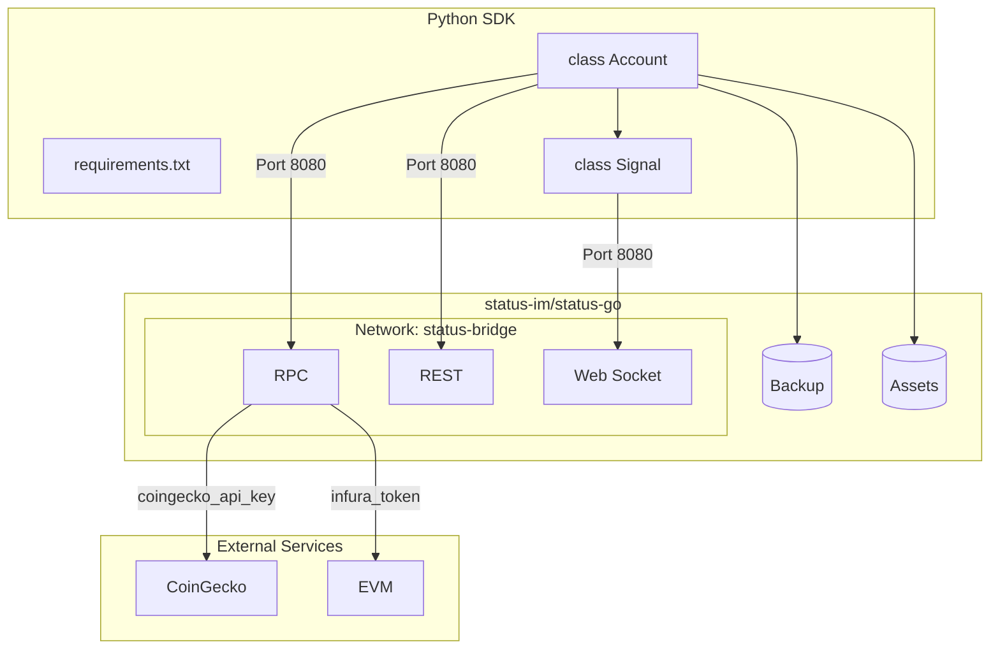
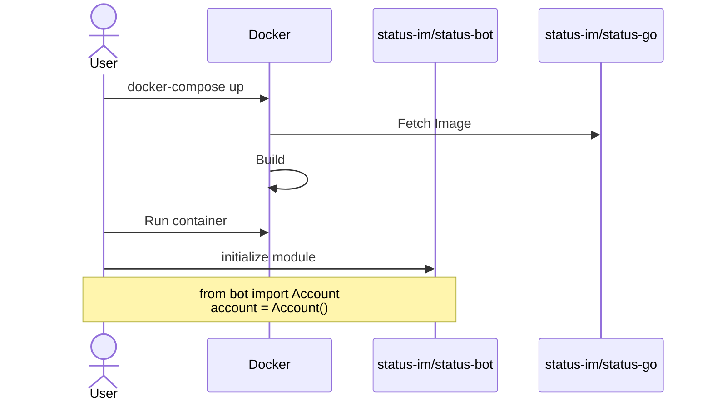

# Status Python SDK


The initial Python Status Backend was built with testing in mind, instead of easy developer access. The objective of this repository is to make a SDK that is:

- **light** - as less external packages when it comes to working with Status App
- **fast** - quick to get started with Status Python
- **documented** - clear explanations of what was done and **why it was done in a specific way**.

Currently this repository is not on [PyPi](https://pypi.org/) but will be added when core functionality has been devleoped and tested.

## How it works



## Setup

To access Python funcitonality you will have to set up [Status Backend](https://github.com/status-im/status-go/). Easiest and fastest way to get it running would be with [Docker](https://www.docker.com/products/docker-desktop/).



### Python

1. Setup environment. [Conda](https://www.anaconda.com/) example:
```bash
conda create -n status-sdk python=3.12
```

**Note**: Code has been tested with **Python 3.12**.

2. Install requirements

```bash
pip install -r ./requirements.txt
```

### Docker

Setup [`status-im/status-go`](https://github.com/status-im/status-go/) with the provided `docker-compose.yaml` file.

```
docker compose up -d
```

If you would like to initialize and start the container with Python:

```python
from bot import launch_docker_container
launch_docker_container()
```

**Note**: To run on Windows, please make sure you clone `status-im/status-go` and change the context to the folder. If you do not want to clone the repository, make sure you have set up [WSL](https://learn.microsoft.com/en-us/windows/wsl/install) and started it.
