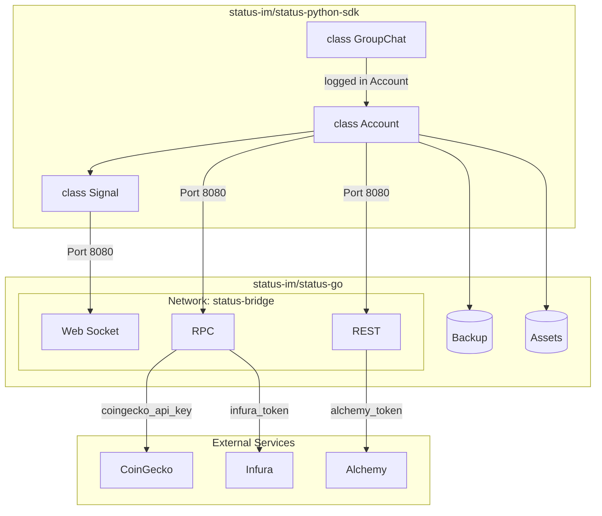
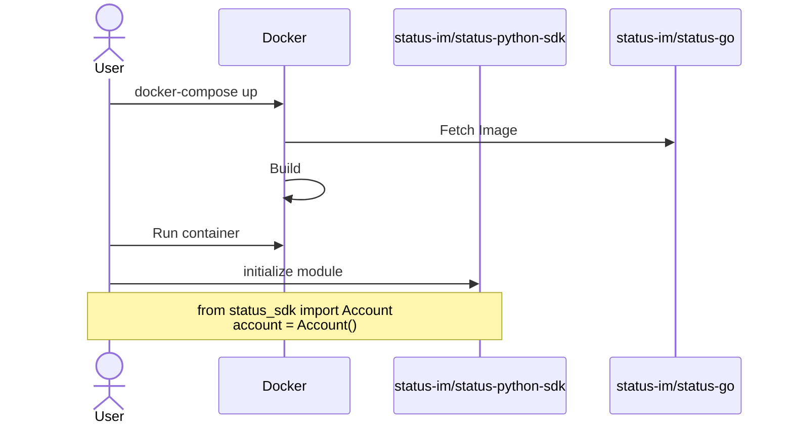

# Status Python SDK


[Status](http://status.app/) is a decentralized, open-source super app combining a crypto wallet, messenger, and community spaces. It uses peer-to-peer technology so no central server can censor your messages or access your data.

The initial Python Status Backend was built with testing in mind, instead of easy developer access. The objective of this repository is to make a SDK that is:

- **light** - as less external packages when it comes to working with Status App
- **fast** - quick to get started with Status Python
- **documented** - clear explanations of what was done and **why it was done in a specific way**.

## How it works



## Setup

To access Python funcitonality you will have to set up [Status Backend](https://github.com/status-im/status-go/). Easiest and fastest way to get it running would be with [Docker](https://www.docker.com/products/docker-desktop/).



### Python

#### Install

Clone the repository and move into it:

```
git clone https://github.com/status-im/status-python-sdk.git
cd status-python-sdk
```

Install the base library:

```
pip install .
```

If you want to modify the library itself without having to reinstall:

```
pip install -e .
```

#### Uninstall

```
pip uninstall status-sdk
```


### Docker

[`status-im/status-go`](https://github.com/status-im/status-go/) runs from the provided [`docker-compose.yaml`](./status_sdk/docker-compose.yaml) file. It does not use a pre-built image - it builds the backend from source, pulling directly from GitHub.


To run on Windows, please make sure you have set up [WSL](https://learn.microsoft.com/en-us/windows/wsl/install). It is **required** for the `build: context` above. The SDK invokes Docker through WSL so it can build the Linux image and clone the repository during the build. If the `build` is changed to point to a local repository, then WSL is not required.

You can set it up in **two** ways.

#### With Python

Use [`launch_docker_container`](./docs/utils.md#launch_docker_containercommitnone-wait_seconds5-platformlinuxamd64), which builds and starts the container for you. This is the recommended option, as it handles platform selection and (on Windows) recovers from stale Docker mounts:

```python
from status_sdk import launch_docker_container
launch_docker_container()
```

#### Manually

Run the compose file yourself. It lives inside the installed package, so point Docker at it:

```
docker compose -f status_sdk/docker-compose.yaml up -d
```

The compose file reads two variables from the environment. Both have a default, so the command above works as-is, but they can be overridden:

| Variable | Default | Description |
|-----|-----|-------------|
| `STATUS_GO_REF` | `develop` | The [`status-im/status-go`](https://github.com/status-im/status-go/) git ref (commit SHA, branch or tag) to build from. |
| `STATUS_GO_PLATFORM` | `linux/amd64` | The platform the image is built for. |

```
STATUS_GO_REF=2bee8b6a38cdc8f92d74e2dbb8c4e77fbbeea149 STATUS_GO_PLATFORM=linux/amd64 docker compose -f status_sdk/docker-compose.yaml up -d
```
