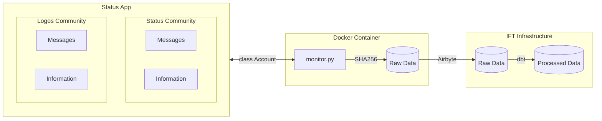

# [Status App Community Monitoring](https://status.app/)

Monitoring tool for Status App communities. **No personal data is collected from users.**


| Field                 | Hashed   | Description                                                 |
|:----------------------|:---------|:------------------------------------------------------------|
| **id**                | **Yes**  | The message's ID                                            |
| **whisper_timestamp** | No       | The whisper timestamp of the message                        |
| **from**              | **Yes**  | The public key of the user                                  |
| **message_type**      | No       | The message type                                            |
| **seen**              | No       | True if the message has been seen otherwise False           |
| **chat_id**           | No       | The chat ID is a combination of community ID and channel ID |
| **community_id**      | No       | The ID of the community                                     |
| **response_to**       | **Yes**  | Ithe public key of the user who the response is for         |
| **timestamp**         | No       | The timestamp of the message                                |
| **deleted**           | No       | True if the message was deleted otherwise False             |

Status Bot account information can be found in [`config.yaml`](./config.yaml).

## How it works



# Setup

## Environment Variables

- `POSTGRES_USERNAME` - Postgres username.
- `POSTGRES_PASSWORD` - Postgres password.
- `POSTGRES_DATABASE` - The database name in the Postgres connection.
- `POSTGRES_HOST` - The Postgres host name that will be remotely connected to.
- `POSTGRES_PORT` - The Postgres port that will be remotely connected to.
- `STATUS_DISPLAY_NAME` - The Status display name that will be used to create an account.
- `STATUS_PASSWORD` - The Status password that will be used to create an account.
- `STATUS_MNEMONIC` - The mnemonic used to recover the account. If passed a `.bkp` file will be loaded as well. Use this when you want to login to a bot account via Status App, join a community / leave community and export the `.bkp` file.
- `STATUS_INFURA_TOKEN` - [Infura token](https://www.infura.io/) is required for **token gated communities**
- `STATUS_COINGECKO_API_KEY` - [Coingecko API Key](https://www.coingecko.com/) is required for **token gated communities**

## Docker deployement

You can use the `docker-compose.yaml` to run the project.

Example of `.env` file to use
```
# Status Backend connection
STATUS_DISPLAY_NAME = "bot-status"
STATUS_PASSWORD = "ChangeThisPassword"
STATUS_MNEMONIC= "test test test test test test test test test test test test"

# Necessary for communities that have tokens
STATUS_INFURA_TOKEN = "Token from https://www.infura.io/"
STATUS_COINGECKO_API_KEY = "Token from https://www.coingecko.com/"

# Database config
POSTGRES_HOST=database
POSTGRES_PORT=5432
POSTGRES_DATABASE=status-bot
POSTGRES_USERNAME=status
POSTGRES_PASSWORD=ChangeThisOneAlso
```

## Python

1. Setup environment. [Conda](https://www.anaconda.com/) example:
```bash
conda create -n status-monitoring python=3.12
```

**Note**: Code has been tested with **Python 3.12**.

2. Install `monitor.py` and `bot` requirements

```bash
# To run Status bot
pip install -r ./bot/requirements.txt

# To run monitor.py
pip install -r ./requirements.txt
```

**Note**: If you are on Windows, you will have to install `psycopg2` instead of `psycopg2-binary`.

# Backups

If you have already created a Status account and want to use it with it's current data, please make sure you export the `.bkp` file and put it in folder **backups** and have the following `.env` variables:

- `STATUS_DISPLAY_NAME`
- `STATUS_PASSWORD`
- `STATUS_MNEMONIC`

## Files

- `monitor.py` - Status community message monitoring. It will download and upload messages in parallel.

# Guidelines

Things to keep in mind when building projects:

1. **Wrong recovery phrase** can create a new account by accident. To recover the account you must correctly write the phrase.

2. **Dynamic** `chats`, `communities` and `contacts` properties. If you log in to the account without a backup the properties will be empty **but will be populated automatically** if a message in a chat or community appears.

3. **Display name is not the same as username**. In Status App a display name is the **curent username** of active account. This means that if you have the same profile logged in with Python, Status Desktop and Status Mobile you can have 3 different usernames **based on your current device**. If an account is logged in from more than one device, the display name will change based on the currently used one (when messaging). This feature can be handy to distinguish if a bot or an actual user is logged in to the account. **Profile pictures work in a similar way to display names**

4. Community join requests do not work properly due to `status-go` issues. For latest updates, please monitor [`status-im/status-bot` issue #9](https://github.com/status-im/status-bot/issues/9). The fastest way to get in to a community is to manually log in with the Bot account and send a via Status App. Once the account is accepted, the bot can log in and start running. The community and chat information will appear in (2) as the messages come in.

5. To monitor for new messages, the account **must  always be logged in**. Log out of the account only if you do not want to receive messages.

6. **Token gated chats have an impact on the entire community**. You must provide an [Infura Token](https://www.infura.io/) and [Coingecko API key](https://www.coingecko.com/) during `login`. If wallet credentials are left out, then the community will not appear in (2) properties instead of the token gated chats only.
