# Account


The account class allows you to easily work with a Status account.

## Display name

The **display name** is the human‑readable identifier for a Status account. It is used when creating an account, resolving an existing account during [`login`](./account.md#loginpassword-key_uidnone-display_namenone-mnemonicnone-infura_tokennone-alchemy_tokennone-coingecko_api_keynone), and when updating the account name through the [`display_name`](./account.md#display_name) property.

Display names must follow strict validation rules enforced by the library and expected by the Status application. A valid display name must satisfy all of the following conditions:

- It may contain **uppercase letters (`A–Z`)**
- It may contain **spaces (` `)**
- It may contain **numbers (`0–9`)**
- It may contain **hyphens (`-`)**
- It may contain **underscores (`_`)**
- It must be **at least 5 characters long**
- It **cannot be more than 24 characters long**
- It **cannot start or end with a space**

Characters such as spaces, punctuation, emojis, or other symbols are **not allowed**.

### Valid examples

```
alpha_01
STATUS-01
bot_user_5
HELLO123
node-42
```

### Invalid examples

| Example | Reason |
|-------|--------|
| `bot` | Too short (minimum length is 5) |
| ` mybot` | Leading space |
| `mybot ` | Trailing space |
| `bot!123` | Contains invalid character `!` |

If a display name does not follow these rules, a **`ValueError`** will be raised by the account validation logic.

## Backups

Backup files (`.bkp`) can be both created in [Status App](https://our.status.im/status-desktop-v2-35-local-backups-new-home-page-performance-boosts-and-more/) and the [Python SDK](./account.md#backup). 

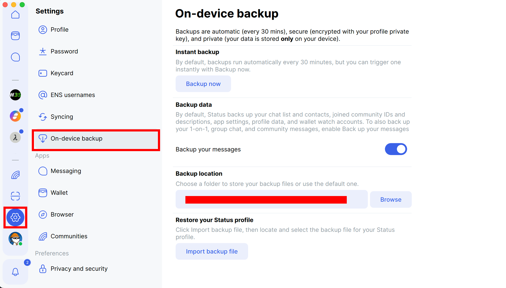

[Status Backend](https://github.com/status-im/status-go) backup folder is exposed in a Docker volume so users can:

- **Upload backup** - by dropping `.bkp` files in the `backups` folder locally (linked to Status Backend Docker container). Backups are automatically uploaded if a [`mnemonic` is provided during `login`](./account.md#loginpassword-key_uidnone-display_namenone-mnemonicnone-infura_tokennone-alchemy_tokennone-coingecko_api_keynone).
- **Create backup** - by using [`backup()`](./account.md#backup) or creating one in [Status App](https://our.status.im/status-desktop-v2-35-local-backups-new-home-page-performance-boosts-and-more/).

**Note**: Status App will not automatically backup messages. This has to be manually overridden on the app (above screenshot). When using the Python SDK, the messages are automatically stored in the `.bkp` files.

You can point [`backup_folder`](./account.md#accountdomainlocalhost-port8080-is_securefalse-backup_foldernone) at the folder Status App uses for its own local backups. Because both Status App and the SDK name `.bkp` files deterministically from the account's compressed key (see [`backup()`](./account.md#backup)), a backup created by the SDK lands with the exact filename Status App expects, and Status App will pick it up and load it directly - and likewise, a backup created in Status App can be auto-loaded by the SDK during recovery. This lets you move backups between the app and the SDK without renaming anything.

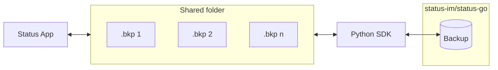

Because the file name is derived from the account's key rather than from whoever wrote it, the same account always maps to the same `.bkp` file - so neither side needs to know which tool produced the backup.


## Public keys

Every Status account is identified by **one key**, but that key appears in three different forms depending on where you look at it.

| Format | Example | What it is | Where to find it |
|-------|--------|-----------|-----------------|
| **Public key** | `0x04ebcad...` | The full, uncompressed key. This is what Status Backend works with internally, and what the SDK keys its data by. | `public_key` in [`info`](./account.md#info) / [`contacts`](./account.md#contacts) |
| **Chat key** (compressed key) | `zQ3shYSHp7...` | The same key in its compressed form. This is the value Status App shows and what users copy when they share their chat key. | `compressed_key` in [`info`](./account.md#info) / [`contacts`](./account.md#contacts), or the **chat key** in Status App |
| **Account URL** | `https://status.app/u/...` | A shareable profile link with the chat key embedded in it. This is what **Share profile** produces in Status App. | `url` in [`info`](./account.md#info) / [`contacts`](./account.md#contacts), or **Share profile** in Status App |

Where a list is accepted, the formats can even be **mixed within the same list**, since each value is normalised on its own.

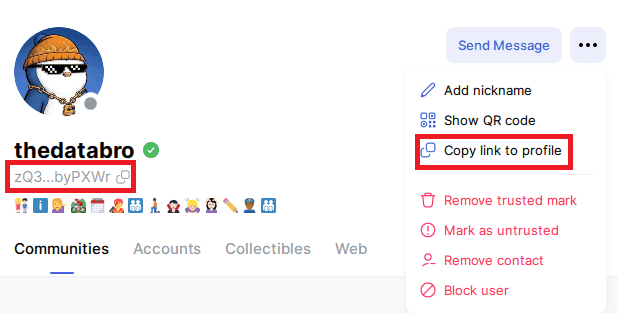

**Note**: An **account URL** (`https://status.app/u/...`) is not the same as a **community URL** (`https://status.app/c/...`). Community URLs identify a community and belong in the [`Community`](./community.md#communityaccount-community_idnone-urlnone-data_foldernone) constructor.

## Wallet

Wallet features are optional and can be omitted if not required for your use case. They provide functionality equivalent to the **Wallet** and **Market** tabs.

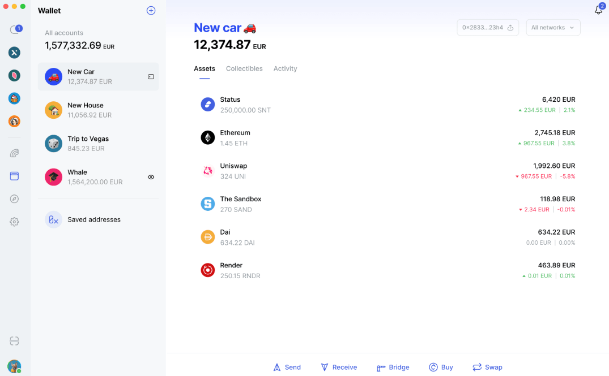

## Installation ID

Currently installation IDs can be found in **Debug Mode** only. To turn **Debug Mode**:

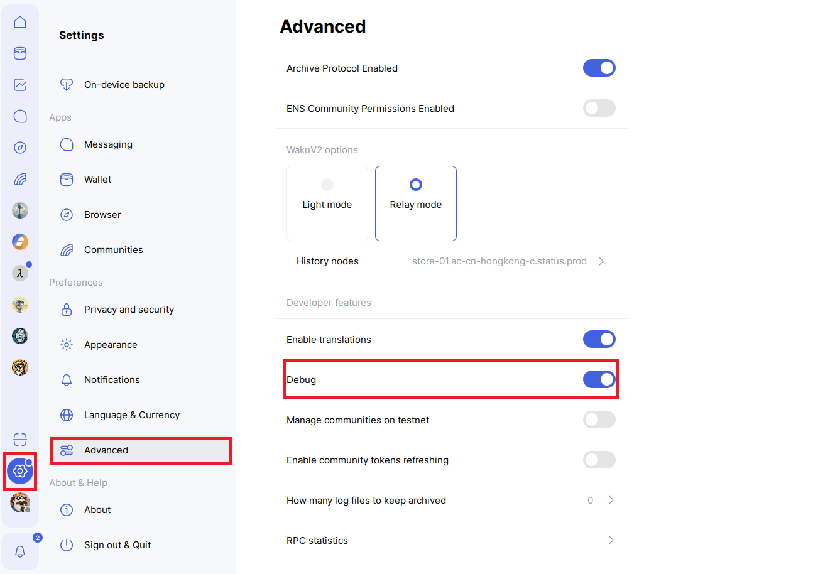

Once **Debug Mode** is turned on and Status App is restarted, you can go to **Syncing** tab.

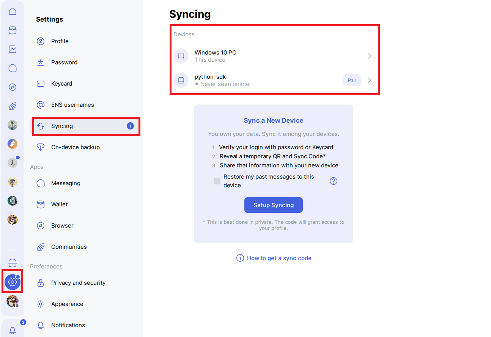

The **Installation ID** should be used when calling [`sync`](./account.md#syncinstallation_id-namenone) and [`unsync`](./account.md#unsyncinstallation_id).

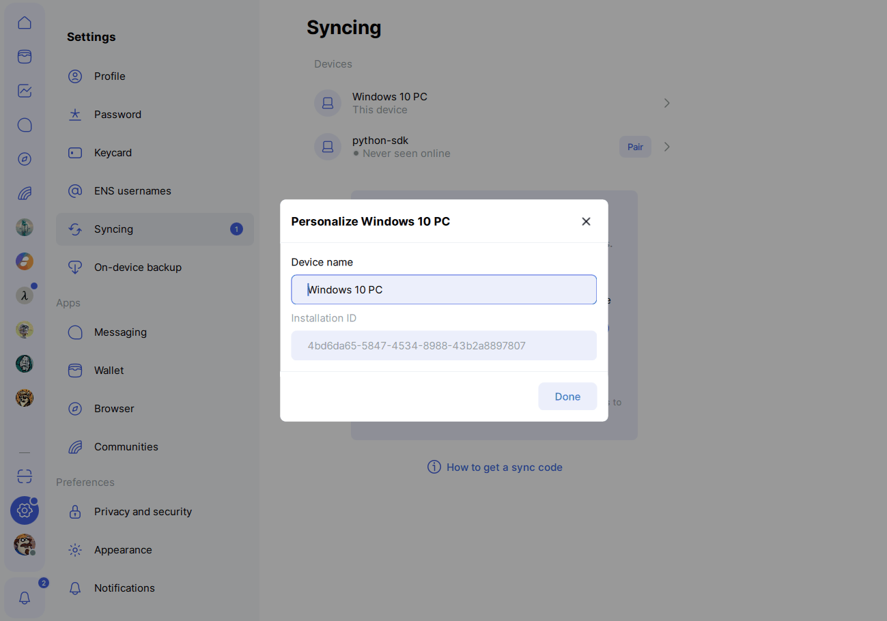

## `Account(domain="localhost", backend_port=8080, media_port=9000, is_secure=False, backup_folder=None, volume_folder=None)`

Create a new `Account` instance ready to be logged in. The constructor wires the SDK to a running [Status Backend](https://github.com/status-im/status-go) at the given `domain` and `backend_port`, prepares the local `assets/` folder (used for image uploads, such as the [profile picture](./account.md#profile_picture)) and `backups/` folder (used for [backup uploads](./account.md#backups) and recovery).

| Name | Type | Required | Description |
|-----|-----|-----|-------------|
| `domain` | `str` | No | Domain where Status Backend is reachable. Defaults to `localhost` when running through [`launch_docker_container`](./utils.md#launch_docker_container) on the same machine. **Use the container name when the SDK runs inside the same Docker network as Status Backend.** |
| `backend_port` | `int` | No | Port exposed by Status Backend. Defaults to `8080`. If this is changed, the published port for `backend_port` must be updated to match in `docker-compose.yaml` as well. |
| `media_port` | `int` | No | Port exposed by the Status media server, used to fetch localhost images such as the [profile picture](./account.md#profile_picture). Defaults to `9000`. If this is changed, the published port for `media_port` must be updated to match in `docker-compose.yaml` as well. |
| `is_secure` | `bool` | No | When `True`, the SDK communicates over `https`; otherwise `http` is used. Defaults to `False`. |
| `backup_folder` | `str` | No | Absolute path on the host machine where `.bkp` files will be created and loaded from. If not provided, the SDK's own `backups/` folder is used. See [Backups](./account.md#backups).  |
| `volume_folder` | `str` | No | Directory containing the `docker-compose.yaml` whose `backups/` and `assets/` folders are mounted into the Status Backend container. Defaults to this package's own installation folder (e.g. the `status_sdk` folder under `site-packages` when installed via `pip`). Set this when Status Backend is launched from a different `docker-compose.yaml`, such as a local clone of the repository. |

The constructor does not log into any account on its own - call [`login`](./account.md#loginpassword-key_uidnone-display_namenone-mnemonicnone-infura_tokennone-alchemy_tokennone-coingecko_api_keynone) afterwards. To discover what accounts already exist in the configured data directory, use the [`available_accounts`](./account.md#available_accounts) property, which is also populated automatically during initialization.

```python
from status_sdk import Account

account = Account()
```

Use a custom backup folder:

```python
from status_sdk import Account

account = Account(backup_folder=r"C:\\Users\\me\\status-backups")
```

Connect to a Status Backend running on a different host or port:

```python
from status_sdk import Account

account = Account(
    domain="status-backend.internal",
    port=9090,
    is_secure=True
)
```

Run against a local clone of the repository instead of with [`launch_docker_container`](./utils.md#launch_docker_container):

```python
from status_sdk import Account

account = Account(volume_folder="/path/to/status-python-sdk/status_sdk")
```

**Note**: Status Backend must be running before initializing `Account`. You can launch the backend container with [`launch_docker_container`](./utils.md#launch_docker_container). If the backend is not reachable on `domain:port`, calls to [`login`](./account.md#loginpassword-key_uidnone-display_namenone-mnemonicnone-infura_tokennone-alchemy_tokennone-coingecko_api_keynone) will fail.

**Note**: When `backup_folder` is set, [`backup`](./account.md#backup) moves the generated `.bkp` file out of the SDK's internal `backups/` folder into the provided path, and recovery via `mnemonic` will look in this same folder for `.bkp` files to auto-load. Make sure the folder exists and is writable.

**Note**: `volume_folder` must match the directory containing the `docker-compose.yaml` actually used to launch Status Backend, since that is what determines where Docker mounts `backups/` and `assets/` on the host. If `volume_folder` points elsewhere, `Account` will create and use folders that are never seen by the running container.

## Methods

### `login(password, key_uid=None, display_name=None, mnemonic=None, infura_token=None, alchemy_token=None, coingecko_api_key=None)`

Login to an existing Status account. If the account does not exist in the initialized data directory, a new account will be created and automatically logged in. 

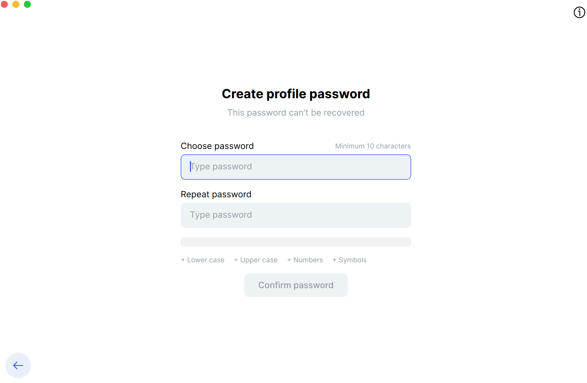

After a successful login, the decentralized messenger service is automatically started so the account can send and receive messages.

An account can also be recovered if the [`mnemonic`](https://status.app/help/profile/understand-your-status-keys-and-recovery-phrase#about-your-recovery-phrase) is passed.

| Name | Type | Required | Description |
|-----|-----|-----|-------------|
| `password` | `str` | Yes | Password used to encrypt the account |
| `key_uid` | `str` | Yes* | Unique key identifier of the account. If provided, the account will be logged in directly using this identifier. If not provided, then you must use `display_name` and `password` to login. |
| `name` | `str` | Yes* | Display name or [ENS name](https://status.app/help/profile/transfer-your-ens-name-to-status) of the account. Used to resolve the `key_uid` if it is not provided, or to create a new account if one does not already exist. This field is required if an account needs to be recovered with `mnemonic`. |
| `mnemonic` | `str` | No | The [mnemonic](https://status.app/help/profile/understand-your-status-keys-and-recovery-phrase#about-your-recovery-phrase) from [`info`](./account.md#info). Use this field with `password` and `display_name` to recover the account. If you have [`.bkp`](./account.md#backup) files, in the backup Docker volume they will be automatically picked up and loaded.<br><br>**Note**: You can pass a different `display_name` but that will be internal only. When an account is recovered setting [`display_name`](./account.md#display_name) can be buggy. Ideally when recovering the account, use the original `display_name` of the account. |
| `infura_token` | `str` | No | [RPC token](https://www.infura.io/) used by Status Backend for the Ethereum RPC component of the wallet. |
| `alchemy_token` | `str` | No | Used to fetch [wallet transactions](./account.md#get_transactionsrefreshfalse) to fetch wallet transaction history via the Alchemy REST API, so no separate key is needed for transactions. |
| `coingecko_api_key` | `str` | No | [API key](https://www.coingecko.com/) used by Status Backend to fetch token prices. |

Wallet functionality is split into three components, each backed by a token: Ethereum RPC (`infura_token`), transactions (`alchemy_token`) and prices (`coingecko_api_key`). All three must be provided for wallet RPC methods to work - if any is missing, wallet calls raise a `WalletNotConfiguredError`.

Returns the current `Account` instance, allowing method chaining.

#### Login with Display name
```python
from status_sdk import Account

account = Account()
params = {
    "name": "status-app-bot",
    "password": "SNTPUMP"
}
account.login(**params)
```

The code above is equivalent to the following screen on Status App:

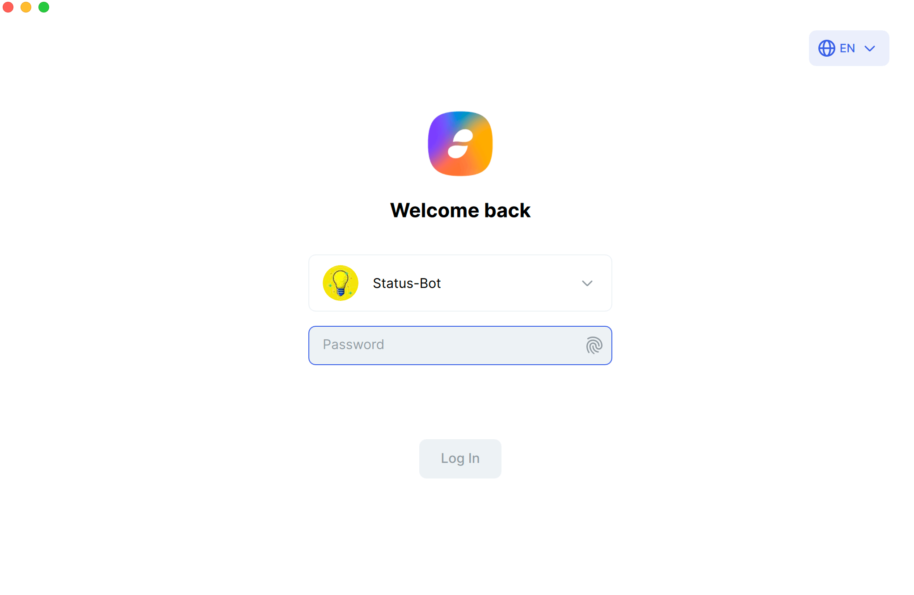

**Note**: This assumes that `display_name` and is unique for every `key_uid`. If there are duplicated `display_names` then the first found match will be used. You can log in with `key_uid` if you have `display_name` duplicates.

#### Login with ENS

```python
from status_sdk import Account

account = Account()
params = {
    "name": "malte.stateofus.eth",
    "password": "SNTPUMP"
}
account.login(**params)
```

You can purchase a **universal username** on Status App:

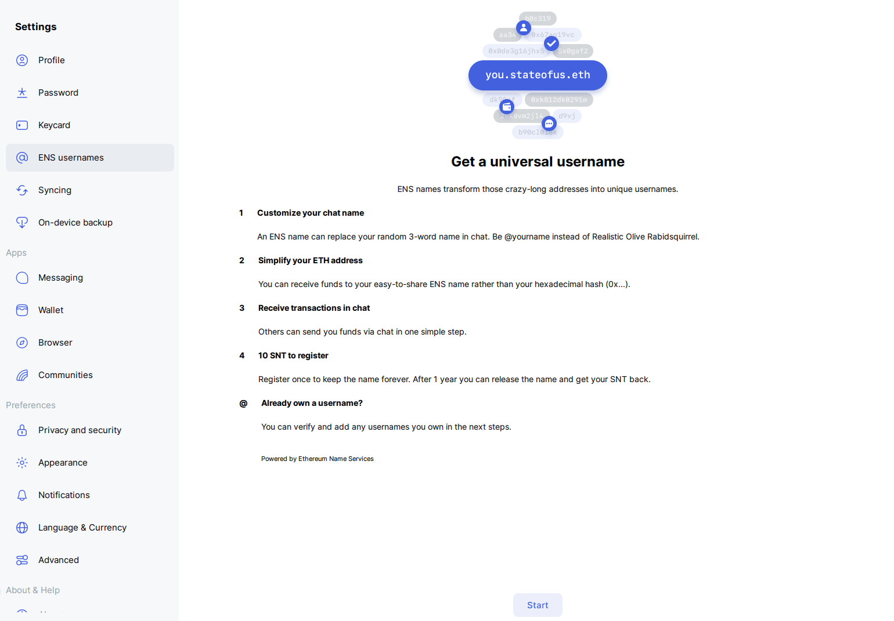


#### Login with `key_uid`

```python
from status_sdk import Account

account = Account()
params = {
    "key_uid": "0xff2c3...",
    "password": "SNTPUMP"
}
account.login(**params)
```

#### Recover account

```python
from status_sdk import Account

account = Account()
params = {
    "name": "status-app-bot",
    "password": "SNTPUMP",
    "mnemonic" : "phrase_1 phrase_2 phrase_3 phrase_4 phrase_5 phrase_6 phrase_7 phrase_8 phrase_9 phrase_10 phrase_11 phrase_12"
}
account.login(**params)
```

The code above is equivalent to the following screen on Status App:

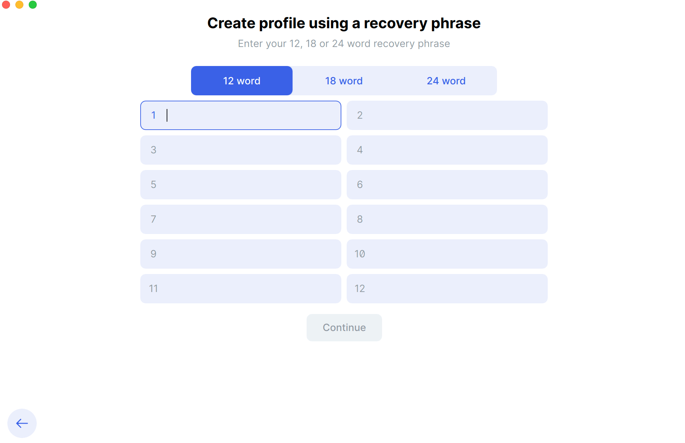

**Note**: When in recovery mode, the display name is updated on Status App as well so it is consistent locally and to other users.

#### Wallet setup

```python
from status_sdk import Account

account = Account()

params = {
    "name": "status-app-bot",
    "password": "SNTPUMP",
    "infura_token": "token from https://www.infura.io/",
    "alchemy_token": "token from https://www.alchemy.com/",
    "coingecko_api_key": "API key from https://www.coingecko.com/"
}
account.login(**params)
```

**Note**: `infura_token`, `alchemy_token` and `coingecko_api_key` can be used when creating, recovering and logging in to an account. All three are required to enable wallet functionality - if any is missing, those calls raise a `WalletNotConfiguredError`.

### `logout()`

Logout from the currently logged-in Status account. This method also clears the internal account state and stops the active messenger session. This function is also supported in `del` and when the script automatically finishes.

```python
from status_sdk import Account

account = Account()
params = {
    "name": "status-app-bot",
    "password": "SNTPUMP"
}
account.login(**params)

# Optional - even if not specified __del__ will log you out
account.logout()
```

Returns the current `Account` instance. This allows chaining additional operations if needed.

**Note**: Currently `logout` works for a single sign in and may break because it does not listen for [`signals`](./account.md#signal).

### `backup()`

Create a **local backup file** (`.bkp`) for the currently logged‑in account. The backup is generated by the Status Backend and stored inside the configured Docker backup volume. Each file is uniquely associated with an account. If the backup creation fails, an **exception will be raised**.

Returns `str` representing the **Docker path** of the generated backup file. The returned path refers to the **Docker container path** where the backup was created. If the backup directory is mounted as a Docker volume, the file will also appear on the host machine in the mapped folder.

The filename is generated by the Status Backend and follows the pattern `<suffix>_user_data.bkp`, where `<suffix>` is the **last 6 characters of the account's compressed public key**. For example, an account whose compressed key ends in `abc123` produces `abc123_user_data.bkp`. Because the suffix is derived deterministically from the account's key, the same account always maps to the same filename, which is how a backup is uniquely associated with its account.

```python
from status_sdk import Account

account = Account(backup_folder=r"C:\\Users\\me\\status-backups")
params = {
    "name": "status-app-bot",
    "password": "SNTPUMP"
}
account.login(**params)

backup_path = account.backup()
print(f"Backup created at: {backup_path}")
```

### `sync(installation_id, name=None)`

Pair another **device** with the account, so messages, contacts and settings are synced between them. This is the SDK equivalent of **Sync new device** in Status App - useful for running a remotely while keeping the same account on a phone or desktop. 

Each device that logs into an account is registered with the backend as an **installation**, identified by an `installation_id`. A device reports its own id under `installation_id` in [`info`](./account.md#info), so pairing means passing the **other** device's id to this method. Both devices must have logged in to the same Status account for the installation to be known to the backend.

| Name | Type | Required | Description |
|-----|-----|-----|-------------|
| `installation_id` | `str` | Yes | The id of the device to pair with. It is the value that device reports under `installation_id` in its own [`info`](./account.md#info). |
| `name` | `str` | No | The name of the paired device, so it is easier to recognise locally. When omitted, the device keeps whatever name it already has. |

Returns `None`. Passing the logged-in account's **own** `installation_id` is a **no-op**, so a device can safely loop over a list of ids without filtering itself out first.

```python
from status_sdk import Account

account = Account()
params = {
    "name": "status-app-bot",
    "password": "SNTPUMP"
}
account.login(**params)

# The id the other device reports under `installation_id` in its own `info`
account.sync("6a2f9c1e-...", "raspberry-pi")
```

**Note**: [`login`](./account.md#loginpassword-key_uidnone-display_namenone-mnemonicnone-infura_tokennone-alchemy_tokennone-coingecko_api_keynone) **deletes** every installation that is not enabled. A device that was never synced, or that was [unsynced](./account.md#unsyncinstallation_id), is therefore removed on the next login and has to be re-registered by logging in from that device again.

### `unsync(installation_id)`

Stop syncing with a device that was paired with [`sync`](./account.md#syncinstallation_id-namenone). The device stops receiving the account's messages, contacts and settings.

| Name | Type | Required | Description |
|-----|-----|-----|-------------|
| `installation_id` | `str` | Yes | The id of the device to stop syncing with, in the same format accepted by [`sync`](./account.md#syncinstallation_id-namenone). |

Returns `None`. As with [`sync`](./account.md#syncinstallation_id-namenone), passing the account's **own** `installation_id` is a **no-op** - an account cannot unsync itself. A custom exception is raised if the backend rejects the call.

```python
from status_sdk import Account

account = Account()
params = {
    "name": "status-app-bot",
    "password": "SNTPUMP"
}
account.login(**params)

account.unsync("6a2f9c1e-...")
```

**Note**: unsyncing only **disables** the installation, so it can be paired again with [`sync`](./account.md#syncinstallation_id-namenone) within the same session. It does not survive a restart though - the next [`login`](./account.md#loginpassword-key_uidnone-display_namenone-mnemonicnone-infura_tokennone-alchemy_tokennone-coingecko_api_keynone) deletes disabled installations, and the other device has to log in again before it can be synced.

### Chat

#### `send_message(chat_id, message, reply_to_message_id=None)`

Send a text message to a specific chat. A message can also be sent as a **reply** to an existing message in the same chat, which renders in Status App with the original message quoted above it - the same as replying to a message in the app.

A message can be **at most 2000 characters long**, matching the limit enforced by Status App. Sending a longer message raises a custom exception.

| Name | Type | Required | Description |
|-----|-----|-----|-------------|
| `chat_id` | `str` | Yes | Identifier of the chat where the message will be sent. All available chat IDs can be obtained from the [`chats`](./account.md#chats) property. |
| `message` | `str` | Yes | The text message to send. Cannot be longer than **2000 characters**. |
| `reply_to_message_id` | `str` | No | The `id` of the message being replied to. Message IDs can be obtained from the `id` key of [`get_messages`](./account.md#get_messageschat_id-start_timestampnone-end_timestampnone) or from a [`listen_messages`](./account.md#listen_messages) event. When omitted (default), the message is sent as a standalone message. |

Returns `str` - the `id` of the message that was just sent. It is the same identifier that appears under the `id` key in [`get_messages`](./account.md#get_messageschat_id-start_timestampnone-end_timestampnone), so it can be passed straight into [`delete_message`](./account.md#delete_messageid) or used as the `reply_to_message_id` of a follow-up message, without having to fetch the chat's messages first.

```python
from status_sdk import Account

account = Account()
params = {
    "name": "status-app-bot",
    "password": "SNTPUMP"
}
account.login(**params)

# This is under the assumption you already have a contact / joined a community
chat = account.chats[0]
message_id = account.send_message(chat["id"], "Hello from my Status bot!")
print(f"Sent message: {message_id}")
```

Reply to a message:

```python
from status_sdk import Account

account = Account()
params = {
    "name": "status-app-bot",
    "password": "SNTPUMP"
}
account.login(**params)

chat = account.chats[0]

# Messages are returned newest first, so this is the latest message in the chat
messages = account.get_messages(chat["id"])
latest = messages[0]

account.send_message(
    chat_id=chat["id"],
    message="Thanks for the update!",
    reply_to_message_id=latest["id"]
)
```

#### `send_image(chat_id, file_path, message=None, reply_to_message_id=None)`

Send an image to a specific chat, with an optional text message. The image renders inline in Status App, the same as attaching an image in the app. Like [`send_message`](./account.md#send_messagechat_id-message-reply_to_message_idnone), it can be sent as a **reply** to an existing message.

| Name | Type | Required | Description |
|-----|-----|-----|-------------|
| `chat_id` | `str` | Yes | Identifier of the chat where the image will be sent. All available chat IDs can be obtained from the [`chats`](./account.md#chats) property. |
| `file_path` | `str` | Yes | Local full path to the image file. |
| `message` | `str` | No | Caption sent together with the image. Cannot be longer than **2000 characters**. When omitted (default), the image is sent without any text. |
| `reply_to_message_id` | `str` | No | The `id` of the message being replied to. Message IDs can be obtained from the `id` key of [`get_messages`](./account.md#get_messageschat_id-start_timestampnone-end_timestampnone) or from a [`listen_messages`](./account.md#listen_messages) event. When omitted (default), the image is sent as a standalone message. |

Returns `str` - the `id` of the message that was just sent, exactly as [`send_message`](./account.md#send_messagechat_id-message-reply_to_message_idnone) does, so it can be passed straight into [`delete_message`](./account.md#delete_messageid) or used as the `reply_to_message_id` of a follow-up message.

```python
from status_sdk import Account

account = Account()
params = {
    "name": "status-app-bot",
    "password": "SNTPUMP"
}
account.login(**params)

# This is under the assumption you already have a contact / joined a community
chat = account.chats[0]
message_id = account.send_image(chat["id"], "/full/file-path/meme-67.png")
print(f"Sent image: {message_id}")
```

Send an image with a caption:

```python
from status_sdk import Account

account = Account()
params = {
    "name": "status-app-bot",
    "password": "SNTPUMP"
}
account.login(**params)

chat = account.chats[0]

account.send_image(
    chat_id=chat["id"],
    file_path="/full/file-path/meme-67.png",
    message="Du bist gut genug"
)
```

Reply to a message with an image:

```python
from status_sdk import Account

account = Account()
params = {
    "name": "status-app-bot",
    "password": "SNTPUMP"
}
account.login(**params)

chat = account.chats[0]

# Messages are returned newest first, so this is the latest message in the chat
messages = account.get_messages(chat["id"])
latest = messages[0]

account.send_image(
    chat_id=chat["id"],
    file_path="/full/file-path/meme-67.png",
    message="Du bist gut genug",
    reply_to_message_id=latest["id"]
)
```

#### `send_emoji_reaction(message_id, emoji_shortname, chat_id=None)`

React to a message with an emoji, the same as reacting to a message in Status App. The reaction is a **toggle** - calling the method again with the same emoji on the same message removes it, so the same call both sets and unsets the reaction.

Emojis are identified by their **shortname**, exactly as Status App names them (`:thumbsup:`, `:heart_eyes:`). The surrounding colons are optional - `thumbsup` and `:thumbsup:` are the same emoji - and the full list of supported shortnames is documented under [Emojis](./utils.md#emojis).

Passing `chat_id` is purely an **optimisation**. Without it the chat has to be resolved from the message first, which costs one extra round trip to the Status Backend per reaction - worth avoiding when reacting to many messages in a chat that is already known, such as inside a [`listen_messages`](./account.md#listen_messages) loop. A `chat_id` that does not match the message is rejected by the backend and raises a custom exception, so pass it only when it is certain.

| Name | Type | Required | Description |
|-----|-----|-----|-------------|
| `message_id` | `str` | Yes | The `id` of the message to react to. Message IDs can be obtained from the `id` key of [`get_messages`](./account.md#get_messageschat_id-start_timestampnone-end_timestampnone), from the `lastMessage` of a [`listen_messages`](./account.md#listen_messages) event, or directly from the return value of [`send_message`](./account.md#send_messagechat_id-message-reply_to_message_idnone) / [`send_image`](./account.md#send_imagechat_id-file_path-messagenone-reply_to_message_idnone). |
| `emoji_shortname` | `str` | Yes | The emoji shortname as in Status App, with or without the surrounding colons. See [Emojis](./utils.md#emojis) for all supported values. |
| `chat_id` | `str` | No | Identifier of the chat the message belongs to, as found in the [`chats`](./account.md#chats) property. When omitted (default), it is resolved from `message_id` with an extra call to the Status Backend. |

```python
from status_sdk import Account

account = Account()
params = {
    "name": "status-app-bot",
    "password": "SNTPUMP"
}
account.login(**params)

chat = account.chats[0]

# Messages are returned newest first, so this is the latest message in the chat
messages = account.get_messages(chat["id"])
latest = messages[0]

account.send_emoji_reaction(latest["id"], ":thumbsup:")

# Reacting with the same emoji again removes the reaction
account.send_emoji_reaction(latest["id"], ":thumbsup:")
```

#### `get_messages(chat_id, start_timestamp=None, end_timestamp=None)`

Retrieve messages from the specified chat within an optional time range. Messages are returned in **descending order** (newest to oldest). The method automatically paginates through the backend until all messages in the specified range are collected. This method is ideal for backfilling, [batch processing](https://aws.amazon.com/what-is/batch-processing/) or [micro batch processing](https://www.dremio.com/wiki/micro-batch-processing/).

Messages can be fetched from:
- **Direct messages** - current contacts and contacts that were later removed
- **Community channels** - the bot must have read access from the admin

| Name | Type | Required | Description |
|-----|-----|-----|-------------|
| `chat_id` | `str` | Yes | Identifier of the chat. All available chat IDs can be obtained from the [`chats`](./account.md#chats) property. |
| `start_timestamp` | `str`<br>`datetime.date`<br>`datetime.datetime`<br>`pandas.Timestamp` | No | The earliest timestamp to include. Messages older than this value will stop the fetch process. |
| `end_timestamp` | `str`<br>`datetime.date`<br>`datetime.datetime`<br>`pandas.Timestamp` | No | The latest timestamp to include. Messages newer than this value will be skipped. |

Returns `list[dict]` containing message objects. Timestamp fields returned by the backend are automatically converted into `datetime.datetime` objects.

```python
from status_sdk import Account
import datetime

account = Account()
params = {
    "name": "status-app-bot",
    "password": "SNTPUMP"
}
account.login(**params)

chat = account.chats[0]

messages = account.get_messages(
    chat_id=chat["id"],
    start_timestamp=datetime.datetime(2024, 1, 1)
)

for message in messages:
    print(f"{message['timestamp']}\t{message['text']}")
```

**Note**: If there are missing messages in a chat that might be because the node (Status Backend) has not received them yet. They may appear later.

**Timestamps**

Both timestamps also accept a plain `str`, so a range can be written out without building a `datetime.datetime` first. The **time is optional** and can be given with any precision - the missing parts default to zero, meaning that `2026-08-11` is read as `2026-08-11 00:00:00`. A `datetime.date` carries no time at all and is moved to midnight the same way.

| Format | Example |
|-----|-----|
| `YYYY-MM-DD HH:MM:SS.ffffff` | `2026-08-11 22:57:51.134000` |
| `YYYY-MM-DD HH:MM:SS` | `2026-08-11 22:57:51` |
| `YYYY-MM-DD HH:MM` | `2026-08-11 22:57` |
| `YYYY-MM-DD HH` | `2026-08-11 22` |
| `YYYY-MM-DD` | `2026-08-11` |

Both `T` and a space are accepted as the date / time separator, so `2026-08-11T22:57:51` and `2026-08-11 22:57:51` are the same timestamp.

#### `delete_message(id)`

Delete one of your **own** messages from a chat. The deletion is propagated to the other members of the chat, so the message disappears for everybody - the same as deleting a message in Status App.

You can only delete messages that the logged-in account has sent. Messages sent by other accounts cannot be deleted, even in a [group chat](./group-chat.md) where the account is the [administrator](./group-chat.md#administrator).

| Name | Type | Required | Description |
|-----|-----|-----|-------------|
| `id` | `str` | Yes | The `id` of the message to delete. Message IDs can be obtained from the `id` key of [`get_messages`](./account.md#get_messageschat_id-start_timestampnone-end_timestampnone), or directly from the return value of [`send_message`](./account.md#send_messagechat_id-message-reply_to_message_idnone). |

Returns `bool`.

| Value | Meaning |
|------|--------|
| `True` | The message was deleted. |
| `False` | The message was not deleted, because the account does not have permission to delete it. |

```python
from status_sdk import Account

account = Account()
params = {
    "name": "status-app-bot",
    "password": "SNTPUMP"
}
account.login(**params)

chat = account.chats[0]
message_id = account.send_message(chat["id"], "Oops, this was a mistake!")

deleted = account.delete_message(message_id)
print(f"Deleted: {deleted}")
```

#### `listen_messages()`

Listen for new incoming messages **in real time**. This method yields raw message events as they are received from the Status Backend [signal](./account.md#signallisten) `messages.new`. This method is ideal for developing real time chat applications

```python
from status_sdk import Account

account = Account()
params = {
    "name": "status-app-bot",
    "password": "SNTPUMP"
}
account.login(**params)

for msg in account.listen_messages():
    print(msg)
```

**Note**: If you receive multiple messages at once, `contacts` and `chats` will grow.

#### `listen_contact_requests()`

Listen for contact requests **in real time**. Both **incoming** contact requests sent to the account and contact requests sent by the account that were **accepted** by the other user are yielded. Every yielded event carries a `request_type` key that tells the two apart:

| `request_type` | Meaning |
|-----|-----|
| `incoming` | Another user sent a contact request to the account. Approve it with [`add_contact`](./account.md#add_contactpublic_key-display_namenone). |
| `accepted` | Another user accepted a contact request that the account had sent. The contact is now mutual. |

```python
from status_sdk import Account

account = Account()
params = {
    "name": "status-app-bot",
    "password": "SNTPUMP"
}
account.login(**params)

for request in account.listen_contact_requests():
    print(request)
```

Handle each type separately:

```python
from status_sdk import Account

account = Account()
params = {
    "name": "status-app-bot",
    "password": "SNTPUMP"
}
account.login(**params)

for request in account.listen_contact_requests():
    if request["request_type"] == "incoming":
        print("New contact request received")
    elif request["request_type"] == "accepted":
        print("Contact request was accepted")
```

#### `listen_message_mentions()`

Listen for `@0x...` mentions **in real time**. 

```python
from status_sdk import Account

account = Account()
params = {
    "name": "status-app-bot",
    "password": "SNTPUMP"
}
account.login(**params)

for mention in account.listen_message_mentions():
    print(mention)
```

#### `add_contact(public_key, display_name=None)`

Send a contact request or approve an existing contact request. The mode depends on how the contact shows up in [`contacts`](./account.md#contacts). Best practice would be to look at the the following [`contacts`](./account.md#contacts) keys:

- `has_added_us` - `bool` value to check if the other user has added the account as a friend
- `added` - `bool` value to check if the account has added the other user as a friend
- `mutual` - `bool` value to check if the account and other user are in contacts
- `contact_state` - `str` value to see the account's current state
- `external_contact_state` - `str` value to see the other user's state as it is in your node

Modes:

- **Approve mode** - `has_added_us` is `True` and `added` is `False`
- **Add mode** - `has_added_us` is `False`

The contact can be identified in three different ways, so you can pass whichever value you have at hand - the public key, the chat key as shown in Status App, or the profile link a user shares with you:

| Format | Example | Where to find it |
|-------|--------|-----------------|
| **Public key** | `0x04ebcad...` | `public_key` in [`contacts`](./account.md#contacts) / [`info`](./account.md#info) |
| **Chat key** (compressed key) | `zQ3shYSHp7...` | `compressed_key` in [`contacts`](./account.md#contacts) / [`info`](./account.md#info), or the **chat key** in Status App |
| **Account URL** | `https://status.app/u/...` | `url` in [`contacts`](./account.md#contacts) / [`info`](./account.md#info), or **Share profile** in Status App |

When an account URL is passed, the public key is resolved from it automatically before the contact request is sent, so the contact is always added with the same identity regardless of which format you used.

| Name | Type | Required | Description |
|-----|-----|-----|-------------|
| `public_key` | `str` | Yes | The contact's Status **public key** (`0x...`), **chat key** (`zQ...`) or **account URL** (`https://...`). |
| `display_name` | `str` | Yes / No | Display name for the contact. If the contact already exists in [`contacts`](./account.md#contacts), the `display_name` parameter is optional and the existing name will be reused. If the contact has **never interacted with the bot before**, `display_name` must be provided so the contact can be created locally. |

Returns the current `Account` instance, allowing method chaining.

```python
from status_sdk import Account

account = Account()
params = {
    "name": "status-app-bot",
    "password": "SNTPUMP"
}
account.login(**params)

# Send a contact request
account.add_contact(
    public_key="0x04ebcad...",
    display_name="status-enjoyer"
)
```

Add a contact with their **chat key**:

```python
from status_sdk import Account

account = Account()
params = {
    "name": "status-app-bot",
    "password": "SNTPUMP"
}
account.login(**params)

# Send a contact request
account.add_contact(
    public_key="zQ3shYSHp7...",
    display_name="status-enjoyer"
)
```

Add a contact with their **account URL**:

```python
from status_sdk import Account

account = Account()
params = {
    "name": "status-app-bot",
    "password": "SNTPUMP"
}
account.login(**params)

# Send a contact request
account.add_contact(
    public_key="https://status.app/u/...",
    display_name="status-enjoyer"
)
```

#### `remove_contact(public_key)`

Remove a contact or decline a pending contact request. The mode depends on how the contact shows up in [`contacts`](./account.md#contacts). Best practice would be to look at the the following [`contacts`](./account.md#contacts) keys:

- `has_added_us` - `bool` value to check if the other user has added the account as a friend
- `added` - `bool` value to check if the account has added the other user as a friend
- `mutual` - `bool` value to check if the account and other user are in contacts
- `contact_state` - `str` value to see the account's current state
- `external_contact_state` - `str` value to see the other user's state as it is in your node

Modes:

- **Remove** - `has_added_us` is `True` and `added` is `True`
- **Reject mode** - `has_added_us` is `True`

Just like [`add_contact`](./account.md#add_contactpublic_key-display_namenone), the contact can be identified in three different ways:

| Format | Example | Key in [`contacts`](./account.md#contacts) |
|-------|--------|-----------------|
| **Public key** | `0x04ebcad...` | `public_key` |
| **Chat key** (compressed key) | `zQ3shYSHp7...` | `compressed_key` |
| **Account URL** | `https://status.app/u/...` | `url` |

Whichever format is used, the value is matched against [`contacts`](./account.md#contacts) - so it must belong to a user that has already interacted with the account.

| Name | Type | Required | Description |
|-----|-----|-----|-------------|
| `public_key` | `str` | Yes | The contact's Status **public key** (`0x...`), **chat key** (`zQ...`) or **account URL** (`https://...`). All three values correspond to the ones exposed in [`contacts`](./account.md#contacts). |

Returns `bool`.

| Value | Meaning |
|------|--------|
| `True` | The contact was successfully removed or the request was declined. |
| `False` | The contact does not exist or was already removed. |

```python
from status_sdk import Account

account = Account()
params = {
    "name": "status-app-bot",
    "password": "SNTPUMP"
}
account.login(**params)

# NOTE: contacts are returned as a dict for 
# internal class checks and scalability
contact = list(account.contacts.values())[0]

removed = account.remove_contact(contact["public_key"])
print(f"Removed: {removed}")
```

#### `block_contact(public_key)`

Block a user, the same as **Block user** in Status App. Once blocked, the Status Backend stops surfacing that user's messages and contact requests to the account.

Just like [`add_contact`](./account.md#add_contactpublic_key-display_namenone), the contact can be identified in three different ways:

| Format | Example | Key in [`contacts`](./account.md#contacts) |
|-------|--------|-----------------|
| **Public key** | `0x04ebcad...` | `public_key` |
| **Chat key** (compressed key) | `zQ3shYSHp7...` | `compressed_key` |
| **Account URL** | `https://status.app/u/...` | `url` |

| Name | Type | Required | Description |
|-----|-----|-----|-------------|
| `public_key` | `str` | Yes | The contact's Status **public key** (`0x...`), **chat key** (`zQ...`) or **account URL** (`https://...`). The value is normalised with [`get_public_key`](./account.md#get_public_keyvalue) before the call. |


```python
from status_sdk import Account

account = Account()
params = {
    "name": "status-app-bot",
    "password": "SNTPUMP"
}
account.login(**params)

contact = list(account.contacts.values())[0]
account.block_contact(contact["public_key"])
```

Block a user from a chat key:

```python
from status_sdk import Account

account = Account()
params = {
    "name": "status-app-bot",
    "password": "SNTPUMP"
}
account.login(**params)

account.block_contact("zQ3shYSHp7...")
```

#### `unblock_contact(public_key)`

Unblock a previously [blocked](./account.md#block_contactpublic_key) user, the same as **Unblock user** in Status App. Their messages and contact requests reach the account again. The value is accepted in the same three formats as [`block_contact`](./account.md#block_contactpublic_key) and normalised with [`get_public_key`](./account.md#get_public_keyvalue).

| Name | Type | Required | Description |
|-----|-----|-----|-------------|
| `public_key` | `str` | Yes | The contact's Status **public key** (`0x...`), **chat key** (`zQ...`) or **account URL** (`https://...`). |


```python
from status_sdk import Account

account = Account()
params = {
    "name": "status-app-bot",
    "password": "SNTPUMP"
}
account.login(**params)

account.unblock_contact("0x04ebcad...")

# Unblocking alone does not make them a contact again
account.add_contact("0x04ebcad...", display_name="status-enjoyer")
```

#### `get_public_key(value)`

Normalise any of the three account identifiers into a **public key** (`0x...`). This normalisation is used internally by the library as well, so methods that accept a contact identifier work the same regardless of which format is passed.

The behaviour depends on the format of `value`:

| Format | Example | Behaviour |
|-------|--------|-----------|
| **Public key** | `0x04ebcad...` | Returned as is - no backend call is made. |
| **Chat key** (compressed key) | `zQ3shYSHp7...` | Uncompressed by Status Backend into the public key. |
| **Account URL** | `https://status.app/u/...` | The chat key is parsed out of the URL and then uncompressed into the public key. |

| Name | Type | Required | Description |
|-----|-----|-----|-------------|
| `value` | `str` | Yes | The **public key** (`0x...`), **chat key** (`zQ...`) or **account URL** (`https://...`) to resolve. All three values correspond to the `public_key`, `compressed_key` and `url` keys in [`contacts`](./account.md#contacts) / [`info`](./account.md#info). |

Returns `str` representing the account's **public key**, always prefixed with `0x`.

```python
from status_sdk import Account

account = Account()
params = {
    "name": "status-app-bot",
    "password": "SNTPUMP"
}
account.login(**params)

# All three return the same public key
for key in ["public_key", "url", "compressed_key"]:
    value = account.info[key]
    print(f"\n{key}: {value}\nkey: {account.get_public_key(value)}\n")
```

Look up a contact when all you have is a shared profile link:

```python
from status_sdk import Account

account = Account()
params = {
    "name": "status-app-bot",
    "password": "SNTPUMP"
}
account.login(**params)

public_key = account.get_public_key("https://status.app/u/...")
# contacts are keyed by public key
contact = account.contacts.get(public_key)
if contact:
    print(contact["display_name"], contact["contact_state"])
```

**Note**: An **exception will be raised** when:
- `value` does not start with `0x`, `zQ` or `http` (`PublicKeyError`)
- the chat key cannot be uncompressed by Status Backend (`PublicKeyError`)
- the URL cannot be parsed, or it is a **community / channel URL** rather than an account URL (`InvalidContactError`)

### Wallet

#### `get_tokens()`

Retrieve all tokens available in Status Backend across all supported chains.

Returns `pd.DataFrame`.


| Column | Type | Description |
|--------|------|-------------|
| `chain_id` | `int` | Chain ID where the token exists. Matches values from [`chains`](./account.md#chains). |
| `address` | `str` | Token contract address. |
| `symbol` | `str` | Token symbol (e.g. `ETH`, `USDT`). |
| `decimals` | `int` | Number of decimals used for the token. |
| `cross_chain_id` | `str`<br>`None` | Cross-chain identifier (if available). |
| `source_id` | `str` | Source list from which the token was fetched. |

```python
from status_sdk import Account

account = Account()

params = {
    "name": "status-app-bot",
    "password": "SNTPUMP",
    "infura_token": "token from https://www.infura.io/",
    "alchemy_token": "token from https://www.alchemy.com/",
    "coingecko_api_key": "API key from https://www.coingecko.com/"
}
account.login(**params)
available_tokens = account.get_tokens()
```

#### `get_balance(token_addresses, chain_ids=1, wallets=None, ccy=None)`

Retrieve token balances for one or more wallets across specified chains. This method supports querying multiple tokens, chains, and wallets. Balances are adjusted using token decimals. Optionally, values can be converted to fiat currencies.

Returns `pd.DataFrame`.

| Column | Type | Description |
|--------|------|-------------|
| `timestamp` | `datetime.datetime` | Timestamp when the balance was fetched. |
| `wallet_address` | `str` | Wallet address for which the balance was retrieved. |
| `token_address` | `str` | Token contract address. |
| `token_symbol` | `str` | Token symbol (e.g. `ETH`, `USDT`). |
| `amount` | `float` | Token balance (adjusted using token decimals). |
| `chain_id` | `int` | Chain ID where the token exists. |
| `ccy` | `str` | Fiat currency (only present if `ccy` is provided). |
| `price` | `float` | Token price **for 1 `token_symbol`** in the given fiat currency (only present if `ccy` is provided). If you want to get the amount in the wallet, you must `amount * price`. |

```python
from status_sdk import Account

account = Account()

params = {
    "name": "status-app-bot",
    "password": "SNTPUMP",
    "infura_token": "token from https://www.infura.io/",
    "alchemy_token": "token from https://www.alchemy.com/",
    "coingecko_api_key": "API key from https://www.coingecko.com/"
}
account.login(**params)

token_mapping = {
    'ETH': '0x0000000000000000000000000000000000000000',
    'SNT': '0x744d70fdbe2ba4cf95131626614a1763df805b9e',
    'USDT': '0xdac17f958d2ee523a2206206994597c13d831ec7',
    'CELO': '0x9b88d293b7a791e40d36a39765ffd5a1b9b5c349'
}
token_addresses = list(token_mapping.values())
# Returns data for logged in wallet
data = account.get_balance(token_addresses)
```

Access multuple chains:

```python
from status_sdk import Account

account = Account()

params = {
    "name": "status-app-bot",
    "password": "SNTPUMP",
    "infura_token": "token from https://www.infura.io/",
    "alchemy_token": "token from https://www.alchemy.com/",
    "coingecko_api_key": "API key from https://www.coingecko.com/"
}
account.login(**params)

token_mapping = {
    'ETH': '0x0000000000000000000000000000000000000000',
    'SNT': '0x744d70fdbe2ba4cf95131626614a1763df805b9e',
    'USDT': '0xdac17f958d2ee523a2206206994597c13d831ec7',
    'CELO': '0x9b88d293b7a791e40d36a39765ffd5a1b9b5c349'
}
token_addresses = list(token_mapping.values())
chain_ids = [1, 10] # Can be a single int value as well
# Returns data for logged in wallet
data = account.get_balance(token_addresses, chain_ids)
```

Access multiple wallets:

```python
from status_sdk import Account

account = Account()

params = {
    "name": "status-app-bot",
    "password": "SNTPUMP",
    "infura_token": "token from https://www.infura.io/",
    "alchemy_token": "token from https://www.alchemy.com/",
    "coingecko_api_key": "API key from https://www.coingecko.com/"
}
account.login(**params)

token_mapping = {
    'ETH': '0x0000000000000000000000000000000000000000',
    'SNT': '0x744d70fdbe2ba4cf95131626614a1763df805b9e',
    'USDT': '0xdac17f958d2ee523a2206206994597c13d831ec7',
    'CELO': '0x9b88d293b7a791e40d36a39765ffd5a1b9b5c349'
}
token_addresses = list(token_mapping.values())
chain_ids = [1, 10] # Can be a single int value as well

vitalik_address = "0xd8dA6BF26964aF9D7eEd9e03E53415D37aA96045"
bot_wallet = account.info["wallet_address"]
wallets = [bot_wallet, vitalik_address]

data = account.get_balance(token_addresses, chain_ids, wallets)
```

Get token prices:

```python
from status_sdk import Account

account = Account()

params = {
    "name": "status-app-bot",
    "password": "SNTPUMP",
    "infura_token": "token from https://www.infura.io/",
    "alchemy_token": "token from https://www.alchemy.com/",
    "coingecko_api_key": "API key from https://www.coingecko.com/"
}
account.login(**params)

token_mapping = {
    'ETH': '0x0000000000000000000000000000000000000000',
    'SNT': '0x744d70fdbe2ba4cf95131626614a1763df805b9e',
    'USDT': '0xdac17f958d2ee523a2206206994597c13d831ec7',
    'CELO': '0x9b88d293b7a791e40d36a39765ffd5a1b9b5c349'
}
token_addresses = list(token_mapping.values())
chain_ids = [1, 10] # Can be a single int value as well

vitalik_address = "0xd8dA6BF26964aF9D7eEd9e03E53415D37aA96045"
bot_wallet = account.info["wallet_address"]
wallets = [bot_wallet, vitalik_address] # Can be a single str value as well
ccy = ["GBP", "USD"] # Can be a single str value as well

data = account.get_balance(token_addresses, chain_ids, wallets, ccy)
```

#### `get_market(token_addresses, chain_ids=1, ccy="USD")`

Retrieve market data for one or more tokens across specified chains. 

Returns `pd.DataFrame`.

| Column | Type | Description |
|--------|------|-------------|
| `timestamp` | `datetime.datetime` | Timestamp when the market data was fetched. |
| `chain_id` | `int` | Chain ID where the token exists. |
| `token_address` | `str` | Token contract address. |
| `token_symbol` | `str` | Token symbol (e.g. `ETH`, `USDT`). |
| `fiat_ccy` | `str` | Fiat currency used for the market data. |
| `market_cap` | `float` | Total market capitalization of the token. |
| `high_price` | `float` | Highest price in the last 24 hours. |
| `low_price` | `float` | Lowest price in the last 24 hours. |
| `pnl_24hr` | `float` | Absolute price change over the last 24 hours. |
| `pct_change` | `float` | Percentage price change (day-level). |
| `pct_change_1hr` | `float` | Percentage price change over the last hour. |
| `pct_change_24hr` | `float` | Percentage price change over the last 24 hours. |


#### `get_transactions(refresh=False)`

Retrieve the historical transactions for the **logged-in account wallet** across all chains in [`chains`](./account.md#chains). Data is fetched from the [Alchemy REST API](https://www.alchemy.com/) using the `alchemy_token` provided during [`login`](./account.md#loginpassword-key_uidnone-display_namenone-mnemonicnone-infura_tokennone-alchemy_tokennone-coingecko_api_keynone) and combines three transaction types into a single `DataFrame`: regular transactions (`transaction`), internal transactions (`internal`) and ERC-20 token transfers (`ERC-20`).

| Name | Type | Required | Description |
|-----|-----|-----|-------------|
| `refresh` | `bool` | No | When `True`, the full transaction history is refetched from Alchemy and the cache is replaced. When `False` (default), the cached `DataFrame` from the first call is returned. |

Returns `pd.DataFrame`, sorted by `timestamp` in descending order (newest first).

| Column | Type | Description |
|--------|------|-------------|
| `timestamp` | `datetime.datetime` | Block timestamp when the transaction was confirmed. |
| `trx_type` | `str` | Type of transaction: `transaction` (regular EOA call), `internal` (contract-initiated transfer) or `ERC-20` (token transfer). |
| `trx_hash` | `str` | Unique transaction hash. Can be appended to `https://etherscan.io/tx/` to inspect the transaction on Etherscan. |
| `from_address` | `str` | Wallet address that initiated the transaction. |
| `to_address` | `str` | Wallet address that received the transaction. |
| `movement` | `str` | `sent` if the wallet has made the transaction, otherwise `received`. |
| `token_address` | `str` | Token contract address. |
| `token_symbol` | `str` | Token symbol (e.g. `ETH`, `SNT`, `USDT`). |
| `amount` | `float` | Decimal-adjusted transaction amount. **Negative** when `movement` is `sent`, **positive** when `received`. |
| `is_error` | `bool` | `True` if the transaction failed on-chain. |
| `chain_id` | `int` | Chain ID where the transaction occurred. Matches values from [`chains`](./account.md#chains). |
| `decimals` | `int` | Number of decimals used to scale `amount`. Defaults to `18` for native-token transfers. |
| `trx_fee` | `float` | Gas fee paid in the chain's native token, computed as `gas_price * gas_used / 10**18`. Populated only for `sent` rows; `0` for `received` rows since the receiver does not pay gas. |

```python
from status_sdk import Account

account = Account()

params = {
    "name": "status-app-bot",
    "password": "SNTPUMP",
    "infura_token": "token from https://www.infura.io/",
    "alchemy_token": "token from https://www.alchemy.com/",
    "coingecko_api_key": "API key from https://www.coingecko.com/"
}
account.login(**params)

transactions = account.get_transactions()
print(transactions.head().to_markdown(index=False))
```

Force a fresh fetch (e.g. after sending a new transaction with [`send_transaction`](./account.md#send_transactionaddress-symbol-amount-chain_id1)):

```python
transactions = account.get_transactions(refresh=True)
```

#### `send_transaction(address, symbol, amount, chain_id=1)`

Send crypto from the logged-in account's wallet to another wallet address on the same chain. This method supports both **ETH** and **ERC-20** tokens. The token can be identified either by its Status symbol (e.g. `ETH`, `SNT`, `USDT`) or by its contract address. Before broadcasting, the method validates that the token exists on the given chain and that the wallet holds enough balance for the requested `amount`.

| Name | Type | Required | Description |
|-----|-----|-----|-------------|
| `address` | `str` | Yes | The wallet address of the receiver. |
| `symbol` | `str` | Yes | Either a valid Status token symbol from [`get_tokens`](./account.md#get_tokens) or the token's contract address (must start with `0x`). |
| `amount` | `float` | Yes | The amount of the token to send. Must be less than or equal to the wallet's current balance for that token. |
| `chain_id` | `int` | No | Chain ID where the transaction will be broadcast. Defaults to `1` (Ethereum mainnet). All available chain IDs can be obtained from the [`chains`](./account.md#chains) property. |

Returns `str` representing the **transaction hash**. The hash can be appended to `https://etherscan.io/tx/` to monitor the transaction's progress. The transaction URL is also written to [`logger`](./account.md#logger) at `INFO` level. If the backend fails to broadcast and does not return a hash, `None` is returned instead.

Send ETH:

```python
from status_sdk import Account

account = Account()

params = {
    "name": "status-app-bot",
    "password": "SNTPUMP",
    "infura_token": "token from https://www.infura.io/",
    "alchemy_token": "token from https://www.alchemy.com/",
    "coingecko_api_key": "API key from https://www.coingecko.com/"
}
account.login(**params)

vitalik_address = "0xd8dA6BF26964aF9D7eEd9e03E53415D37aA96045"

tx_hash = account.send_transaction(
    address=vitalik_address,
    symbol="ETH",
    amount=0.01
)
print(f"Transaction: https://etherscan.io/tx/{tx_hash}")
```

Send an ERC-20 token by symbol:

```python
from status_sdk import Account

account = Account()

params = {
    "name": "status-app-bot",
    "password": "SNTPUMP",
    "infura_token": "token from https://www.infura.io/",
    "alchemy_token": "token from https://www.alchemy.com/",
    "coingecko_api_key": "API key from https://www.coingecko.com/"
}
account.login(**params)

vitalik_address = "0xd8dA6BF26964aF9D7eEd9e03E53415D37aA96045"

tx_hash = account.send_transaction(
    address=vitalik_address,
    symbol="SNT",
    amount=10
)
```

Send an ERC-20 token by contract address:

```python
from status_sdk import Account

account = Account()

params = {
    "name": "status-app-bot",
    "password": "SNTPUMP",
    "infura_token": "token from https://www.infura.io/",
    "alchemy_token": "token from https://www.alchemy.com/",
    "coingecko_api_key": "API key from https://www.coingecko.com/"
}
account.login(**params)

vitalik_address = "0xd8dA6BF26964aF9D7eEd9e03E53415D37aA96045"
snt_address = "0x744d70fdbe2ba4cf95131626614a1763df805b9e"

tx_hash = account.send_transaction(
    address=vitalik_address,
    symbol=snt_address,
    amount=10
)
```

Send on a different chain:

```python
from status_sdk import Account

account = Account()

params = {
    "name": "status-app-bot",
    "password": "SNTPUMP",
    "infura_token": "token from https://www.infura.io/",
    "alchemy_token": "token from https://www.alchemy.com/",
    "coingecko_api_key": "API key from https://www.coingecko.com/"
}
account.login(**params)

vitalik_address = "0xd8dA6BF26964aF9D7eEd9e03E53415D37aA96045"

tx_hash = account.send_transaction(
    address=vitalik_address,
    symbol="ETH",
    amount=0.01,
    chain_id=10 # Optimism
)
```

**Note**: This is a wallet method, so it requires `infura_token`, `alchemy_token` and `coingecko_api_key` to all be provided in [`login`](./account.md#loginpassword-key_uidnone-display_namenone-mnemonicnone-infura_tokennone-alchemy_tokennone-coingecko_api_keynone). If any is missing, a `WalletNotConfiguredError` is raised when this method is called.

**Note**: The sender and receiver must be on the **same chain**. Cross-chain transfers are not supported by this method - set `chain_id` to the chain where the funds currently exist.

**Note**: An **exception will be raised** when:
- the `symbol` (or contract address) does not exist on the given `chain_id`
- the token is not present in the logged-in wallet's balance
- the requested `amount` exceeds the current wallet balance

#### `swap_tokens(from_token, to_token, amount, chain_id=1)`

Swap one token for another on a single chain. The swap happens on a **single chain** - both `from_token` and `to_token` must exist on the given `chain_id`. Cross-chain swaps are not supported. Swaps are submitted with a fixed slippage tolerance of `0.5%`.  Each token can be identified either by its Status symbol (e.g. `ETH`, `SNT`, `USDT`) or by its contract address. Before submitting, the method validates that `from_token` exists in the wallet's balance and that the wallet holds enough of it for the requested `amount`.

| Name | Type | Required | Description |
|-----|-----|-----|-------------|
| `from_token` | `str` | Yes | The token to swap from. Either a valid Status token symbol from [`get_tokens`](./account.md#get_tokens) or the token's contract address (must start with `0x`). |
| `to_token` | `str` | Yes | The token to swap to. Either a valid Status token symbol from [`get_tokens`](./account.md#get_tokens) or the token's contract address (must start with `0x`). |
| `amount` | `float` | Yes | The amount of `from_token` to swap. Must be less than or equal to the wallet's current balance for that token. |
| `chain_id` | `int` | No | Chain ID where the swap will happen. Defaults to `1` (Ethereum mainnet). Both `from_token` and `to_token` must exist on this chain. All available chain IDs can be obtained from the [`chains`](./account.md#chains) property. |

Returns `str` representing the **transaction hash**. The hash can be appended to `https://etherscan.io/tx/` to monitor the swap's progress.  An **exception will be raised** when:
- either `from_token` or `to_token` is not available on the given `chain_id` (`InvalidTokenError`)
- both `from_token` and `to_token` are ERC-20 tokens, i.e. neither side is `ETH` (`InvalidTokenError`)
- `from_token` is not present in the logged-in wallet's balance, or the requested `amount` exceeds the current balance (`InvalidTokenError`)
- the Status Backend cannot build a swap route or the swap transaction fails (`BackendError`)

Swap **ETH** for an **ERC-20** token:

```python
from status_sdk import Account

account = Account()

params = {
    "name": "status-app-bot",
    "password": "SNTPUMP",
    "infura_token": "token from https://www.infura.io/",
    "alchemy_token": "token from https://www.alchemy.com/",
    "coingecko_api_key": "API key from https://www.coingecko.com/"
}
account.login(**params)

tx_hash = account.swap_tokens(
    from_token="ETH",
    to_token="SNT",
    amount=0.0001
)
print(f"Swap: https://etherscan.io/tx/{tx_hash}")
```

Swap **ERC-20** for an **ETH** token:

```python
from status_sdk import Account

account = Account()

params = {
    "name": "status-app-bot",
    "password": "SNTPUMP",
    "infura_token": "token from https://www.infura.io/",
    "alchemy_token": "token from https://www.alchemy.com/",
    "coingecko_api_key": "API key from https://www.coingecko.com/"
}
account.login(**params)

tx_hash = account.swap_tokens(
    from_token="USDC",
    to_token="ETH",
    amount=100
)
print(f"Swap: https://etherscan.io/tx/{tx_hash}")
```

Swap **ERC-20** for an **ERC-20** token:

```python
from status_sdk import Account

account = Account()

params = {
    "name": "status-app-bot",
    "password": "SNTPUMP",
    "infura_token": "token from https://www.infura.io/",
    "alchemy_token": "token from https://www.alchemy.com/",
    "coingecko_api_key": "API key from https://www.coingecko.com/"
}
account.login(**params)

tx_hash = account.swap_tokens(
    from_token="USDC",
    to_token="USDT",
    amount=0.01
)
print(f"Swap: https://etherscan.io/tx/{tx_hash}")
```

## Properties

### `available_accounts`

Returns all Status accounts that are **locally available** in the initialized data directory. These accounts are detected when the `Account` class is initialized.

This property is useful when you want to:
- inspect which accounts exist locally
- retrieve a `key_uid` for login
- display metadata about stored accounts

**You will have to know the passwords for the given `key_uid`.**

Returns `list[dict]`, one entry per locally available account.

| Key | Type | Description |
|----|----|-------------|
| `name` | `str` | The account's name. For accounts using an [ENS](https://status.app/help/profile/transfer-your-ens-name-to-status) name, this is the ENS name (e.g. `malte.stateofus.eth`). For accounts that do not have an ENS name, this will be their display name. |
| `is_ens` | `bool` | `True` when `display_name` is an ENS name (ends with `.eth`), otherwise `False`. Useful for telling apart plain display names from universal usernames. |
| `key_uid` | `str` | Internal Status key identifier for the account. Can be passed to [`login`](./account.md#loginpassword-key_uidnone-display_namenone-mnemonicnone-infura_tokennone-alchemy_tokennone-coingecko_api_keynone) as `key_uid`. |
| `created_at` | `datetime.datetime` | Timestamp when the account was created locally. |

```python
from status_sdk import Account
# For terminal readability only
from rich import print as rprint
from rich.pretty import Pretty

account = Account()

rprint(Pretty(account.available_accounts))
```

### `info`

Provides information about the currently logged-in account. If `login()` has not been called, accessing this property will raise an exception. Returns `dict` containing account metadata.

| Key | Type | Description |
|----|----|-------------|
| `public_key` | `str` | Public key that uniquely identifies the account. |
| `url` | `str` | The URL that can be shared with other users. |
| `emojis` | `str` | Emoji hash associated with the account identity. |
| `key_uid` | `str` | Internal Status key identifier for the account. |
| `compressed_key` | `str` | The chat key as it is in Status App. |
| `mnemonic` | `str` | Mnemonic phrase used to generate the account keys. |
| `display_name` | `str` | Display name of the account. |
| `password` | `str` | Password used to encrypt the account locally. |
| `wallet_address` | `str` | Ethereum wallet address associated with the account. |
| `installation_id` | `str` | Id of **this** device's installation. Pass it to another device's [`sync`](./account.md#syncinstallation_id-namenone) to pair the two. `None` if the backend did not return one. |
| `logged_in_timestamp` | `datetime.datetime` | Timestamp when the account successfully logged in. |

```python
from status_sdk import Account

account = Account()
params = {
    "name": "status-app-bot",
    "password": "SNTPUMP"
}
account.login(**params)

print(account.info)
```

### `display_name`

Get or update the current display name of the logged‑in account.

Returns `str` when reading the property.

```python
from status_sdk import Account

account = Account()
params = {
    "name": "status-app-bot",
    "password": "SNTPUMP"
}
account.login(**params)

# Get the current display name
print(account.display_name)
```

You can update the display name by assigning a new value:

```python
from status_sdk import Account

account = Account()
params = {
    "name": "status-app-bot",
    "password": "SNTPUMP"
}
account.login(**params)

# Change the display name
account.display_name = "status_bot_42"
print(account.display_name)
```

**Note**: Next time you login with the changed display name, you will have to put in the new display name, instead of the initial one.

### `bio`

Get or update the **bio** of the currently logged‑in account. The length of the bio (as in Status App) is 240 characters.

Returns `str` when reading the property.

```python
from status_sdk import Account

account = Account()
params = {
    "name": "status-app-bot",
    "password": "SNTPUMP"
}
account.login(**params)

# Read the current bio
print(account.bio)
```

The value assigned to `bio` will automatically be converted to a string before being sent to the backend. You can update the bio by assigning a new value:

```python
from status_sdk import Account

account = Account()
params = {
    "name": "status-app-bot",
    "password": "SNTPUMP"
}
account.login(**params)

# Update the bio
account.bio = "Monitoring Status communities and chats"
print(account.bio)
```

You can also **clear the bio** by deleting the property:

```python
from status_sdk import Account

account = Account()
params = {
    "name": "status-app-bot",
    "password": "SNTPUMP"
}
account.login(**params)

# Clears the bio - same as: 
# account.bio = ""
# account.bio = None
del account.bio
```

### `profile_picture`

Get or update the **profile picture** of the currently logged‑in account. The image is the same one shown on the user's profile in Status App.

Returns `PIL.Image.Image` when reading the property, or `None` if no profile picture has been set.

```python
from status_sdk import Account

account = Account()
params = {
    "name": "status-app-bot",
    "password": "SNTPUMP"
}
account.login(**params)

# Read the current profile picture
image = account.profile_picture
if image:
    image.show()
```

The file path assigned to `profile_picture` will be automatically set as the latest profile picture in Status App. If the given file does not exist or the extension is not supported, an **exception will be raised**. Supported image formats are `.jpg`, `.jpeg` and `.png`.

```python
from status_sdk import Account

account = Account()
params = {
    "name": "status-app-bot",
    "password": "SNTPUMP"
}
account.login(**params)

# Update the profile picture
account.profile_picture = "./full_path/to/my_image.png"
account.profile_picture.show()
```

When a new profile picture is set, any previous image in the **assets** folder is removed. The image is also copied into the Status Backend Docker volume so it is picked up by the backend when updating the account identity.

### `status`

Get or update the **presence status** of the currently logged‑in account. This is the same presence indicator shown next to the account in Status App, and it controls how the account appears to other users.

Returns `str` when reading the property - one of the options below. After a successful [`login`](./account.md#loginpassword-key_uidnone-display_namenone-mnemonicnone-infura_tokennone-alchemy_tokennone-coingecko_api_keynone), the status is automatically set to `on`.

The value is **case‑insensitive** and must be one of the following options:

| Option | Description |
|-------|-------------|
| `on` | **Always online**. The account is shown as online to other users. This is the default after login. |
| `auto` | **Automatic**. Status App decides the presence automatically based on activity. |
| `dnd` | **Do Not Disturb**. The account is shown as do not disturb. **This is experimental**. |
| `off` | **Inactive**. The account is shown as offline / inactive to other users. |

```python
from status_sdk import Account

account = Account()
params = {
    "name": "status-app-bot",
    "password": "SNTPUMP"
}
account.login(**params)

# Read the current status
print(account.status)
```

You can update the status by assigning a new value:

```python
from status_sdk import Account

account = Account()
params = {
    "name": "status-app-bot",
    "password": "SNTPUMP"
}
account.login(**params)

# Update the presence status
account.status = "off"
print(account.status)
```

**Note**: Assigning any value other than `on`, `auto`, `dnd` or `off` raises a custom exception. The comparison is case‑insensitive, so `ON` and `on` are equivalent.

### `signal`

The property exists in `Account` because signals require an **active logged‑in session**. Attempting to use signals before calling `login()` will raise an exception. Signals are low‑level events emitted by the Status Backend.

The property exposes the following methods:

- `signal.get()` - fetch a single event. If the event is not found, you may end up in an infinite loop.
- `signal.listen()` - stream events continuously. Example usage of this is found in [`listen_messages()`](./account.md#listen_messages)
- `signal.connect()` - open a persistent websocket connection that buffers **every** incoming signal in the background. Must be called before `expect()`.
- `signal.disconnect()` - tear down the persistent connection opened by `connect()`.
- `signal.expect()` - return a context manager that waits for one or more matching signals to arrive **after** you perform an action. This is the recommended way to make **async message calls**, since it removes the race conditions and infinite-loop risk of `get()`.

```python
from status_sdk import Account

account = Account()
params = {
    "name": "status-app-bot",
    "password": "SNTPUMP"
}
account.login(**params)

account.signal.connect()
with account.signal.expect("messages.new") as exp:
    account.send_message(chat_id, "hello")

# Available only after the `with` block exits
print(exp.result)

account.signal.disconnect()
```

**Note**: Some signals arrive faster than others - the Status Backend does not emit every signal type at the same speed (for example, a local `envelope.sent` confirmation typically arrives well before a `messages.new` event that depends on network propagation). Tune the `timeout` per signal type, and use `count` when an action is expected to produce multiple signals, rather than assuming they all land at once or in a fixed order.


### `logger`

Provides access to the internal **Python logger** for monitoring the lifecycle of the account and backend operations such as login, account creation, messenger startup, and recovery.

Returns `logging.Logger`.

Default logger configuration:

- **Name**: `status-bot`
- **Level**: `INFO`
- **Output**: standard output (terminal)

Example:

```python
from status_sdk import Account

account = Account()

print("Starting Status bot")
account.logger.warning("This is a warning")
account.logger.error("Something went wrong")
```

### Chat

#### `contacts`

This property returns contacts that have interacted with the account, including:

- active contacts.
- users who sent a contact request.
- users whose contact request was sent by the bot.
- contacts that were previously removed. If the contact is removed on both sides then it might disappear from the property.

The property always fetches the latest state directly from the Status Backend. The lifecycle is as follows:
  - `none` - no relationship
  - `sent` - request sent by this account
  - `received` - request received from another account
  - `mutual` - both users have added each other

Returns `dict[str, dict]` where the key is the contact's **public key**. This makes internal searching for account specific information faster. If you only have a contact's **chat key** or **account URL**, pass it through [`get_public_key`](./account.md#get_public_keyvalue) to get the key used in this property.

| Key | Type | Description |
|----|----|-------------|
| `public_key` | `str` | Public key that uniquely identifies the contact. |
| `url` | `str` | The URL that can be shared with other users. |
| `chat_id` | `str` | Chat identifier used for direct messaging. |
| `compressed_key` | `str` | Internal compressed key identifier used by Status Backend. |
| `emojis` | `str` | Emoji hash associated with the contact identity. |
| `contact_state` | `str` | Current state of the contact relationship (`none`, `mutual`, `sent`, `received`, `dismissed`). |
| `external_contact_state` | `str` | How the contact relationship appears from the other user's perspective. |
| `has_added_us` | `bool` | Whether the other user has added this account as a contact. |
| `added` | `bool` | Whether this account has added the other user as a contact. |
| `mutual` | `bool` | Whether both users have added each other. |
| `display_name` | `str` | The current display name of the contact. |
| `bio` | `str` | The contact's profile bio. |
| `last_updated` | `datetime.datetime` | Timestamp when the contact information was last updated. |

```python
from status_sdk import Account

account = Account()
params = {
    "name": "status-app-bot",
    "password": "SNTPUMP"
}
account.login(**params)

contacts = account.contacts

for contact in contacts.values():
    print(contact["display_name"], contact["contact_state"])
```

#### `communities`

Get all communities that the account is currently a member of. This property always fetches the **latest community state** directly from the Status Backend, so dynamic values such as community metadata and member count are always up to date.

Each community contains information about:

- community metadata (name, tags)
- membership status
- number of members
- every channel in the community, with the account's permissions on it

Returns `list[dict]` where each element represents a community.

| Key | Type | Description |
|----|----|-------------|
| `id` | `str` | Unique identifier of the community. |
| `url` | `str` | The URL that can be shared with other users. |
| `name` | `str` | Name of the community. |
| `verified` | `bool` | Whether the community is verified. |
| `tags` | `list[str]` | Tags associated with the community. |
| `is_member` | `bool` | Whether the account is currently a member of the community. |
| `joined_timestamp` | `datetime.datetime`<br>`None` | Timestamp when the account joined the community. `None` when the account has not joined. |
| `requested_timestamp` | `datetime.datetime`<br>`None` | Timestamp when the join request was submitted. `None` when no request was made. |
| `encrypted` | `bool` | Whether the community messaging is encrypted. |
| `members` | `int` | Total number of community members. |
| `channels` | `list[dict]` | Every channel in the community. See [channels](./account.md#channels) below. |

##### `channels`

Each entry of `channels` describes one channel and what the account is allowed to do in it.

| Key | Type | Description |
|----|----|-------------|
| `id` | `str` | The channel's own id, **without** the community id in front of it. |
| `chat_id` | `str` | The community id and channel id joined together. **This is the value to pass** to [`send_message`](./account.md#send_messagechat_id-message-reply_to_message_idnone) and [`get_messages`](./account.md#get_messageschat_id-start_timestampnone-end_timestampnone) - `id` on its own will not work. |
| `name` | `str` | The channel name, as shown in Status App. |
| `description` | `str` | The channel description. |
| `permissions` | `dict` | What the account can do in the channel - see below. |

`permissions` holds four booleans:

| Key | Type | Description |
|----|----|-------------|
| `posting` | `bool` | Whether the account can send messages to the channel. [`chats`](./account.md#chats) only lists channels where this is `True`. |
| `viewing` | `bool` | Whether the account can read the channel. |
| `reactions` | `bool` | Whether the account can post emoji reactions. |
| `token_gated` | `bool` | Whether access to the channel is gated behind a token. |

```python
from status_sdk import Account

account = Account()
params = {
    "name": "status-app-bot",
    "password": "SNTPUMP"
}
account.login(**params)

for community in account.communities:
    print(community["name"], community["members"])
```

Find every channel the account can post in, without going through [`chats`](./account.md#chats):

```python
for community in account.communities:
    for channel in community["channels"]:
        if not channel["permissions"]["posting"]:
            continue

        print(f"{community['name']} #{channel['name']}\t{channel['chat_id']}")
```

**Note**: To work with a community's channels, members and settings, wrap its `id` in the [`Community`](./community.md) class - for example `Community(account, community["id"])`. `communities` is a read-only snapshot: it lists the channels but cannot create, edit or delete them.

**Note**: `joined` currently returns the same value as `verified`, because [`communities`](../status_sdk/account.py#L498) reads `community["verified"]` for both. Use `is_member` to check membership until that is fixed.

#### `chats`

Get all chats that the account can **send messages to**. This includes:
- [`contacts`](./account.md#contacts) - direct messages with users
- [`communities`](./account.md#communities) - community channels where the account has **posting permission**
- Group chats that the account is in

Returns `list[dict]` where each `dict` represents a chat that can be used with [`send_message`](./account.md#send_messagechat_id-message-reply_to_message_idnone) and [`get_messages`](./account.md#get_messageschat_id-start_timestampnone-end_timestampnone).

| Key | Type | Description |
|----|----|-------------|
| `type` | `str` | Type of chat (`contact`, `channel` or `group_chat`). |
| `id` | `str` | Chat identifier used when sending messages. |
| `name` | `str` | Either the display name of the user or the community channel name. |

```python
from status_sdk import Account

account = Account()
params = {
    "name": "status-app-bot",
    "password": "SNTPUMP"
}
account.login(**params)

# This is under the assumption you already have a contact / joined a community
for chat in account.chats:
    print(f"{chat['type']}\t{chat['name']}\t{chat['id']}")
```

### Wallet

#### `chains`

Retrieve all **production blockchain networks** available in Status Backend. This property returns a mapping between `chain_id` and the corresponding **chain name**.

Returns `dict[int, str]`.


| Key | Type | Description |
|-----|------|-------------|
| `chain_id` | `int` | Unique identifier of the blockchain network. |
| `chain_name` | `str` | Human-readable name of the chain (e.g. `Ethereum`, `Optimism`). |


```python
from status_sdk import Account

account = Account()

params = {
    "name": "status-app-bot",
    "password": "SNTPUMP",
    "infura_token": "token from https://www.infura.io/",
    "alchemy_token": "token from https://www.alchemy.com/",
    "coingecko_api_key": "API key from https://www.coingecko.com/"
}
account.login(**params)
print(account.chains)
```

#### `balance`

Retrieve the current **non-zero balances** token balances for the **logged-in account wallet** across all supported chains.

Returns `pd.DataFrame`.

| Column | Type | Description |
|--------|------|-------------|
| `timestamp` | `datetime.datetime` | Timestamp when the balance was fetched. |
| `address` | `str` | Token contract address. |
| `chain_id` | `int` | Chain ID where the token exists. |
| `amount` | `float` | Token balance (adjusted using token decimals). |
| `symbol` | `str` | Token symbol (e.g. `ETH`, `USDT`). |

```python
from status_sdk import Account

account = Account()

params = {
    "name": "status-app-bot",
    "password": "SNTPUMP",
    "infura_token": "token from https://www.infura.io/",
    "alchemy_token": "token from https://www.alchemy.com/",
    "coingecko_api_key": "API key from https://www.coingecko.com/"
}
account.login(**params)
print(account.balance)
```

You can convert the current balance into fiat currency by using a [ISO 4217 currency code](https://www.iso.org/iso-4217-currency-codes.html) in the `[]` accessor:

```python
from status_sdk import Account

account = Account()

params = {
    "name": "status-app-bot",
    "password": "SNTPUMP",
    "infura_token": "token from https://www.infura.io/",
    "alchemy_token": "token from https://www.alchemy.com/",
    "coingecko_api_key": "API key from https://www.coingecko.com/"
}
account.login(**params)
print(account["GBP"])
```
