# Community


The community class lets you work with a [Status Community](https://status.app/help/communities) and its channels. A [`Community`](./community.md#communityaccount-community_idnone-urlnone) is always bound to a logged-in [`Account`](./account.md), and each of its channels is exposed as a [`Channel`](./community.md#channel).

- [`Community`](./community.md#communityaccount-community_idnone-urlnone) - manages membership (members, join requests, bans) and the community's channels.
- [`Channel`](./community.md#channel) - manages a single channel - its identity (name, description, emoji, colour) and messaging.

You never construct a `Channel` directly. Instead you [create one](./community.md#create_channelname-description-emojinone-colournone-category_namenone) or fetch an existing one by name with [subscript access](./community.md#fetching-a-channel).

## Membership


As of now `Community` works with already created Status App communities. To get started, please read [**Create your community**](https://status.app/help/communities#create-your-community). A `Community` can be created two ways:

- **By id** - wrap a community the account is **already a member of**, using its `community_id`.
- **By invite URL** - pass a shared community `url`. 


If the account is already a member, the community is ready to use. Otherwise a **join request is sent** and the instance is left unusable until an administrator accepts it (see [Joining a community](./community.md#joining-a-community)).

Only members can read a community's state, and only privileged members (owner / admin / token master) can [ban](./community.md#banpublic_keys-delete_messagesfalse), [accept](./community.md#acceptpending_request_id) or manage channels.

The account's own standing in the community is reported by [`is_member`](./community.md#is_member), [`has_joined`](./community.md#has_joined), [`joined_timestamp`](./community.md#joined_timestamp) and [`requested_timestamp`](./community.md#requested_timestamp).

## Roles

Every member carries one or more **roles**, returned by [`get_members`](./community.md#get_membersdataframefalse). The raw `dict` form exposes the backend's numeric codes, while the `DataFrame` form resolves them to the names below.

| Code | Name | Description |
|-----|-----|-------------|
| `0` | `none` | A regular member. Can read and post, but cannot manage the community. |
| `1` | `owner` | The community's owner. Full control over members, channels and settings. |
| `4` | `admin` | Can manage members (ban, kick, accept, decline) and channels. |
| `5` | `token_master` | Manages the community's tokens and token-gated permissions. |

**Note**: the backend **omits** the `roles` key entirely for regular members - `0` / `none` is the fallback applied by the SDK, so it shows up in the `DataFrame` but never in the raw payload. Only the codes above are recognised; a member carrying any other code cannot be resolved by [`get_members(dataframe=True)`](./community.md#get_membersdataframefalse).

## `Community(account, community_id=None, url=None)`

Create a `Community` instance bound to a **logged-in** [`Account`](./account.md). Provide **either** `community_id` **or** `url`.

| Name | Type | Required | Description |
|-----|-----|-----|-------------|
| `account` | `Account` | Yes | A **logged-in** [`Account`](./account.md). If the account is not logged in, a custom exception is raised. |
| `community_id` | `str` | No* | The id of a community the account is **already a member of**. Community ids can be obtained from [`communities`](./account.md#communities) on `Account`. |
| `url` | `str` | No* | A shared community invite URL. Used to join the community if the account is not already a member. See [Joining a community](./community.md#joining-a-community). |

Wrap a community the account is already in:

```python
from status_sdk import Account, Community

account = Account()
params = {
    "name": "status-app-bot",
    "password": "SNTPUMP"
}
account.login(**params)

# Community ids come from the account's communities
community_id = account.communities[0]["id"]
community = Community(account, community_id)

print(community.id)
```

URL initialization:

```python
from status_sdk import Account, Community

account = Account()
params = {
    "name": "status-app-bot",
    "password": "SNTPUMP"
}
account.login(**params)

# Community ids come from the account's communities
url = "https://status.app/c/G3QAAMQn9ueHRsR3W5Ouuy25fkCxziknAIEkCbYAoC04HjyGeQ6X8k45q3GVeyZiksbd38tQ4S_EfhrJKhRV3sDvjhmrCuSoDBIf2QJiEKwAOZipxis8ntNRVyPhC5IoWaEsj9X4P5zw093pcLofZzTV2gM=#zQ3shZeEJqTC1xhGUjxuS4rtHSrhJ8vUYp64v6qWkLpvdy9L9"
community = Community(account, url=url)

print(community.id)
```

When either `url` or `community_id` is provided, the constructor acts based on the account's membership current status:

- **Already a member** - the community is ready to use immediately.
- **Not a member** - a **join request is sent** on your behalf (revealing the account's wallet address), and the instance is left unusable until an administrator [accepts](./community.md#acceptpending_request_id) it.
- **Request pending** - a warning is logged and the instance is left unusable until the request is accepted.

**Note**: While a request is pending or has just been sent, the community's [`id`](./community.md#id) is unset and accessing it raises a custom exception. Re-create the `Community` by id once the request has been accepted.

## Methods

### `get_members(dataframe=False)`

The current members of the community, returned in one of two shapes.

By default a **raw `dict`** is returned as it comes back from the backend, keyed by public key. This costs a single call, so it is the shape to reach for in membership checks, lookups and bots where speed matters. Passing `dataframe=True` instead returns an enriched `pd.DataFrame` that resolves each member's contact details and profile URL - that costs **two additional calls per member**. It can be used for reporting and data pipelines rather than instant checks.

| Name | Type | Required | Description |
|-----|-----|-----|-------------|
| `dataframe` | `bool` | No | When `False` (the default), a raw `dict` keyed by public key is returned. When `True`, an enriched `pd.DataFrame` is returned. |

#### Raw `dict` - `dataframe=False`

Returns `dict[str, dict]`, keyed by the member's **public key**. An empty `dict` is returned when there are no members. Each value is the backend's member payload:

| Key | Type | Description |
|----|----|-------------|
| `compressedKey` | `str` | The member's compressed chat key as shown in Status App. |
| `emojiHash` | `list[str]` | The member's emoji identicon - a list of individual emojis, **not** a single string. Entries can be multi-codepoint (skin tones, ZWJ sequences), e.g. `🧑🏾‍✈️`. |
| `alias` | `str` | The member's initial (generated) name, e.g. `Carefree Joyful Bushviper`. |
| `colorId` | `int` | The id of the colour Status App assigns to the member's identicon. |
| `last_update_clock` | `int` | The logical clock of the member's last update. |
| `roles` | `list[int]` | The member's [role](./community.md#roles) codes - `1` owner, `4` admin, `5` token master. **Absent for regular members**, so read it with `member.get("roles", [0])`. |

**Note**: this is the unmodified backend payload, so its keys are inconsistently cased (`compressedKey` next to `last_update_clock`), keys can be missing per member, and further keys may be present. The [`DataFrame`](./community.md#pddataframe---dataframetrue) form is the stable, documented shape.

#### `pd.DataFrame` - `dataframe=True`

Returns `pd.DataFrame`, one row per member. An empty `DataFrame` is returned when there are no members.

| Column | Type | Description |
|--------|------|-------------|
| `public_key` | `str` | Public key that uniquely identifies the member. |
| `chat_id` | `str` | Chat identifier used for direct messaging. |
| `compressed_key` | `str` | The member's compressed chat key as shown in Status App. |
| `emojis` | `list[str]` | The member's emoji identicon, passed through from `emojiHash` as a list of individual emojis. |
| `display_name` | `str` | The member's display name. Members without one are shown as a short key + Status URL fragment. |
| `alias` | `str` | The member's initial (generated) name. |
| `roles` | `list[str]` | The member's [roles](./community.md#roles), resolved to their names. |
| `bio` | `str` | The member's profile bio. |
| `url` | `str` | Shareable Status profile URL for the member. |

```python
from status_sdk import Account, Community

account = Account()
params = {
    "name": "status-app-bot",
    "password": "SNTPUMP"
}
account.login(**params)

url = "https://status.app/c/G3QAAMQn9ueHRsR3W5Ouuy25fkCxziknAIEkCbYAoC04HjyGeQ6X8k45q3GVeyZiksbd38tQ4S_EfhrJKhRV3sDvjhmrCuSoDBIf2QJiEKwAOZipxis8ntNRVyPhC5IoWaEsj9X4P5zw093pcLofZzTV2gM=#zQ3shZeEJqTC1xhGUjxuS4rtHSrhJ8vUYp64v6qWkLpvdy9L9"
community = Community(account, url=url)

# Raw dict - one call, keyed by public key
for public_key, member in community.get_members().items():
    print(public_key, member["alias"])

# DataFrame - enriched, for data pipelines
members = community.get_members(dataframe=True)
print(members[["display_name", "roles"]].to_markdown(index=False))
```

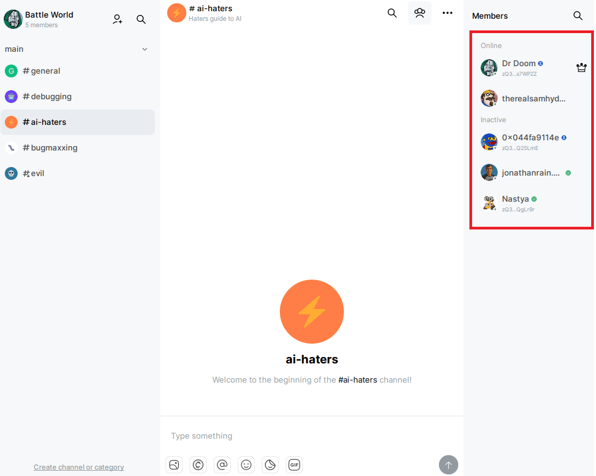

### `ban(public_keys, delete_messages=False)`

Ban one or more members from the community. Banned members appear in [`banned_members` property](./community.md#banned_members). A custom exception is raised if none of the provided public keys belong to the community.

Each member can be identified in three different ways, so you can pass whichever value you have at hand - the public key, the chat key as shown in Status App, or the profile link a user shares with you:

| Format | Example | Where to find it |
|-------|--------|-----------------|
| **Public key** | `0x04ebcad...` | The keys of [`get_members()`](./community.md#get_membersdataframefalse), or `public_key` in its `DataFrame` form |
| **Chat key** (compressed key) | `zQ3shYSHp7...` | `compressedKey` in [`get_members()`](./community.md#get_membersdataframefalse), or the **chat key** in Status App |
| **Account URL** | `https://status.app/u/...` | `url` in [`get_members(dataframe=True)`](./community.md#get_membersdataframefalse), or **Share profile** in Status App |

Every value is normalised into the public key with [`get_public_key`](./account.md#get_public_keyvalue) before it is matched against the community's members, so the formats can be **mixed within the same list**.

| Name | Type | Required | Description |
|-----|-----|-----|-------------|
| `public_keys` | `list[str]`<br>`str` | Yes | The **public keys** (`0x...`), **chat keys** (`zQ...`) or **account URLs** (`https://...`) of the members to ban. A single value can be passed as a `str`. Current members can be obtained from [`get_members`](./community.md#get_membersdataframefalse). |
| `delete_messages` | `bool` | No | When `True`, all messages sent by the banned members are also deleted. Defaults to `False`. |

```python
from status_sdk import Account, Community

account = Account()
params = {
    "name": "status-app-bot",
    "password": "SNTPUMP"
}
account.login(**params)

url = "https://status.app/c/G3QAAMQn9ueHRsR3W5Ouuy25fkCxziknAIEkCbYAoC04HjyGeQ6X8k45q3GVeyZiksbd38tQ4S_EfhrJKhRV3sDvjhmrCuSoDBIf2QJiEKwAOZipxis8ntNRVyPhC5IoWaEsj9X4P5zw093pcLofZzTV2gM=#zQ3shZeEJqTC1xhGUjxuS4rtHSrhJ8vUYp64v6qWkLpvdy9L9"
community = Community(account, url=url)

member = next(iter(community.get_members()))
community.ban(member, delete_messages=True)
```

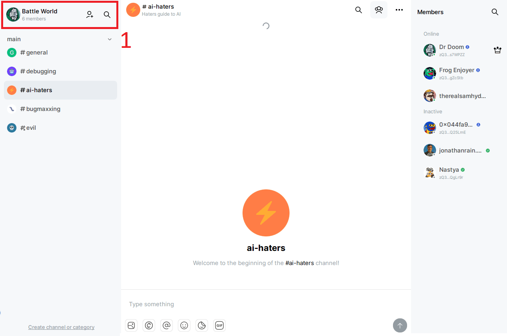

---

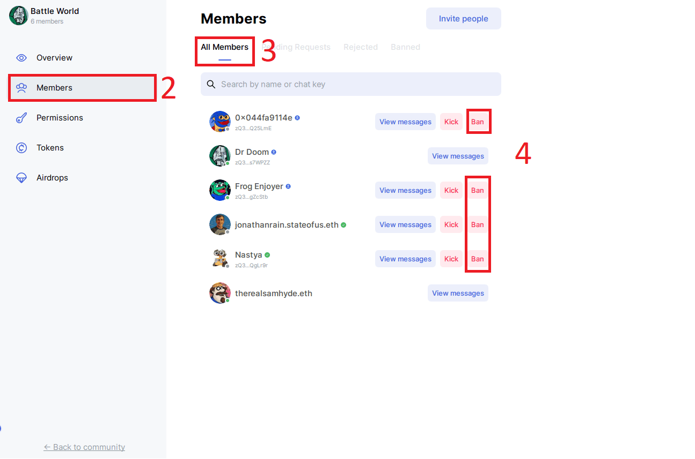

### `unban(public_keys)`

Unban one or more previously banned members.

Each member can be identified by their **public key**, **chat key** or **account URL**, and the formats can be mixed within the same list.

| Name | Type | Required | Description |
|-----|-----|-----|-------------|
| `public_keys` | `list[str]`<br>`str` | Yes | The **public keys** (`0x...`), **chat keys** (`zQ...`) or **account URLs** (`https://...`) of the members to unban. A single value can be passed as a `str`. Banned members can be obtained from [`banned_members` properties](./community.md#banned_members). |

```python
from status_sdk import Account, Community

account = Account()
params = {
    "name": "status-app-bot",
    "password": "SNTPUMP"
}
account.login(**params)

url = "https://status.app/c/G3QAAMQn9ueHRsR3W5Ouuy25fkCxziknAIEkCbYAoC04HjyGeQ6X8k45q3GVeyZiksbd38tQ4S_EfhrJKhRV3sDvjhmrCuSoDBIf2QJiEKwAOZipxis8ntNRVyPhC5IoWaEsj9X4P5zw093pcLofZzTV2gM=#zQ3shZeEJqTC1xhGUjxuS4rtHSrhJ8vUYp64v6qWkLpvdy9L9"
community = Community(account, url=url)

community.unban(community.banned_members)
```


---

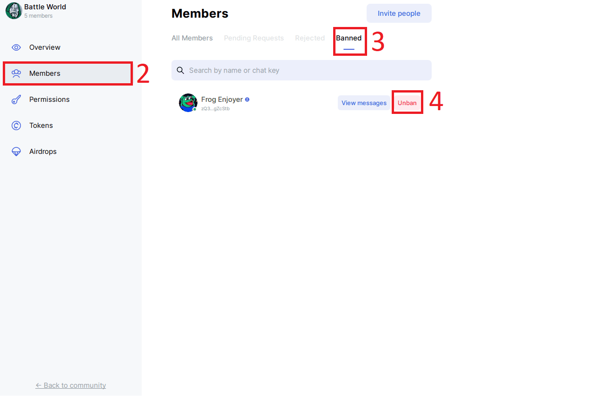


### `kick(public_keys)`

Remove one or more members from the community. Unlike [`ban`](./community.md#banpublic_keys-delete_messagesfalse), a kicked member is **not** added to [`banned_members`](./community.md#banned_members) and can request to join again. A custom exception is raised if none of the provided public keys belong to the community.

Each member can be identified by their **public key**, **chat key** or **account URL**, and the formats can be mixed within the same list.

| Name | Type | Required | Description |
|-----|-----|-----|-------------|
| `public_keys` | `list[str]`<br>`str` | Yes | The **public keys** (`0x...`), **chat keys** (`zQ...`) or **account URLs** (`https://...`) of the members to remove. A single value can be passed as a `str`. Current members can be obtained from [`get_members`](./community.md#get_membersdataframefalse). |

```python
from status_sdk import Account, Community

account = Account()
params = {
    "name": "status-app-bot",
    "password": "SNTPUMP"
}
account.login(**params)

url = "https://status.app/c/G3QAAMQn9ueHRsR3W5Ouuy25fkCxziknAIEkCbYAoC04HjyGeQ6X8k45q3GVeyZiksbd38tQ4S_EfhrJKhRV3sDvjhmrCuSoDBIf2QJiEKwAOZipxis8ntNRVyPhC5IoWaEsj9X4P5zw093pcLofZzTV2gM=#zQ3shZeEJqTC1xhGUjxuS4rtHSrhJ8vUYp64v6qWkLpvdy9L9"
community = Community(account, url=url)

member = next(iter(community.get_members()))
community.kick(member)
```


---

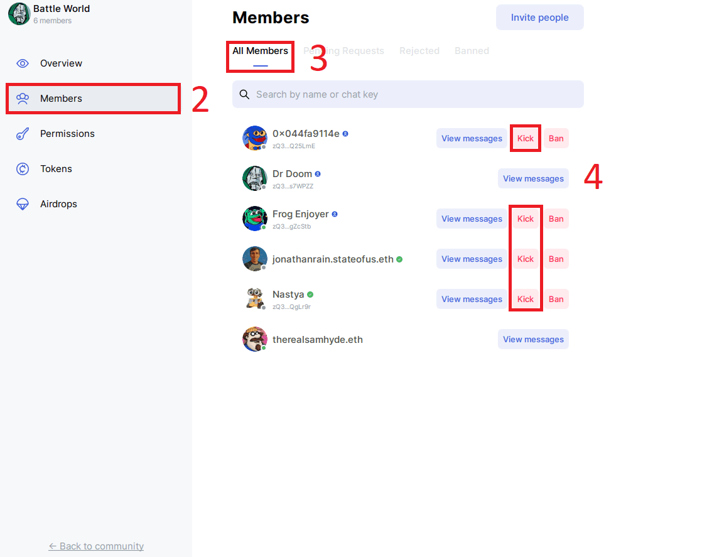

### `accept(pending_request_id)`

Accept a pending join request. Members waiting to be accepted are found in [`pending_members`](./community.md#pending_members). A custom exception is raised if `pending_request_id` is not a pending (or declined) join request.

| Name | Type | Required | Description |
|-----|-----|-----|-------------|
| `pending_request_id` | `str` | Yes | The `request_id` of a member from [`pending_members`](./community.md#pending_members). |

```python
from status_sdk import Account, Community

account = Account()
params = {
    "name": "status-app-bot",
    "password": "SNTPUMP"
}
account.login(**params)

url = "https://status.app/c/G3QAAMQn9ueHRsR3W5Ouuy25fkCxziknAIEkCbYAoC04HjyGeQ6X8k45q3GVeyZiksbd38tQ4S_EfhrJKhRV3sDvjhmrCuSoDBIf2QJiEKwAOZipxis8ntNRVyPhC5IoWaEsj9X4P5zw093pcLofZzTV2gM=#zQ3shZeEJqTC1xhGUjxuS4rtHSrhJ8vUYp64v6qWkLpvdy9L9"
community = Community(account, url=url)

for member in community.pending_members:
    community.accept(member["request_id"])
```


---

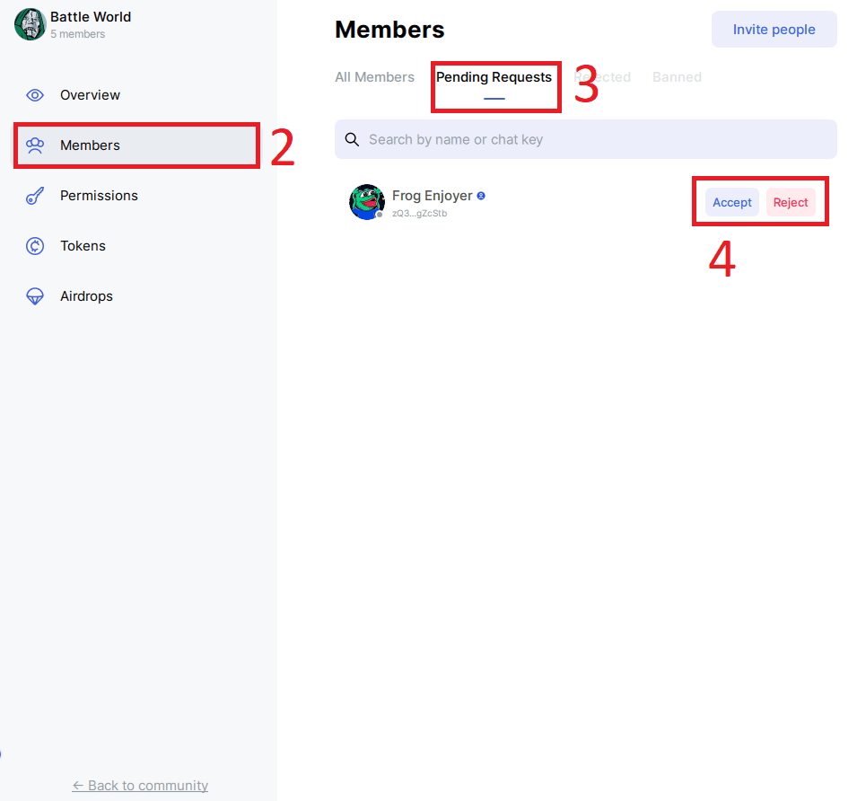

### `decline(pending_request_id)`

Decline a pending join request. Declined members appear in [`declined_members`](./community.md#declined_members).

| Name | Type | Required | Description |
|-----|-----|-----|-------------|
| `pending_request_id` | `str` | Yes | The `request_id` of a member from [`pending_members`](./community.md#pending_members). |

```python
from status_sdk import Account, Community

account = Account()
params = {
    "name": "status-app-bot",
    "password": "SNTPUMP"
}
account.login(**params)

url = "https://status.app/c/G3QAAMQn9ueHRsR3W5Ouuy25fkCxziknAIEkCbYAoC04HjyGeQ6X8k45q3GVeyZiksbd38tQ4S_EfhrJKhRV3sDvjhmrCuSoDBIf2QJiEKwAOZipxis8ntNRVyPhC5IoWaEsj9X4P5zw093pcLofZzTV2gM=#zQ3shZeEJqTC1xhGUjxuS4rtHSrhJ8vUYp64v6qWkLpvdy9L9"
community = Community(account, url=url)

member = community.pending_members[0]
community.decline(member["request_id"])
```


---


### `leave()`

Leave the community. After leaving, the `Community` instance can no longer be used - its [`id`](./community.md#id) is unset and accessing it raises a custom exception. Re-create the `Community` (by id or url) if you rejoin.

```python
from status_sdk import Account, Community

account = Account()
params = {
    "name": "status-app-bot",
    "password": "SNTPUMP"
}
account.login(**params)

url = "https://status.app/c/G3QAAMQn9ueHRsR3W5Ouuy25fkCxziknAIEkCbYAoC04HjyGeQ6X8k45q3GVeyZiksbd38tQ4S_EfhrJKhRV3sDvjhmrCuSoDBIf2QJiEKwAOZipxis8ntNRVyPhC5IoWaEsj9X4P5zw093pcLofZzTV2gM=#zQ3shZeEJqTC1xhGUjxuS4rtHSrhJ8vUYp64v6qWkLpvdy9L9"
community = Community(account, url=url)

community.leave()
```

### `create_channel(name, description, emoji=None, colour=None, category_name=None)`

Create a new channel in the community. Returns the created [`Channel`](./community.md#channel). An unknown `category_name` is ignored and the channel is created without a category. Channel creation raises a custom exception if the backend rejects it, and a separate one when a channel with that `name` **already exists** in the community - so a duplicate can be caught on its own and the existing channel [fetched](./community.md#fetching-a-channel) instead.

| Name | Type | Required | Description |
|-----|-----|-----|-------------|
| `name` | `str` | Yes | The channel name. Must follow the [channel name](./community.md#channel-name) rules. |
| `description` | `str` | Yes | The channel description. Must follow the [channel description](./community.md#channel-description) rules. |
| `emoji` | `str` | No | A single emoji for the channel. When omitted, a random default emoji is chosen. See [channel emoji](./community.md#channel-emoji). |
| `colour` | `str` | No | The channel colour as a hex code, e.g. `#4360DF`. When omitted, a random default colour is chosen. See [channel colour](./community.md#channel-colour). |
| `category_name` | `str` | No | The name of an existing category (from [`categories`](./community.md#categories)) to place the channel under. When omitted, the channel is uncategorised. |

```python
from status_sdk import Account, Community

account = Account()
params = {
    "name": "status-app-bot",
    "password": "SNTPUMP"
}
account.login(**params)

url = "https://status.app/c/G3QAAMQn9ueHRsR3W5Ouuy25fkCxziknAIEkCbYAoC04HjyGeQ6X8k45q3GVeyZiksbd38tQ4S_EfhrJKhRV3sDvjhmrCuSoDBIf2QJiEKwAOZipxis8ntNRVyPhC5IoWaEsj9X4P5zw093pcLofZzTV2gM=#zQ3shZeEJqTC1xhGUjxuS4rtHSrhJ8vUYp64v6qWkLpvdy9L9"
community = Community(account, url=url)

channel = community.create_channel(
    name="announcements",
    description="Community news and updates",
    emoji="📢",
    colour="#4360DF"
)
print(channel.id)
```

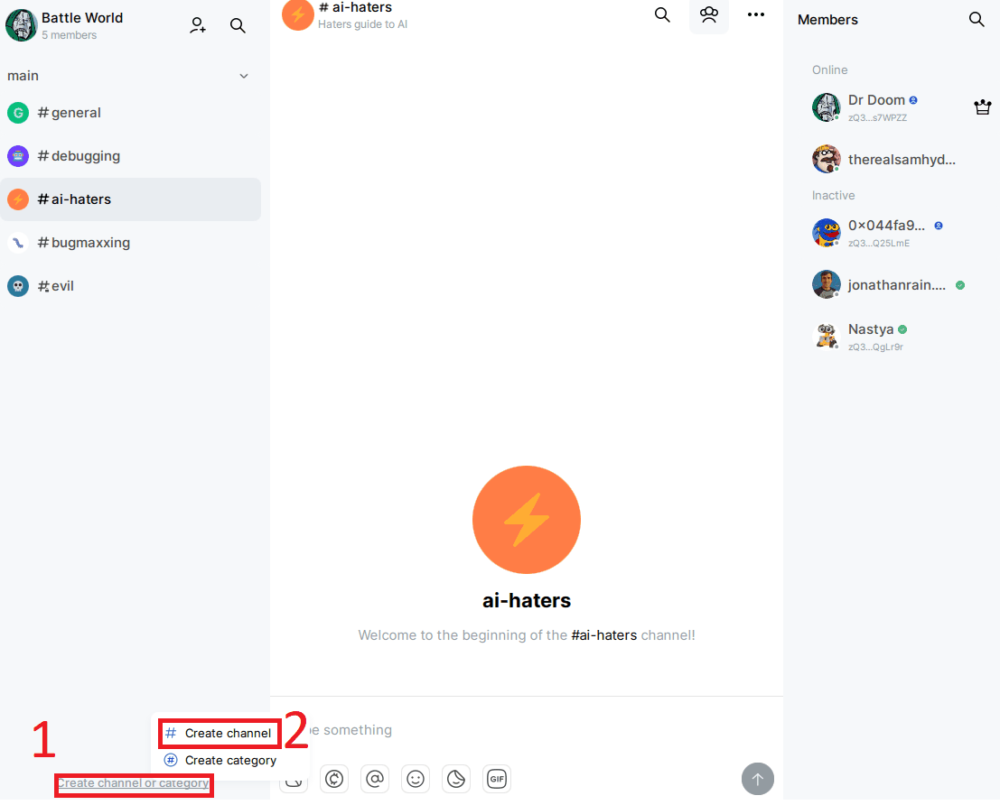

---

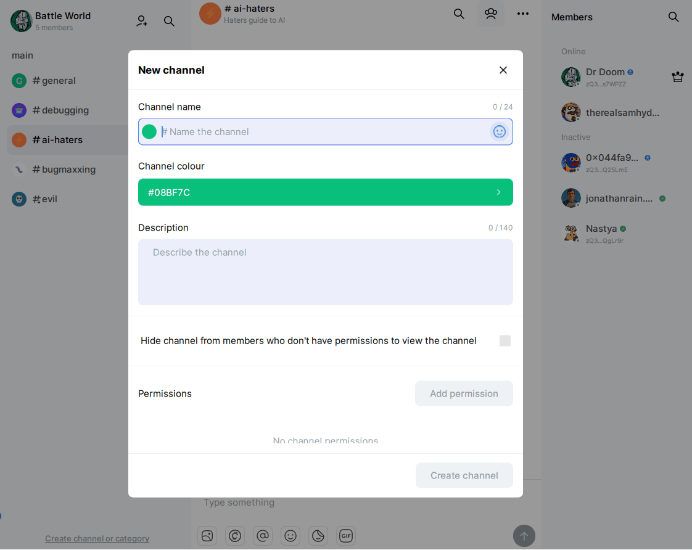

### `delete_channel(channel_name)`

Delete a channel by its name. Available channel names can be found in [`channels` property](./community.md#channels). A custom exception is raised if no channel with that name exists.

| Name | Type | Required | Description |
|-----|-----|-----|-------------|
| `channel_name` | `str` | Yes | The name of the channel to delete. |

```python
from status_sdk import Account, Community

account = Account()
params = {
    "name": "status-app-bot",
    "password": "SNTPUMP"
}
account.login(**params)

url = "https://status.app/c/G3QAAMQn9ueHRsR3W5Ouuy25fkCxziknAIEkCbYAoC04HjyGeQ6X8k45q3GVeyZiksbd38tQ4S_EfhrJKhRV3sDvjhmrCuSoDBIf2QJiEKwAOZipxis8ntNRVyPhC5IoWaEsj9X4P5zw093pcLofZzTV2gM=#zQ3shZeEJqTC1xhGUjxuS4rtHSrhJ8vUYp64v6qWkLpvdy9L9"
community = Community(account, url=url)

community.delete_channel("announcements")
```

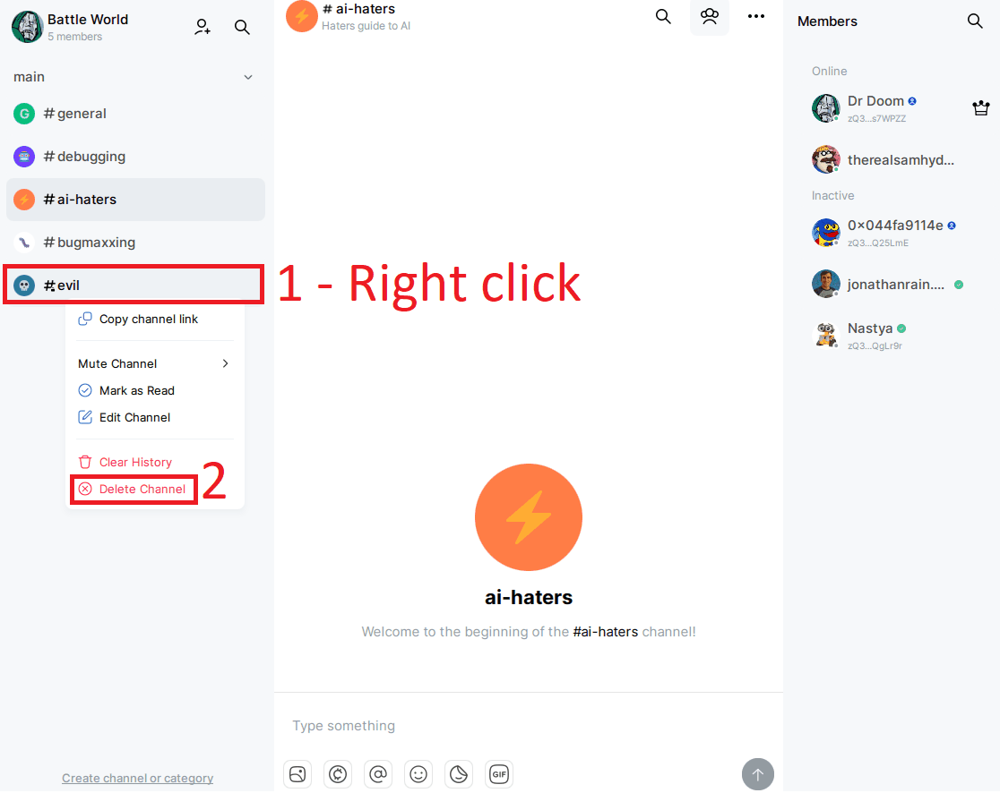

### `listen_requests()`

Listen for join requests to the community **in real time**.

Returns a `Generator` that yields one `dict` per request event:

| Key | Type | Description |
|----|----|-------------|
| `request_id` | `str` | The join request id. Pass this to [`accept`](./community.md#acceptpending_request_id) or [`decline`](./community.md#declinepending_request_id). |
| `state` | `str` | The state the request moved into - see the table below. |
| `public_key` | `str` | Public key of the requesting member. |

**Request states**

| Code | State | Description |
|-----|-----|-------------|
| `1` | `pending` | The request is waiting to be [accepted](./community.md#acceptpending_request_id) or [declined](./community.md#declinepending_request_id). |
| `2` | `reject` | The request was declined. |
| `3` | `accept` | The request was accepted and the member joined. |
| `4` | `cancel` | The request was cancelled. |

Events belonging to **other communities**, and requests whose state is not one of the four above, are skipped - so everything yielded is a request for this community.

```python
from status_sdk import Account, Community

account = Account()
params = {
    "name": "status-app-bot",
    "password": "SNTPUMP"
}
account.login(**params)

url = "https://status.app/c/G3QAAMQn9ueHRsR3W5Ouuy25fkCxziknAIEkCbYAoC04HjyGeQ6X8k45q3GVeyZiksbd38tQ4S_EfhrJKhRV3sDvjhmrCuSoDBIf2QJiEKwAOZipxis8ntNRVyPhC5IoWaEsj9X4P5zw093pcLofZzTV2gM=#zQ3shZeEJqTC1xhGUjxuS4rtHSrhJ8vUYp64v6qWkLpvdy9L9"
community = Community(account, url=url)

# Auto-accept everyone who asks to join
for request in community.listen_requests():
    print(f"{request['public_key']}\t{request['state']}")

    if request["state"] != "pending":
        continue

    community.accept(request["request_id"])
    community["general"].send_message("Welcome to the community!")
```


### Fetching a channel

A `Channel` is retrieved by name with **subscript access** on the community. Available names come from [`channels` property](./community.md#channels).

| Name | Type | Required | Description |
|-----|-----|-----|-------------|
| `channel_name` | `str` | Yes | The name of the channel to fetch. |

```python
from status_sdk import Account, Community

account = Account()
params = {
    "name": "status-app-bot",
    "password": "SNTPUMP"
}
account.login(**params)

url = "https://status.app/c/G3QAAMQn9ueHRsR3W5Ouuy25fkCxziknAIEkCbYAoC04HjyGeQ6X8k45q3GVeyZiksbd38tQ4S_EfhrJKhRV3sDvjhmrCuSoDBIf2QJiEKwAOZipxis8ntNRVyPhC5IoWaEsj9X4P5zw093pcLofZzTV2gM=#zQ3shZeEJqTC1xhGUjxuS4rtHSrhJ8vUYp64v6qWkLpvdy9L9"
community = Community(account, url=url)

channel = community["general"]
channel.send_message("Hello from my Status bot!")
```

**Note**: A custom exception is raised if no channel with that name exists.

### Counting members

The total number of members in the community is obtained by passing the community to the built-in `len()`.

Returns `int`. This is the same count as the number of entries returned by [`get_members`](./community.md#get_membersdataframefalse), without building the `dict` or the `DataFrame`.

```python
from status_sdk import Account, Community

account = Account()
params = {
    "name": "status-app-bot",
    "password": "SNTPUMP"
}
account.login(**params)

url = "https://status.app/c/G3QAAMQn9ueHRsR3W5Ouuy25fkCxziknAIEkCbYAoC04HjyGeQ6X8k45q3GVeyZiksbd38tQ4S_EfhrJKhRV3sDvjhmrCuSoDBIf2QJiEKwAOZipxis8ntNRVyPhC5IoWaEsj9X4P5zw093pcLofZzTV2gM=#zQ3shZeEJqTC1xhGUjxuS4rtHSrhJ8vUYp64v6qWkLpvdy9L9"
community = Community(account, url=url)

print(f"The community has {len(community)} members")
```

## Properties

### `id`

The unique identifier of the community.

Returns `str`. Raises a custom exception if the community is not usable (for example while a join request is pending).

```python
from status_sdk import Account, Community

account = Account()
params = {
    "name": "status-app-bot",
    "password": "SNTPUMP"
}
account.login(**params)

url = "https://status.app/c/G3QAAMQn9ueHRsR3W5Ouuy25fkCxziknAIEkCbYAoC04HjyGeQ6X8k45q3GVeyZiksbd38tQ4S_EfhrJKhRV3sDvjhmrCuSoDBIf2QJiEKwAOZipxis8ntNRVyPhC5IoWaEsj9X4P5zw093pcLofZzTV2gM=#zQ3shZeEJqTC1xhGUjxuS4rtHSrhJ8vUYp64v6qWkLpvdy9L9"
community = Community(account, url=url)

print(community.id)
```

### `url`

The shareable invite URL of the community. This is the same URL that can be passed to the [`Community`](./community.md#communityaccount-community_idnone-urlnone) constructor to join or wrap the community.

Returns `str`, or `None` if the backend does not return one.

```python
from status_sdk import Account, Community

account = Account()
params = {
    "name": "status-app-bot",
    "password": "SNTPUMP"
}
account.login(**params)

url = "https://status.app/c/G3QAAMQn9ueHRsR3W5Ouuy25fkCxziknAIEkCbYAoC04HjyGeQ6X8k45q3GVeyZiksbd38tQ4S_EfhrJKhRV3sDvjhmrCuSoDBIf2QJiEKwAOZipxis8ntNRVyPhC5IoWaEsj9X4P5zw093pcLofZzTV2gM=#zQ3shZeEJqTC1xhGUjxuS4rtHSrhJ8vUYp64v6qWkLpvdy9L9"
community = Community(account, url=url)

print(community.url)
```

### `name`

The community's name.

Returns `str`.

```python
from status_sdk import Account, Community

account = Account()
params = {
    "name": "status-app-bot",
    "password": "SNTPUMP"
}
account.login(**params)

url = "https://status.app/c/G3QAAMQn9ueHRsR3W5Ouuy25fkCxziknAIEkCbYAoC04HjyGeQ6X8k45q3GVeyZiksbd38tQ4S_EfhrJKhRV3sDvjhmrCuSoDBIf2QJiEKwAOZipxis8ntNRVyPhC5IoWaEsj9X4P5zw093pcLofZzTV2gM=#zQ3shZeEJqTC1xhGUjxuS4rtHSrhJ8vUYp64v6qWkLpvdy9L9"
community = Community(account, url=url)

print(community.name)
```

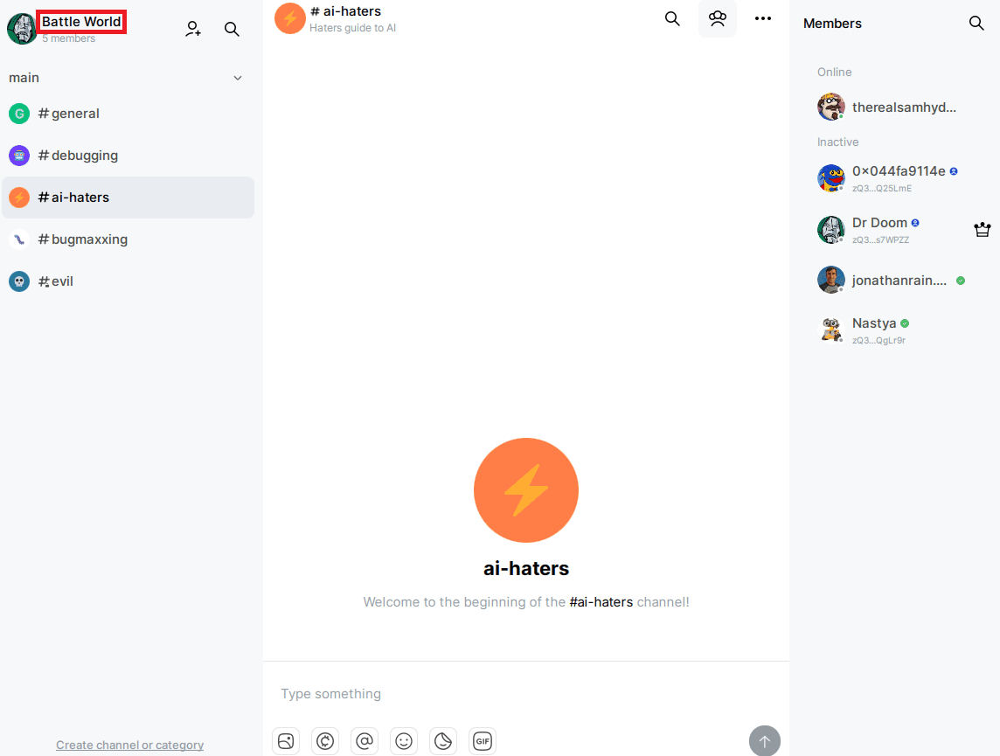

### `description`

The community's description.

Returns `str`.

```python
from status_sdk import Account, Community

account = Account()
params = {
    "name": "status-app-bot",
    "password": "SNTPUMP"
}
account.login(**params)

url = "https://status.app/c/G3QAAMQn9ueHRsR3W5Ouuy25fkCxziknAIEkCbYAoC04HjyGeQ6X8k45q3GVeyZiksbd38tQ4S_EfhrJKhRV3sDvjhmrCuSoDBIf2QJiEKwAOZipxis8ntNRVyPhC5IoWaEsj9X4P5zw093pcLofZzTV2gM=#zQ3shZeEJqTC1xhGUjxuS4rtHSrhJ8vUYp64v6qWkLpvdy9L9"
community = Community(account, url=url)

print(community.description)
```

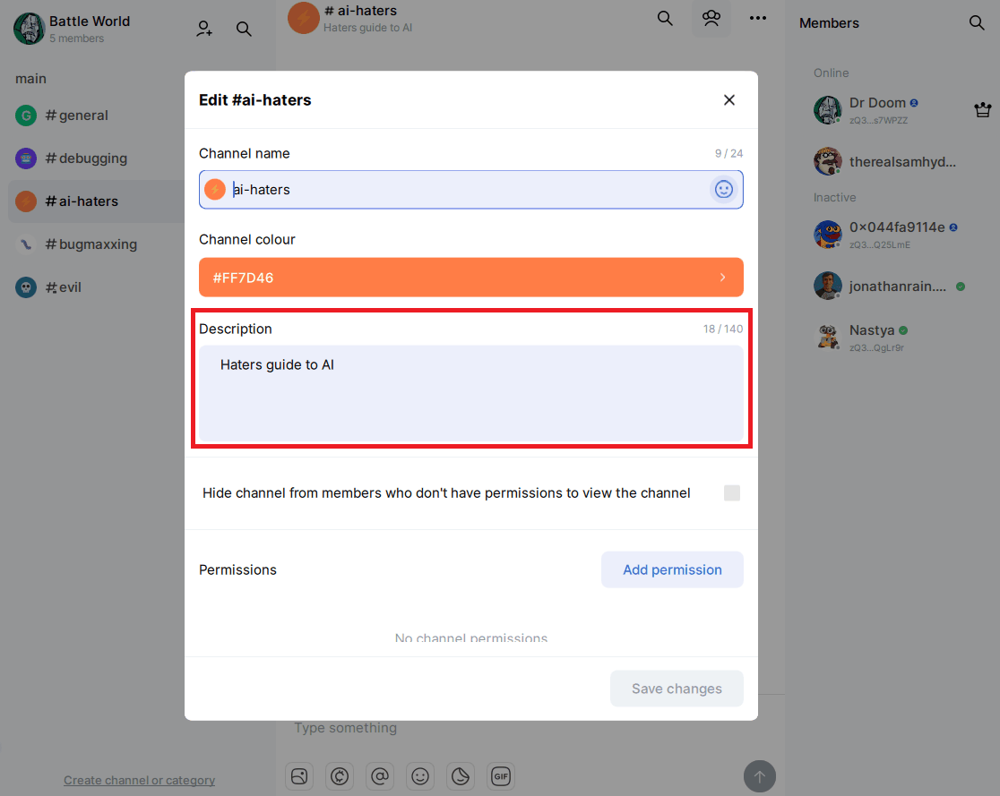

### `introduction`

The community's **introduction message** - the text shown to new members when they join.

Returns `str`.

```python
from status_sdk import Account, Community

account = Account()
params = {
    "name": "status-app-bot",
    "password": "SNTPUMP"
}
account.login(**params)

url = "https://status.app/c/G3QAAMQn9ueHRsR3W5Ouuy25fkCxziknAIEkCbYAoC04HjyGeQ6X8k45q3GVeyZiksbd38tQ4S_EfhrJKhRV3sDvjhmrCuSoDBIf2QJiEKwAOZipxis8ntNRVyPhC5IoWaEsj9X4P5zw093pcLofZzTV2gM=#zQ3shZeEJqTC1xhGUjxuS4rtHSrhJ8vUYp64v6qWkLpvdy9L9"
community = Community(account, url=url)

print(community.introduction)
```

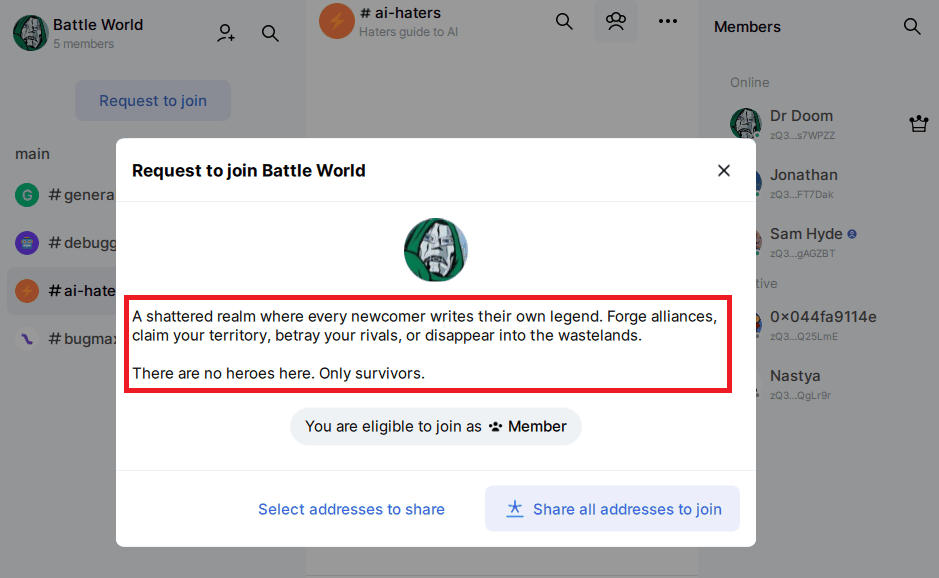

### `leave_message`

The community's **leave message** - the text shown to members when they leave the community.

Returns `str`.

```python
from status_sdk import Account, Community

account = Account()
params = {
    "name": "status-app-bot",
    "password": "SNTPUMP"
}
account.login(**params)

url = "https://status.app/c/G3QAAMQn9ueHRsR3W5Ouuy25fkCxziknAIEkCbYAoC04HjyGeQ6X8k45q3GVeyZiksbd38tQ4S_EfhrJKhRV3sDvjhmrCuSoDBIf2QJiEKwAOZipxis8ntNRVyPhC5IoWaEsj9X4P5zw093pcLofZzTV2gM=#zQ3shZeEJqTC1xhGUjxuS4rtHSrhJ8vUYp64v6qWkLpvdy9L9"
community = Community(account, url=url)

print(community.leave_message)
```

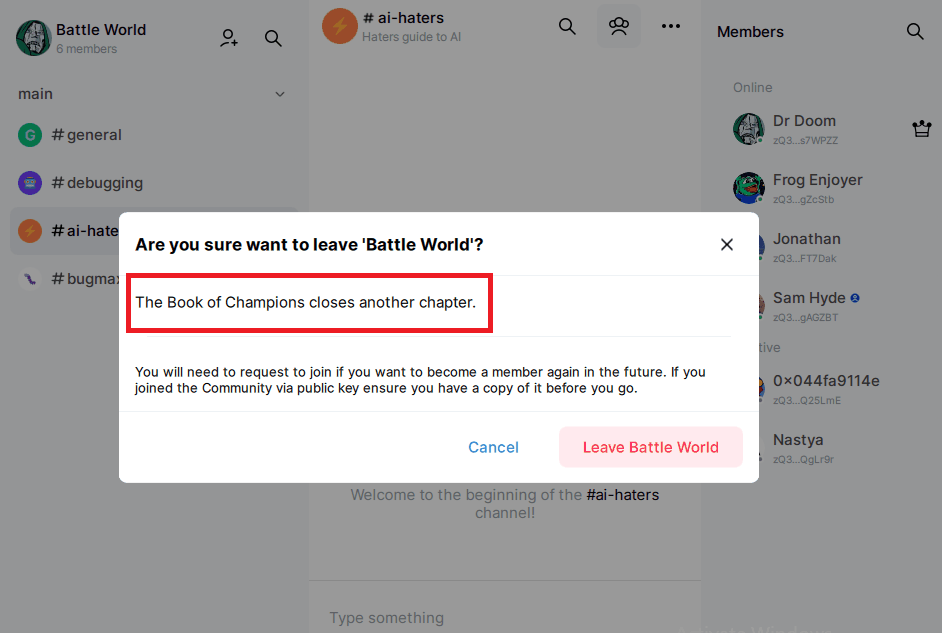

### `tags`

The community's tags - the topics it is listed under in Status App, picked when the community is created.

Returns `list[str]`, e.g. `["Crypto", "Technology"]`. An empty list is returned when the community has no tags.

```python
from status_sdk import Account, Community

account = Account()
params = {
    "name": "status-app-bot",
    "password": "SNTPUMP"
}
account.login(**params)

url = "https://status.app/c/G3QAAMQn9ueHRsR3W5Ouuy25fkCxziknAIEkCbYAoC04HjyGeQ6X8k45q3GVeyZiksbd38tQ4S_EfhrJKhRV3sDvjhmrCuSoDBIf2QJiEKwAOZipxis8ntNRVyPhC5IoWaEsj9X4P5zw093pcLofZzTV2gM=#zQ3shZeEJqTC1xhGUjxuS4rtHSrhJ8vUYp64v6qWkLpvdy9L9"
community = Community(account, url=url)

print(community.tags)
```

### `is_encrypted`

Whether the community's messages are encrypted. This is a community-wide setting chosen at creation - it cannot be turned on for a single [`Channel`](./community.md#channel).

Returns `bool`. This is the same value as `encrypted` in [`communities`](./account.md#communities) on `Account`.

```python
from status_sdk import Account, Community

account = Account()
params = {
    "name": "status-app-bot",
    "password": "SNTPUMP"
}
account.login(**params)

url = "https://status.app/c/G3QAAMQn9ueHRsR3W5Ouuy25fkCxziknAIEkCbYAoC04HjyGeQ6X8k45q3GVeyZiksbd38tQ4S_EfhrJKhRV3sDvjhmrCuSoDBIf2QJiEKwAOZipxis8ntNRVyPhC5IoWaEsj9X4P5zw093pcLofZzTV2gM=#zQ3shZeEJqTC1xhGUjxuS4rtHSrhJ8vUYp64v6qWkLpvdy9L9"
community = Community(account, url=url)

print(community.is_encrypted)
```

### `is_member`

Whether the logged-in account is a member of the community - that is, whether it appears in the community's [member list](./community.md#get_membersdataframefalse).

Returns `bool`. This is the same value as `is_member` in [`communities`](./account.md#communities) on `Account`.

```python
from status_sdk import Account, Community

account = Account()
params = {
    "name": "status-app-bot",
    "password": "SNTPUMP"
}
account.login(**params)

url = "https://status.app/c/G3QAAMQn9ueHRsR3W5Ouuy25fkCxziknAIEkCbYAoC04HjyGeQ6X8k45q3GVeyZiksbd38tQ4S_EfhrJKhRV3sDvjhmrCuSoDBIf2QJiEKwAOZipxis8ntNRVyPhC5IoWaEsj9X4P5zw093pcLofZzTV2gM=#zQ3shZeEJqTC1xhGUjxuS4rtHSrhJ8vUYp64v6qWkLpvdy9L9"
community = Community(account, url=url)

if not community.is_member:
    print("The account is not a member of this community")
```

### `has_joined`

Whether the account has **joined** the community. Where [`is_member`](./community.md#is_member) reflects the account's presence in the community's member list, this is the join flag held on the account's side - it is set when the account joins and cleared when it [leaves](./community.md#leave).

Returns `bool`.

```python
from status_sdk import Account, Community

account = Account()
params = {
    "name": "status-app-bot",
    "password": "SNTPUMP"
}
account.login(**params)

url = "https://status.app/c/G3QAAMQn9ueHRsR3W5Ouuy25fkCxziknAIEkCbYAoC04HjyGeQ6X8k45q3GVeyZiksbd38tQ4S_EfhrJKhRV3sDvjhmrCuSoDBIf2QJiEKwAOZipxis8ntNRVyPhC5IoWaEsj9X4P5zw093pcLofZzTV2gM=#zQ3shZeEJqTC1xhGUjxuS4rtHSrhJ8vUYp64v6qWkLpvdy9L9"
community = Community(account, url=url)

print(community.has_joined)
```

**Note**: this is **not** the same as the `joined` key of [`communities`](./account.md#communities) on `Account`, which currently mirrors `verified`.

### `joined_timestamp`

When the account joined the community.

Returns `datetime.datetime`, or `None` when the account has not joined.

```python
from status_sdk import Account, Community

account = Account()
params = {
    "name": "status-app-bot",
    "password": "SNTPUMP"
}
account.login(**params)

url = "https://status.app/c/G3QAAMQn9ueHRsR3W5Ouuy25fkCxziknAIEkCbYAoC04HjyGeQ6X8k45q3GVeyZiksbd38tQ4S_EfhrJKhRV3sDvjhmrCuSoDBIf2QJiEKwAOZipxis8ntNRVyPhC5IoWaEsj9X4P5zw093pcLofZzTV2gM=#zQ3shZeEJqTC1xhGUjxuS4rtHSrhJ8vUYp64v6qWkLpvdy9L9"
community = Community(account, url=url)

joined = community.joined_timestamp
print(f"Joined on {joined:%Y-%m-%d}" if joined else "Not joined yet")
```

### `requested_timestamp`

When the account's request to join the community was sent - the request created by the [`Community`](./community.md#communityaccount-community_idnone-urlnone) constructor when the account is not yet a member.

Returns `datetime.datetime`, or `None` when no join request was ever sent - for example when the account created the community itself.

```python
from status_sdk import Account, Community

account = Account()
params = {
    "name": "status-app-bot",
    "password": "SNTPUMP"
}
account.login(**params)

url = "https://status.app/c/G3QAAMQn9ueHRsR3W5Ouuy25fkCxziknAIEkCbYAoC04HjyGeQ6X8k45q3GVeyZiksbd38tQ4S_EfhrJKhRV3sDvjhmrCuSoDBIf2QJiEKwAOZipxis8ntNRVyPhC5IoWaEsj9X4P5zw093pcLofZzTV2gM=#zQ3shZeEJqTC1xhGUjxuS4rtHSrhJ8vUYp64v6qWkLpvdy9L9"
community = Community(account, url=url)

print(community.requested_timestamp)
```

**Note**: while a join request is still pending, the community's [`id`](./community.md#id) is unset and every property - this one included - raises a custom exception. The timestamp becomes readable once the request has been [accepted](./community.md#acceptpending_request_id) and the `Community` is re-created by id.

### `categories`

The community's categories, keyed by **category name**.

Returns `dict[str, dict]` where each key is a category name and the value contains:

| Key | Type | Description |
|----|----|-------------|
| `id` | `str` | The category id. |
| `position` | `int` | The category's position (ordering) in the community. |

```python
from status_sdk import Account, Community

account = Account()
params = {
    "name": "status-app-bot",
    "password": "SNTPUMP"
}
account.login(**params)

url = "https://status.app/c/G3QAAMQn9ueHRsR3W5Ouuy25fkCxziknAIEkCbYAoC04HjyGeQ6X8k45q3GVeyZiksbd38tQ4S_EfhrJKhRV3sDvjhmrCuSoDBIf2QJiEKwAOZipxis8ntNRVyPhC5IoWaEsj9X4P5zw093pcLofZzTV2gM=#zQ3shZeEJqTC1xhGUjxuS4rtHSrhJ8vUYp64v6qWkLpvdy9L9"
community = Community(account, url=url)

for name, info in community.categories.items():
    print(name, info["id"], info["position"])
```

### `channels`

High level information for every channel in the community.

Returns `list[dict]`, one entry per channel.

| Key | Type | Description |
|----|----|-------------|
| `id` | `str` | The channel id (within the community). |
| `name` | `str` | The channel name. Use this with [subscript access](./community.md#fetching-a-channel) and [`delete_channel`](./community.md#delete_channelchannel_name). |
| `category` | `str`<br>`None` | The id of the category the channel belongs to, or `None` if uncategorised. |

```python
from status_sdk import Account, Community

account = Account()
params = {
    "name": "status-app-bot",
    "password": "SNTPUMP"
}
account.login(**params)

url = "https://status.app/c/G3QAAMQn9ueHRsR3W5Ouuy25fkCxziknAIEkCbYAoC04HjyGeQ6X8k45q3GVeyZiksbd38tQ4S_EfhrJKhRV3sDvjhmrCuSoDBIf2QJiEKwAOZipxis8ntNRVyPhC5IoWaEsj9X4P5zw093pcLofZzTV2gM=#zQ3shZeEJqTC1xhGUjxuS4rtHSrhJ8vUYp64v6qWkLpvdy9L9"
community = Community(account, url=url)

for channel in community.channels:
    print(channel["name"], channel["category"])
```

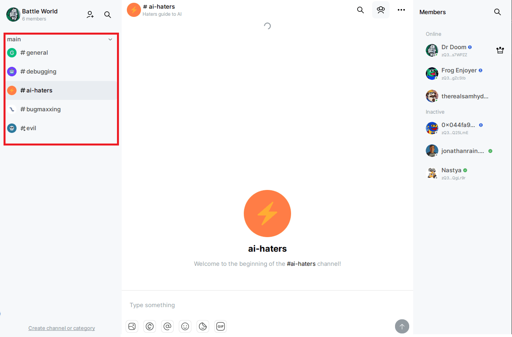

### `banned_members`

The public keys of members currently banned from the community.

Returns `list[str]`.

```python
from status_sdk import Account, Community

account = Account()
params = {
    "name": "status-app-bot",
    "password": "SNTPUMP"
}
account.login(**params)

url = "https://status.app/c/G3QAAMQn9ueHRsR3W5Ouuy25fkCxziknAIEkCbYAoC04HjyGeQ6X8k45q3GVeyZiksbd38tQ4S_EfhrJKhRV3sDvjhmrCuSoDBIf2QJiEKwAOZipxis8ntNRVyPhC5IoWaEsj9X4P5zw093pcLofZzTV2gM=#zQ3shZeEJqTC1xhGUjxuS4rtHSrhJ8vUYp64v6qWkLpvdy9L9"
community = Community(account, url=url)

print(community.banned_members)
```

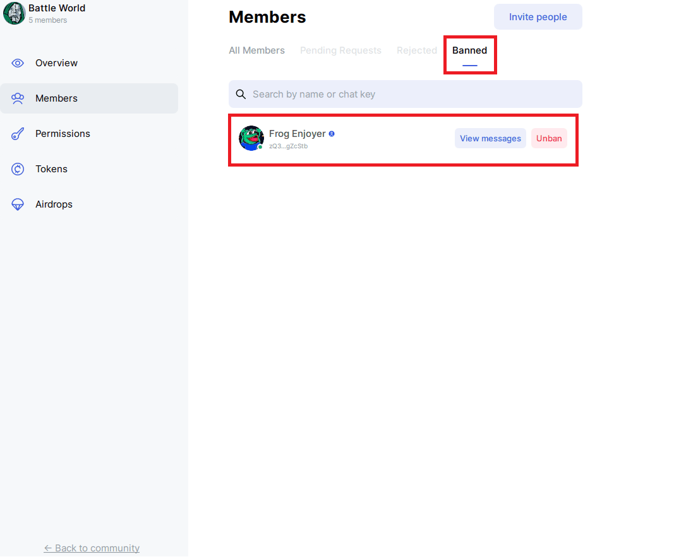

### `pending_members`

Members whose join request is waiting to be [accepted](./community.md#acceptpending_request_id) or [declined](./community.md#declinepending_request_id).

Returns `list[dict]`, each entry containing:

| Key | Type | Description |
|----|----|-------------|
| `public_key` | `str` | Public key of the requesting member. |
| `request_id` | `str` | The join request id. Pass this to [`accept`](./community.md#acceptpending_request_id) or [`decline`](./community.md#declinepending_request_id). |

```python
from status_sdk import Account, Community

account = Account()
params = {
    "name": "status-app-bot",
    "password": "SNTPUMP"
}
account.login(**params)

url = "https://status.app/c/G3QAAMQn9ueHRsR3W5Ouuy25fkCxziknAIEkCbYAoC04HjyGeQ6X8k45q3GVeyZiksbd38tQ4S_EfhrJKhRV3sDvjhmrCuSoDBIf2QJiEKwAOZipxis8ntNRVyPhC5IoWaEsj9X4P5zw093pcLofZzTV2gM=#zQ3shZeEJqTC1xhGUjxuS4rtHSrhJ8vUYp64v6qWkLpvdy9L9"
community = Community(account, url=url)

for member in community.pending_members:
    print(member["public_key"], member["request_id"])
```

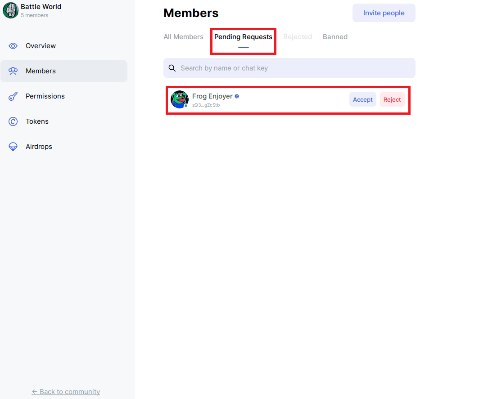

### `declined_members`

Members whose join request has been declined.

Returns `list[dict]` in the same shape as [`pending_members`](./community.md#pending_members).

```python
from status_sdk import Account, Community

account = Account()
params = {
    "name": "status-app-bot",
    "password": "SNTPUMP"
}
account.login(**params)

url = "https://status.app/c/G3QAAMQn9ueHRsR3W5Ouuy25fkCxziknAIEkCbYAoC04HjyGeQ6X8k45q3GVeyZiksbd38tQ4S_EfhrJKhRV3sDvjhmrCuSoDBIf2QJiEKwAOZipxis8ntNRVyPhC5IoWaEsj9X4P5zw093pcLofZzTV2gM=#zQ3shZeEJqTC1xhGUjxuS4rtHSrhJ8vUYp64v6qWkLpvdy9L9"
community = Community(account, url=url)

print(community.declined_members)
```

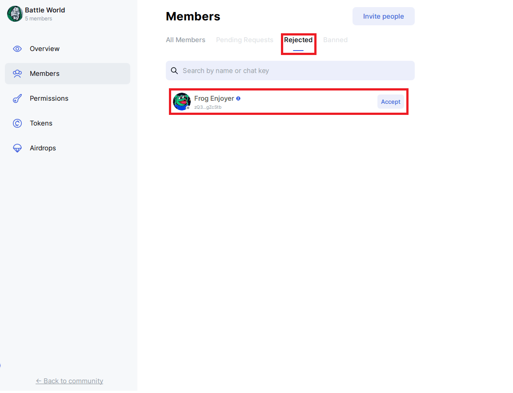

# Channel

A `Channel` represents a single channel inside a [`Community`](./community.md#community). **You never construct it directly**. Channels can be created with [Community `create_channel`](./community.md#create_channelname-description-emojinone-colournone-category_namenone) or by [subscript access](./community.md#fetching-a-channel).


## Channel name

The **channel name** identifies the channel. It is set when [creating a channel](./community.md#create_channelname-description-emojinone-colournone-category_namenone) and can be updated through the [`name` property](./community.md#name-1). Channel names must follow the validation rules enforced by the library and expected by the Status application. A valid channel name must satisfy all of the following conditions:

- It may contain **letters (`A–Z`, `a–z`)**
- It may contain **numbers (`0–9`)**
- It may contain **underscores (`_`)**
- It may contain **periods (`.`)**
- It may contain **hyphens (`-`)**
- **Whitespaces are replaced with hyphens (`-`)**
- It must be **at least 1 character long**
- It **cannot be more than 24 characters long**

Characters such as punctuation, emojis, or other symbols are **not allowed**.

### Valid examples

```
announcements
general-chat
dev.team-42
SNT_PUMP
9000
```

### Invalid examples

| Example | Reason |
|-------|--------|
|  | Too short (minimum length is 1) |
| `a-channel-name-longer-than-24-chars` | Too long (maximum length is 24) |
| `bot!123` | Contains invalid character `!` |
| `chan 🚀` | Contains an emoji |

**Note**: Whitespaces are automatically replaced with hyphens, so `my cool channel` becomes `my-cool-channel`.

## Channel description

The **channel description** is the short text shown under the channel. It is set when [creating a channel](./community.md#create_channelname-description-emojinone-colournone-category_namenone) and can be updated through the [`description`](./community.md#description-1) property.

A valid channel description must satisfy all of the following conditions:

- It may contain **letters (`A–Z`, `a–z`)**
- It may contain **numbers (`0–9`)**
- It may contain **underscores (`_`)**
- It may contain **periods (`.`)**
- It may contain **hyphens (`-`)**
- It may contain **whitespaces (` `)**
- It must be **at least 1 character long**
- It **cannot be more than 140 characters long**

Characters such as punctuation, emojis, or other symbols are **not allowed**.

### Valid examples

```
Community news and updates
General discussion
dev.team-42 planning
```

### Invalid examples

| Example | Reason |
|-------|--------|
|  | Too short (minimum length is 1) |
| `A description longer than one hundred and forty characters...` + more | Too long (maximum length is 140) |
| `see the #general channel!` | Contains invalid character `!` |
| `updates 🚀` | Contains an emoji |

## Channel colour

The **channel colour** is the accent colour of the channel. It can be set when [creating a channel](./community.md#create_channelname-description-emojinone-colournone-category_namenone) and updated through the [`colour`](./community.md#colour) property. When omitted at creation, a random default colour is chosen.

A valid channel colour must be a **hex colour code** satisfying all of the following:

- It must **start with a `#`**
- It must be followed by **3 (`#RGB`) or 6 (`#RRGGBB`) hex digits**
- Hex digits are **case-insensitive** (`0–9`, `a–f`, `A–F`)

### Valid examples

```
#4360DF
#FF7D46
#7140fd
#fff
```

### Invalid examples

| Example | Reason |
|-------|--------|
| `4360DF` | Missing the leading `#` |
| `#12` | Wrong number of digits (needs 3 or 6) |
| `#GGGGGG` | Contains non-hex characters |
| `blue` | Not a hex colour code |

If a channel colour does not follow these rules, a custom exception will be raised.

## Channel emoji

The **channel emoji** is the icon shown next to the channel. It can be set when [creating a channel](./community.md#create_channelname-description-emojinone-colournone-category_namenone) and updated through the [`emoji`](./community.md#emoji) property. When omitted at creation, a random default emoji is chosen.

A valid channel emoji must satisfy all of the following:

- It must be a **single emoji**
- **Skin tones, flags and Zero-Width Joiner (ZWJ) sequences are not supported**

### Valid examples

```
📢
🚀
❤️
⭐
```

### Invalid examples

| Example | Reason |
|-------|--------|
| `AB` | Not an emoji |
| `🎉🎉` | More than one emoji |
| `👍🏽` | Uses a skin-tone modifier |
| `🇬🇧` | Flag (multi-codepoint) |
| `👨‍👩‍👧` | ZWJ sequence |

## Methods

### `send_message(message, reply_to_message_id=None)`

Send a text message to the channel. Supports **text messages only**, optionally as a reply.

| Name | Type | Required | Description |
|-----|-----|-----|-------------|
| `message` | `str` | Yes | The text message to send. |
| `reply_to_message_id` | `str` | No | The `id` of the message being replied to, from [`get_messages`](./community.md#get_messagesstart_timestampnone-end_timestampnone). When omitted, the message is sent standalone. |

Returns `str` - the `id` of the message that was just sent, delegated from [`send_message`](./account.md#send_messagechat_id-message-reply_to_message_idnone) on `Account`. It is the same identifier that appears under the `id` key in [`get_messages`](./community.md#get_messagesstart_timestampnone-end_timestampnone), so it can be passed straight into [`delete_message`](./community.md#delete_messageid) or used as the `reply_to_message_id` of a follow-up message, without having to fetch the channel's messages first.

```python
from status_sdk import Account, Community

account = Account()
params = {
    "name": "status-app-bot",
    "password": "SNTPUMP"
}
account.login(**params)

url = "https://status.app/c/G3QAAMQn9ueHRsR3W5Ouuy25fkCxziknAIEkCbYAoC04HjyGeQ6X8k45q3GVeyZiksbd38tQ4S_EfhrJKhRV3sDvjhmrCuSoDBIf2QJiEKwAOZipxis8ntNRVyPhC5IoWaEsj9X4P5zw093pcLofZzTV2gM=#zQ3shZeEJqTC1xhGUjxuS4rtHSrhJ8vUYp64v6qWkLpvdy9L9"
community = Community(account, url=url)

channel = community["general"]
message_id = channel.send_message("Hello from my Status bot!")
print(f"Sent message: {message_id}")
```

### `get_messages(start_timestamp=None, end_timestamp=None)`

Retrieve messages from the channel within an optional time range. Messages are returned in **descending order** (newest to oldest).

| Name | Type | Required | Description |
|-----|-----|-----|-------------|
| `start_timestamp` | `datetime.datetime` | No | The earliest timestamp to include. Messages older than this stop the fetch. |
| `end_timestamp` | `datetime.datetime` | No | The latest timestamp to include. Messages newer than this are skipped. |

Returns `list[dict]` of message objects. This delegates to [`get_messages`](./account.md#get_messageschat_id-start_timestampnone-end_timestampnone) on `Account`.

```python
from status_sdk import Account, Community
import datetime

account = Account()
params = {
    "name": "status-app-bot",
    "password": "SNTPUMP"
}
account.login(**params)

url = "https://status.app/c/G3QAAMQn9ueHRsR3W5Ouuy25fkCxziknAIEkCbYAoC04HjyGeQ6X8k45q3GVeyZiksbd38tQ4S_EfhrJKhRV3sDvjhmrCuSoDBIf2QJiEKwAOZipxis8ntNRVyPhC5IoWaEsj9X4P5zw093pcLofZzTV2gM=#zQ3shZeEJqTC1xhGUjxuS4rtHSrhJ8vUYp64v6qWkLpvdy9L9"
community = Community(account, url=url)

channel = community["general"]

messages = channel.get_messages(start_timestamp=datetime.datetime(2024, 1, 1))
for message in messages:
    print(f"{message['timestamp']}\t{message['text']}")
```

### `delete_message(id)`

Delete a message from the channel. You can delete your own messages, and if you are an administrator you can delete other members' messages too.

| Name | Type | Required | Description |
|-----|-----|-----|-------------|
| `id` | `str` | Yes | The `id` of the message to delete, from [`get_messages`](./community.md#get_messagesstart_timestampnone-end_timestampnone) or directly from the return value of [`send_message`](./community.md#send_messagemessage-reply_to_message_idnone). |

Returns `bool` - `True` if the message was deleted, `False` if the account did not have permission.

```python
from status_sdk import Account, Community

account = Account()
params = {
    "name": "status-app-bot",
    "password": "SNTPUMP"
}
account.login(**params)

url = "https://status.app/c/G3QAAMQn9ueHRsR3W5Ouuy25fkCxziknAIEkCbYAoC04HjyGeQ6X8k45q3GVeyZiksbd38tQ4S_EfhrJKhRV3sDvjhmrCuSoDBIf2QJiEKwAOZipxis8ntNRVyPhC5IoWaEsj9X4P5zw093pcLofZzTV2gM=#zQ3shZeEJqTC1xhGUjxuS4rtHSrhJ8vUYp64v6qWkLpvdy9L9"
community = Community(account, url=url)

channel = community["general"]

messages = channel.get_messages()
deleted = channel.delete_message(messages[0]["id"])
print(f"Deleted: {deleted}")
```

## Properties

### `id`

The channel's unique identifier - the community id combined with the channel id. This is the value used with [`send_message`](./account.md#send_messagechat_id-message-reply_to_message_idnone) and [`get_messages`](./account.md#get_messageschat_id-start_timestampnone-end_timestampnone) on `Account`.

Returns `str`.

```python
from status_sdk import Account, Community

account = Account()
params = {
    "name": "status-app-bot",
    "password": "SNTPUMP"
}
account.login(**params)

url = "https://status.app/c/G3QAAMQn9ueHRsR3W5Ouuy25fkCxziknAIEkCbYAoC04HjyGeQ6X8k45q3GVeyZiksbd38tQ4S_EfhrJKhRV3sDvjhmrCuSoDBIf2QJiEKwAOZipxis8ntNRVyPhC5IoWaEsj9X4P5zw093pcLofZzTV2gM=#zQ3shZeEJqTC1xhGUjxuS4rtHSrhJ8vUYp64v6qWkLpvdy9L9"
community = Community(account, url=url)

channel = community["general"]
print(channel.id)
```

### `url`

The shareable URL of the channel. Where the [community URL](./community.md#url) points at the community as a whole, this one opens **this channel** in Status App.

Returns `str`, or `None` if the backend does not return one.

```python
from status_sdk import Account, Community

account = Account()
params = {
    "name": "status-app-bot",
    "password": "SNTPUMP"
}
account.login(**params)

url = "https://status.app/c/G3QAAMQn9ueHRsR3W5Ouuy25fkCxziknAIEkCbYAoC04HjyGeQ6X8k45q3GVeyZiksbd38tQ4S_EfhrJKhRV3sDvjhmrCuSoDBIf2QJiEKwAOZipxis8ntNRVyPhC5IoWaEsj9X4P5zw093pcLofZzTV2gM=#zQ3shZeEJqTC1xhGUjxuS4rtHSrhJ8vUYp64v6qWkLpvdy9L9"
community = Community(account, url=url)

channel = community["general"]
channel.send_message(f"Talk about it here: {channel.url}")
```

### `name`

Get or update the channel's name. The name must follow the [channel name](./community.md#channel-name) validation.

Returns `str` when reading.

```python
from status_sdk import Account, Community

account = Account()
params = {
    "name": "status-app-bot",
    "password": "SNTPUMP"
}
account.login(**params)

url = "https://status.app/c/G3QAAMQn9ueHRsR3W5Ouuy25fkCxziknAIEkCbYAoC04HjyGeQ6X8k45q3GVeyZiksbd38tQ4S_EfhrJKhRV3sDvjhmrCuSoDBIf2QJiEKwAOZipxis8ntNRVyPhC5IoWaEsj9X4P5zw093pcLofZzTV2gM=#zQ3shZeEJqTC1xhGUjxuS4rtHSrhJ8vUYp64v6qWkLpvdy9L9"
community = Community(account, url=url)

channel = community["general"]

# Read
print(channel.name)

# Update
channel.name = "general-chat"
```

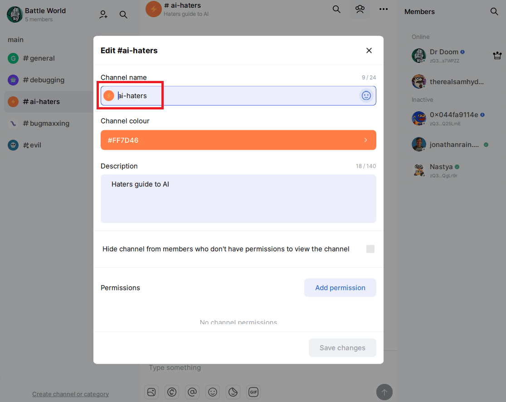

### `description`

Get or update the channel's description. The description must follow the [channel description](./community.md#channel-description) validation.

Returns `str` when reading.

```python
from status_sdk import Account, Community

account = Account()
params = {
    "name": "status-app-bot",
    "password": "SNTPUMP"
}
account.login(**params)

url = "https://status.app/c/G3QAAMQn9ueHRsR3W5Ouuy25fkCxziknAIEkCbYAoC04HjyGeQ6X8k45q3GVeyZiksbd38tQ4S_EfhrJKhRV3sDvjhmrCuSoDBIf2QJiEKwAOZipxis8ntNRVyPhC5IoWaEsj9X4P5zw093pcLofZzTV2gM=#zQ3shZeEJqTC1xhGUjxuS4rtHSrhJ8vUYp64v6qWkLpvdy9L9"
community = Community(account, url=url)

channel = community["general"]

channel.description = "General discussion"
print(channel.description)
```


### `colour`

Get or update the channel's colour. The colour must follow the [channel colour](./community.md#channel-colour) validation.

Returns `str` when reading.

```python
from status_sdk import Account, Community

account = Account()
params = {
    "name": "status-app-bot",
    "password": "SNTPUMP"
}
account.login(**params)

url = "https://status.app/c/G3QAAMQn9ueHRsR3W5Ouuy25fkCxziknAIEkCbYAoC04HjyGeQ6X8k45q3GVeyZiksbd38tQ4S_EfhrJKhRV3sDvjhmrCuSoDBIf2QJiEKwAOZipxis8ntNRVyPhC5IoWaEsj9X4P5zw093pcLofZzTV2gM=#zQ3shZeEJqTC1xhGUjxuS4rtHSrhJ8vUYp64v6qWkLpvdy9L9"
community = Community(account, url=url)

channel = community["general"]

channel.colour = "#7140FD"
print(channel.colour)
```

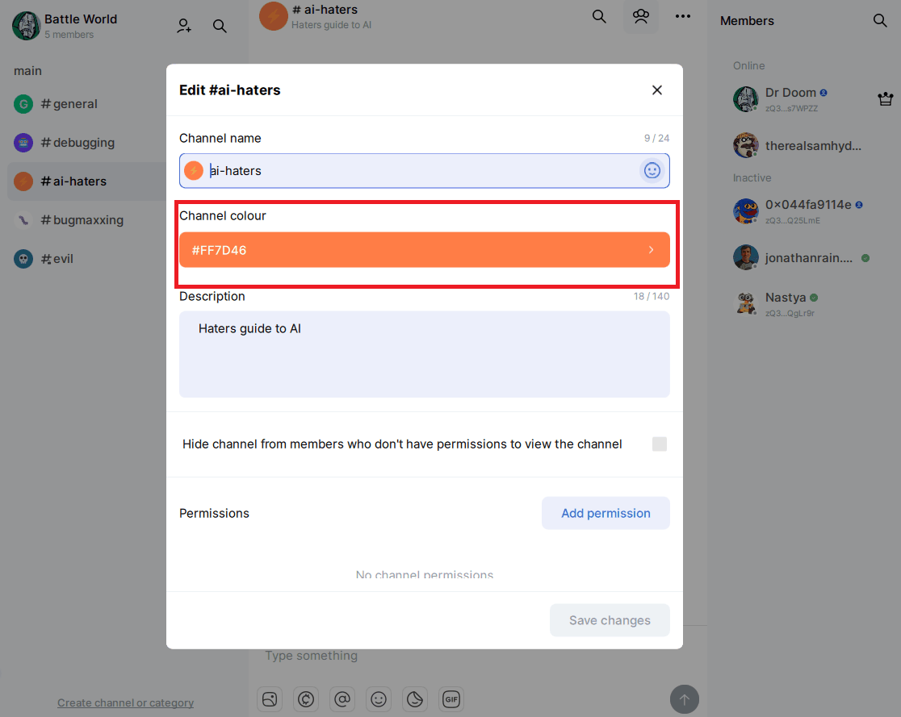

### `emoji`

Get or update the channel's emoji. The emoji must follow the [channel emoji](./community.md#channel-emoji) validation.

Returns `str` when reading, or `None` if the channel has no emoji.

```python
from status_sdk import Account, Community

account = Account()
params = {
    "name": "status-app-bot",
    "password": "SNTPUMP"
}
account.login(**params)

url = "https://status.app/c/G3QAAMQn9ueHRsR3W5Ouuy25fkCxziknAIEkCbYAoC04HjyGeQ6X8k45q3GVeyZiksbd38tQ4S_EfhrJKhRV3sDvjhmrCuSoDBIf2QJiEKwAOZipxis8ntNRVyPhC5IoWaEsj9X4P5zw093pcLofZzTV2gM=#zQ3shZeEJqTC1xhGUjxuS4rtHSrhJ8vUYp64v6qWkLpvdy9L9"
community = Community(account, url=url)

channel = community["general"]

channel.emoji = "🚀"
print(channel.emoji)
```

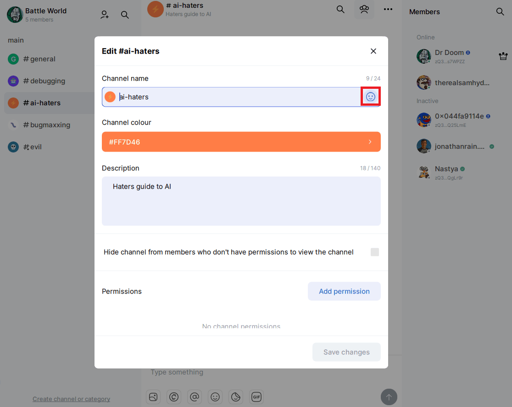

### Permissions

Four properties describe what the logged-in account may do in the channel - [`can_post`](./community.md#can_post), [`can_view`](./community.md#can_view), [`can_react`](./community.md#can_react) and [`is_token_gated`](./community.md#is_token_gated). They are the per-channel counterpart of the `permissions` keys exposed by [`communities`](./account.md#channels) on `Account`, and every one of them returns a `bool`.

| Property | `permissions` key | Description |
|-------|--------|-------------|
| [`can_post`](./community.md#can_post) | `posting` | The account can send messages to the channel. |
| [`can_view`](./community.md#can_view) | `viewing` | The account can read the channel. |
| [`can_react`](./community.md#can_react) | `reactions` | The account can post emoji reactions. |
| [`is_token_gated`](./community.md#is_token_gated) | `token_gated` | Access to the channel is gated behind a token. |

#### `can_post`

Whether the logged-in account is allowed to post in the channel.

Returns `bool`.

```python
from status_sdk import Account, Community

account = Account()
params = {
    "name": "status-app-bot",
    "password": "SNTPUMP"
}
account.login(**params)

url = "https://status.app/c/G3QAAMQn9ueHRsR3W5Ouuy25fkCxziknAIEkCbYAoC04HjyGeQ6X8k45q3GVeyZiksbd38tQ4S_EfhrJKhRV3sDvjhmrCuSoDBIf2QJiEKwAOZipxis8ntNRVyPhC5IoWaEsj9X4P5zw093pcLofZzTV2gM=#zQ3shZeEJqTC1xhGUjxuS4rtHSrhJ8vUYp64v6qWkLpvdy9L9"
community = Community(account, url=url)

channel = community["general"]
if channel.can_post:
    channel.send_message("Hello!")
```

#### `can_view`

Whether the logged-in account is allowed to read the channel. When this is `False`, [`get_messages`](./community.md#get_messagesstart_timestampnone-end_timestampnone) has nothing to return.

Returns `bool`.

```python
from status_sdk import Account, Community

account = Account()
params = {
    "name": "status-app-bot",
    "password": "SNTPUMP"
}
account.login(**params)

url = "https://status.app/c/G3QAAMQn9ueHRsR3W5Ouuy25fkCxziknAIEkCbYAoC04HjyGeQ6X8k45q3GVeyZiksbd38tQ4S_EfhrJKhRV3sDvjhmrCuSoDBIf2QJiEKwAOZipxis8ntNRVyPhC5IoWaEsj9X4P5zw093pcLofZzTV2gM=#zQ3shZeEJqTC1xhGUjxuS4rtHSrhJ8vUYp64v6qWkLpvdy9L9"
community = Community(account, url=url)

# Only read the channels the account is allowed to see
for info in community.channels:
    channel = community[info["name"]]
    if not channel.can_view:
        continue

    print(info["name"], len(channel.get_messages()))
```

#### `can_react`

Whether the logged-in account is allowed to post emoji reactions in the channel.

Returns `bool`.

```python
from status_sdk import Account, Community

account = Account()
params = {
    "name": "status-app-bot",
    "password": "SNTPUMP"
}
account.login(**params)

url = "https://status.app/c/G3QAAMQn9ueHRsR3W5Ouuy25fkCxziknAIEkCbYAoC04HjyGeQ6X8k45q3GVeyZiksbd38tQ4S_EfhrJKhRV3sDvjhmrCuSoDBIf2QJiEKwAOZipxis8ntNRVyPhC5IoWaEsj9X4P5zw093pcLofZzTV2gM=#zQ3shZeEJqTC1xhGUjxuS4rtHSrhJ8vUYp64v6qWkLpvdy9L9"
community = Community(account, url=url)

channel = community["general"]
print(channel.can_react)
```

**Note**: this reports the **permission** as Status App does. Sending reactions is not supported by the SDK - channels are written to with [`send_message`](./community.md#send_messagemessage-reply_to_message_idnone). Channels [created](./community.md#create_channelname-description-emojinone-colournone-category_namenone) through the SDK allow their viewers to post reactions.

#### `is_token_gated`

Whether access to the channel is gated behind a token. Members who do not hold the required token are refused access, which shows up as [`can_view`](./community.md#can_view) and [`can_post`](./community.md#can_post) being `False`.

Returns `bool`.

```python
from status_sdk import Account, Community

account = Account()
params = {
    "name": "status-app-bot",
    "password": "SNTPUMP"
}
account.login(**params)

url = "https://status.app/c/G3QAAMQn9ueHRsR3W5Ouuy25fkCxziknAIEkCbYAoC04HjyGeQ6X8k45q3GVeyZiksbd38tQ4S_EfhrJKhRV3sDvjhmrCuSoDBIf2QJiEKwAOZipxis8ntNRVyPhC5IoWaEsj9X4P5zw093pcLofZzTV2gM=#zQ3shZeEJqTC1xhGUjxuS4rtHSrhJ8vUYp64v6qWkLpvdy9L9"
community = Community(account, url=url)

channel = community["general"]
if channel.is_token_gated and not channel.can_post:
    print("The account does not hold the token this channel requires")
```

**Note**: token gating is configured in Status App. The SDK reports it, and always [creates channels](./community.md#create_channelname-description-emojinone-colournone-category_namenone) that are open to every member.
