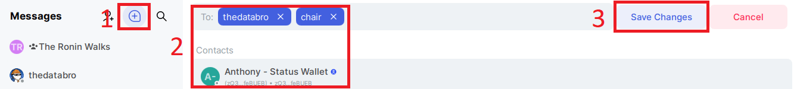
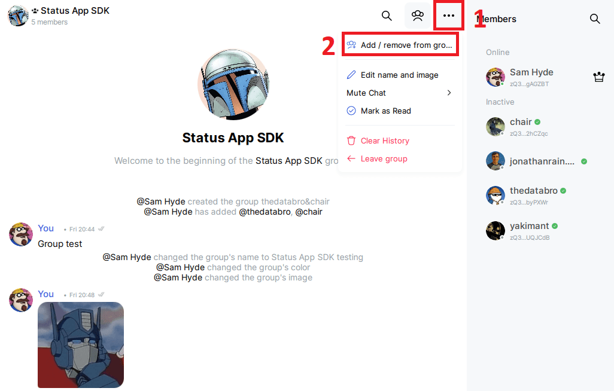
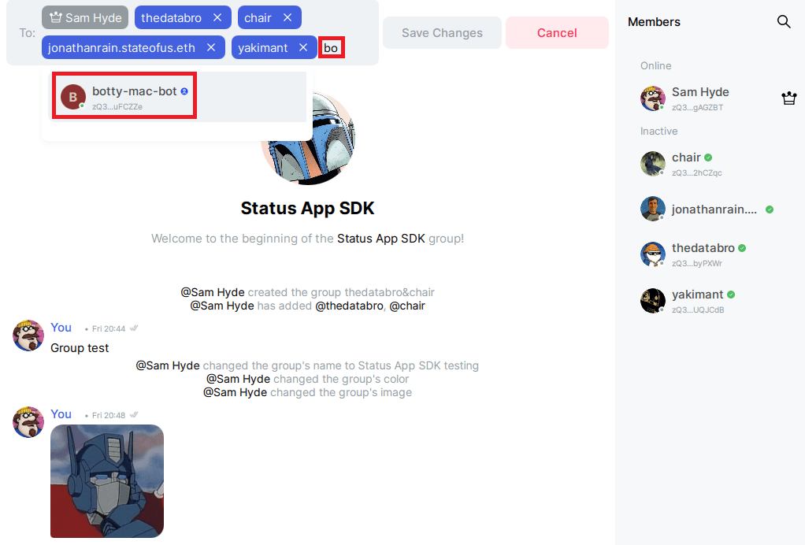
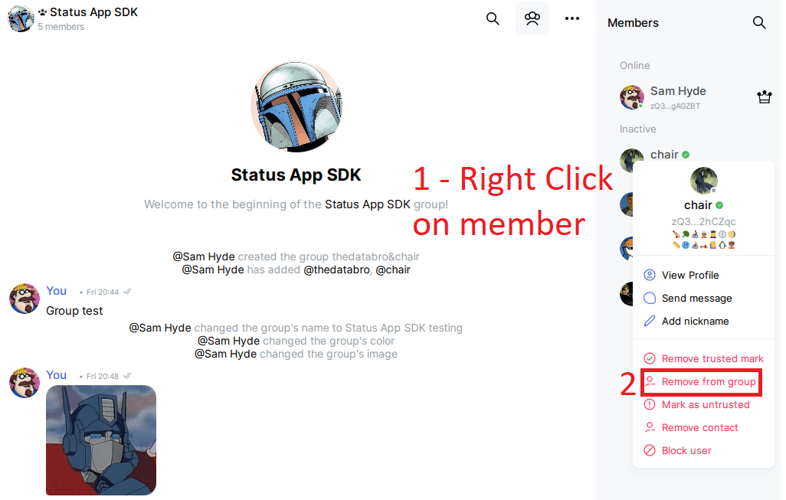
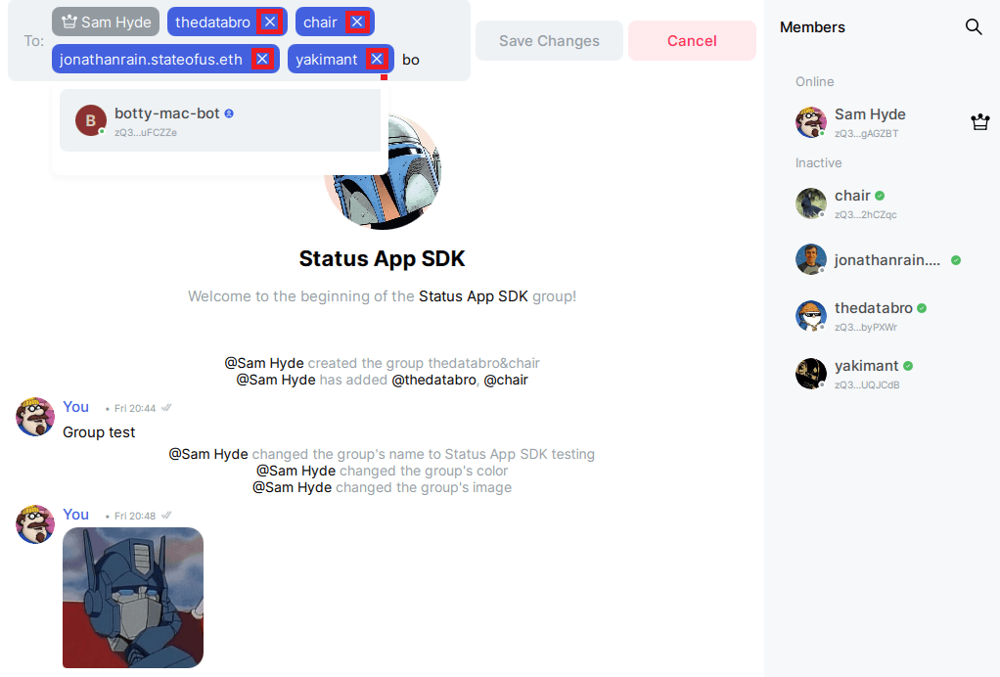
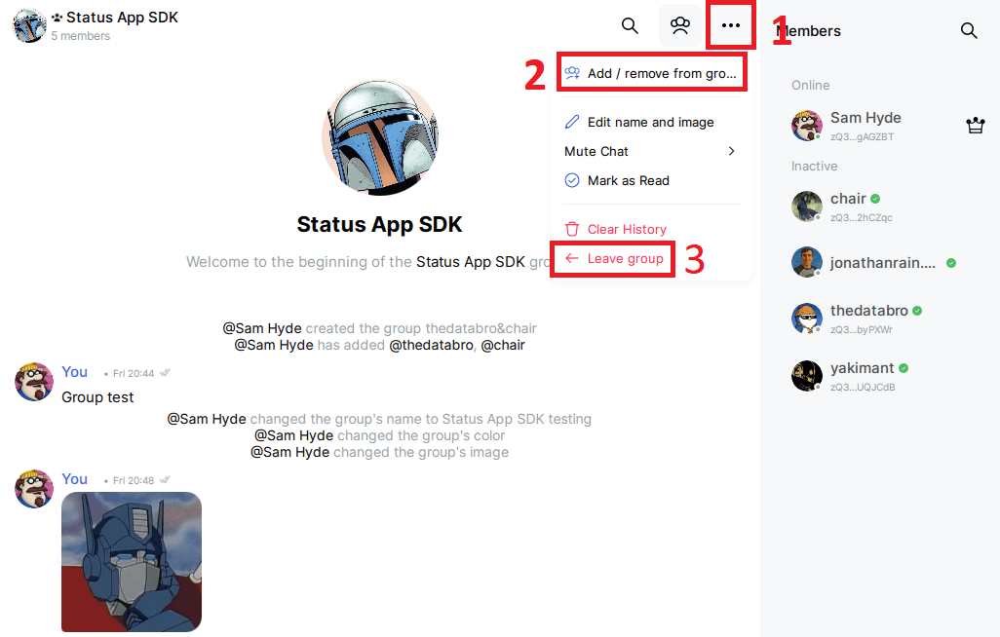
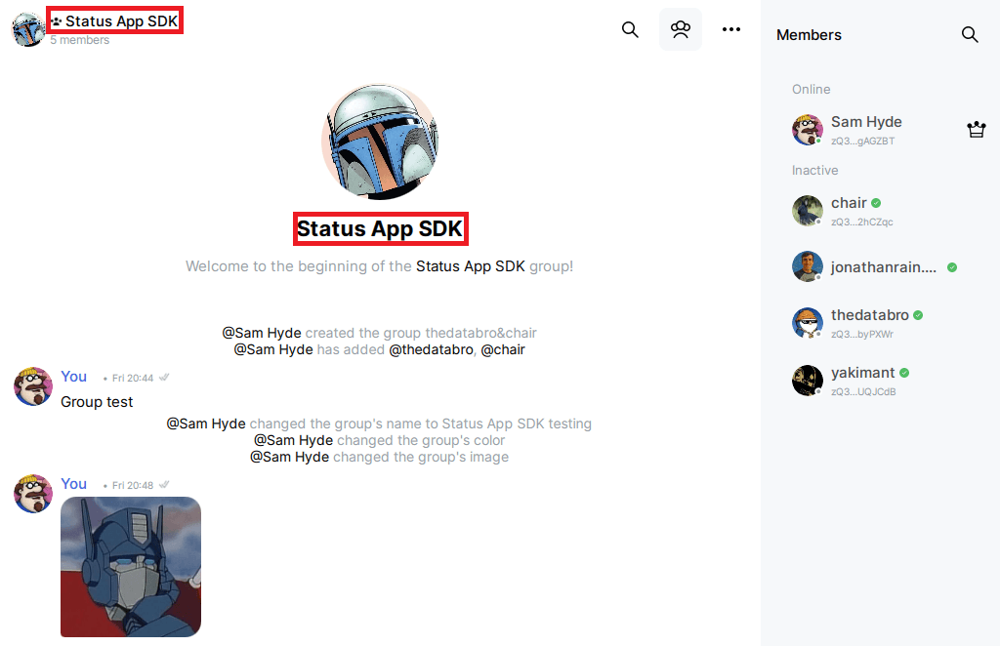
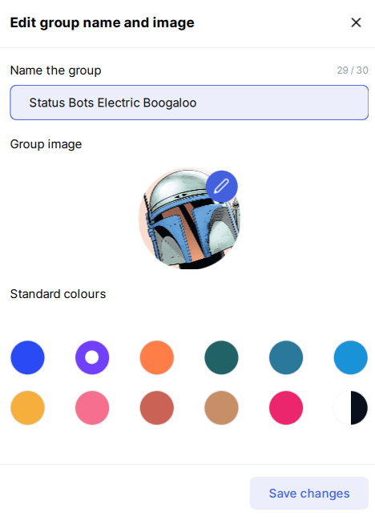

# Group Chat


The group chat class allows you to easily work with a [Status Group Chat](https://status.app/help/messaging/create-a-group-chat). Group chats aren't the same as communities - they are meant for smaller groups of people. **A group chat can have 20 members at most**

A `GroupChat` is always bound to a logged-in [`Account`](./account.md). It can either wrap an **existing** chat (by passing a `chat_id`) or create a brand new one. **A chat be created only with [mutual contacts](./account.md#contacts)** - accounts where the `mutual` key is `True`.

## Administrator

The account that creates a group chat becomes its **administrator**. Only the administrator can [remove](./group-chat.md#removepublic_keys) members from the chat. Every member (admin or not) can [add](./group-chat.md#addpublic_keys) members, [send_message](./group-chat.md#send_messagemessage-reply_to_message_idnone), [get messages](./group-chat.md#get_messagesstart_timestampnone-end_timestampnone) and [leave](./group-chat.md#leave).

## Group chat name

The **group chat name** is the human-readable name of the chat. It is set when [creating](./group-chat.md#createpublic_keys-name) the chat and can be updated through the [`name`](./group-chat.md#name) property.

Group chat names must follow the validation rules enforced by the library and expected by the Status application. A valid group chat name must satisfy all of the following conditions:

- It may contain **letters (`A–Z`, `a–z`)**
- It may contain **numbers (`0–9`)**
- It may contain **underscores (`_`)**
- It may contain **periods (`.`)**
- It may contain **hyphens (`-`)**
- It may contain **whitespaces (` `)**
- It must be **at least 1 character long**
- It **cannot be more than 30 characters long**

Characters such as punctuation, emojis, or other symbols are **not allowed**.

### Valid examples

```
Status Bots
status-bot.01
SNT_PUMP
dev.team-42
a
9000
```

### Invalid examples

| Example | Reason |
|-------|--------|
|  | Too short (minimum length is 1) |
| `a-very-long-group-chat-name-42` + more | Too long (maximum length is 30) |
| `bot!123` | Contains invalid character `!` |
| `status 🚀` | Contains an emoji |

If a group chat name does not follow these rules, a custom exception will be raised.

**Note**: Unlike the [display name](./account.md#display-name), a group chat name **can** start or end with a whitespace.

## `GroupChat(account, chat_id=None)`

Create a new `GroupChat` instance. The constructor binds the group chat to a **logged-in** [`Account`](./account.md). If `chat_id` is not provided, an empty `GroupChat` is created and you must call [`create`](./group-chat.md#createpublic_keys-name) before the chat can be used.

| Name | Type | Required | Description |
|-----|-----|-----|-------------|
| `account` | `Account` | Yes | A **logged-in** [`Account`](./account.md). If the account is not logged in, a custom exception is raised. |
| `chat_id` | `str` | No | The identifier of an existing group chat. Group chat IDs can be obtained from the [`chats`](./account.md#chats) property, where `type` is `group_chat`. If the chat does not exist, a `GroupChatNotFoundError` is raised. |

Prepare an empty `GroupChat` to create a new chat:

```python
from status_sdk import Account, GroupChat

account = Account()
params = {
    "name": "status-app-bot",
    "password": "SNTPUMP"
}
account.login(**params)

group_chat = GroupChat(account)
```


Wrap an existing group chat:

```python
from status_sdk import Account, GroupChat

account = Account()
params = {
    "name": "status-app-bot",
    "password": "SNTPUMP"
}
account.login(**params)

# This is under the assumption you are already in a group chat
chat = [chat for chat in account.chats if chat["type"] == "group_chat"][0]
group_chat = GroupChat(account, chat["id"])

print(group_chat.name)
```

## Methods

### `create(public_keys, name)`

Create a **new group chat** with the given members. The logged-in account becomes the [administrator](./group-chat.md#administrator) of the chat. **[Group chats can have up to 20 members.](https://status.app/help/messaging/create-a-group-chat)**

| Name | Type | Required | Description |
|-----|-----|-----|-------------|
| `public_keys` | `list[str]`<br>`str` | Yes | The public keys of the members to create the chat with. A single public key can be passed as a `str`. Public keys can be obtained from [mutual contacts](./account.md#contacts). |
| `name` | `str` | Yes | The name of the group chat. Must follow the [group chat name](./group-chat.md#group-chat-name) rules. |

Returns the current `GroupChat` instance, allowing method chaining.

```python
from status_sdk import Account, GroupChat

account = Account()
params = {
    "name": "status-app-bot",
    "password": "SNTPUMP"
}
account.login(**params)
public_keys = [contact["public_key"] for contact in account.contacts.values() if contact["mutual"]]

group_chat = GroupChat(account).create(public_keys, "Status Bots")
print(group_chat.id)
```



Because the method returns the instance, calls can be chained:

```python
GroupChat(account).create(public_keys, "Status Bots").send_message("Hello!")
```

**Note**: The account's **own public key** is automatically filtered out of `public_keys`, since the creator is always a member of the chat.

### `send_message(message, reply_to_message_id=None)`

Send a text message to the group chat. This method currently supports **text messages only**. A message can also be sent as a **reply** to an existing message in the chat, which renders in Status App with the original message quoted above it - the same as replying to a message in the app.

| Name | Type | Required | Description |
|-----|-----|-----|-------------|
| `message` | `str` | Yes | The text message to send. |
| `reply_to_message_id` | `str` | No | The `id` of the message being replied to. Message IDs can be obtained from the `id` key of [`get_messages`](./group-chat.md#get_messagesstart_timestampnone-end_timestampnone). When omitted (default), the message is sent as a standalone message. |

Returns the current `GroupChat` instance, allowing method chaining.

```python
from status_sdk import Account, GroupChat

account = Account()
params = {
    "name": "status-app-bot",
    "password": "SNTPUMP"
}
account.login(**params)

chat = [chat for chat in account.chats if chat["type"] == "group_chat"][0]
group_chat = GroupChat(account, chat["id"])\
                .send_message("Hello from my Status bot #1!")\
                .send_message("Hello from my Status bot #2!")
```

Reply to a message:

```python
from status_sdk import Account, GroupChat

account = Account()
params = {
    "name": "status-app-bot",
    "password": "SNTPUMP"
}
account.login(**params)

chat = [chat for chat in account.chats if chat["type"] == "group_chat"][0]
group_chat = GroupChat(account, chat["id"])

# Messages are returned newest first, so this is the latest message in the chat
messages = group_chat.get_messages()
latest = messages[0]

group_chat.send_message("Thanks for the update!", latest["id"])
```

### `delete_message(id)`

Delete one of your **own** messages from the group chat. The deletion is propagated to the other members, so the message disappears for everybody. You can only delete messages that the logged-in account has sent.

| Name | Type | Required | Description |
|-----|-----|-----|-------------|
| `id` | `str` | Yes | The `id` of the message to delete. Message IDs can be obtained from the `id` key of [`get_messages`](./group-chat.md#get_messagesstart_timestampnone-end_timestampnone). |

Returns `bool`.

| Value | Meaning |
|------|--------|
| `True` | The message was deleted. |
| `False` | The message was not deleted, because the account does not have permission to delete it. |

```python
from status_sdk import Account, GroupChat

account = Account()
params = {
    "name": "status-app-bot",
    "password": "SNTPUMP"
}
account.login(**params)

chat = [chat for chat in account.chats if chat["type"] == "group_chat"][0]
group_chat = GroupChat(account, chat["id"])

group_chat.send_message("Oops, this was a mistake!")

# Messages are returned newest first, so the message just sent is the first one
messages = group_chat.get_messages()
deleted = group_chat.delete_message(messages[0]["id"])
account.logger.info(f"Deleted: {deleted}")
```

### `get_messages(start_timestamp=None, end_timestamp=None)`

Retrieve messages from the group chat within an optional time range. Messages are returned in **descending order** (newest to oldest).

| Name | Type | Required | Description |
|-----|-----|-----|-------------|
| `start_timestamp` | `datetime.datetime` | No | The earliest timestamp to include. Messages older than this value will stop the fetch process. |
| `end_timestamp` | `datetime.datetime` | No | The latest timestamp to include. Messages newer than this value will be skipped. |

Returns `list[dict]` containing message objects. Timestamp fields returned by the backend are automatically converted into `datetime.datetime` objects.

```python
from status_sdk import Account, GroupChat
import datetime

account = Account()
params = {
    "name": "status-app-bot",
    "password": "SNTPUMP"
}
account.login(**params)

chat = [chat for chat in account.chats if chat["type"] == "group_chat"][0]
group_chat = GroupChat(account, chat["id"])

messages = group_chat.get_messages(start_timestamp=datetime.datetime(2024, 1, 1))

for message in messages:
    print(f"{message['timestamp']}\t{message['text']}")
```

**Note**: This is the group chat equivalent of [`delete_message`](./account.md#delete_messagemessage_id) on `Account`. The only difference is that it first verifies the group chat exists - a custom exception is raised if the chat has not been created or joined.

### `add(public_keys)`

Add members to the group chat.

| Name | Type | Required | Description |
|-----|-----|-----|-------------|
| `public_keys` | `list[str]`<br>`str` | Yes | The public keys of the members to add. A single public key can be passed as a `str`. Public keys can be obtained from the [`contacts`](./account.md#contacts) property. Public keys can be obtained from [mutual contacts](./account.md#contacts). |

Returns the current `GroupChat` instance, allowing method chaining.

```python
from status_sdk import Account, GroupChat

account = Account()
params = {
    "name": "status-app-bot",
    "password": "SNTPUMP"
}
account.login(**params)

chat = [chat for chat in account.chats if chat["type"] == "group_chat"][0]
group_chat = GroupChat(account, chat["id"])

public_keys = [contact["public_key"] for contact in account.contacts.values() if contact["mutual"]]
group_chat.add(public_keys)

print(group_chat.members.keys())
```



---



### `remove(public_keys)`

Remove members from the group chat. **Only the [administrator](./group-chat.md#administrator) of the chat can remove members.**

| Name | Type | Required | Description |
|-----|-----|-----|-------------|
| `public_keys` | `list[str]`<br>`str` | Yes | The public keys of the members to remove. A single public key can be passed as a `str`. Current members can be obtained from the [`members`](./group-chat.md#members) property. |

Returns the current `GroupChat` instance, allowing method chaining.

```python
from status_sdk import Account, GroupChat

account = Account()
params = {
    "name": "status-app-bot",
    "password": "SNTPUMP"
}
account.login(**params)

chat = [chat for chat in account.chats if chat["type"] == "group_chat"][0]
group_chat = GroupChat(account, chat["id"])

member = list(group_chat.members.values())[0]
group_chat.remove(member["public_key"])
```



**Alternative remove:**


---




### `leave()`

Leave the group chat.

Returns the current `GroupChat` instance, allowing method chaining.

```python
from status_sdk import Account, GroupChat

account = Account()
params = {
    "name": "status-app-bot",
    "password": "SNTPUMP"
}
account.login(**params)

chat = [chat for chat in account.chats if chat["type"] == "group_chat"][0]
group_chat = GroupChat(account, chat["id"])

group_chat.leave()
```



**Note**: The `GroupChat` instance cannot be reused - accessing those properties raises a custom exception. To use it again, either [`create`](./group-chat.md#createpublic_keys-name) a new chat or ask somebody to add you in the chat.

## Properties

### `id`

The unique identifier of the group chat. This is the same value found in the [`chats`](./account.md#chats) property where `type` is `group_chat`, and it can be used directly with [`send_message`](./account.md#send_messagechat_id-message-reply_to_message_idnone) and [`get_messages`](./account.md#get_messageschat_id-start_timestampnone-end_timestampnone) on `Account`.

Returns `str`. Raises a custom exception if the chat has not been created or joined.

```python
from status_sdk import Account, GroupChat

account = Account()
params = {
    "name": "status-app-bot",
    "password": "SNTPUMP"
}
account.login(**params)

chat = [chat for chat in account.chats if chat["type"] == "group_chat"][0]
group_chat = GroupChat(account, chat["id"])

print(group_chat.id)
```

### `name`

Get or update the **name** of the group chat. The name must follow the [group chat name](./group-chat.md#group-chat-name) rules.

Returns `str` when reading the property. Raises a custom exception if the chat has not been created or joined.

```python
from status_sdk import Account, GroupChat

account = Account()
params = {
    "name": "status-app-bot",
    "password": "SNTPUMP"
}
account.login(**params)

chat = [chat for chat in account.chats if chat["type"] == "group_chat"][0]
group_chat = GroupChat(account, chat["id"])

# Get the current group chat name
print(group_chat.name)
```



You can update the name by assigning a new value:

```python
# Change the group chat name
group_chat.name = "Status Bots Electric Boogaloo"
print(group_chat.name)
```


---



### `members`

Get the current members of the group chat.

Returns `dict[str, dict]` where the key is the member's **public key**. This makes internal searching for member specific information faster. Raises a custom exception if the chat has not been created or joined.

| Key | Type | Description |
|----|----|-------------|
| `public_key` | `str` | Public key that uniquely identifies the member. |
| `url` | `str` | The URL that can be shared with other users. |
| `display_name` | `str` | The current display name of the member. |
| `compressed_key` | `str` | The member's compressed chat key as shown in Status App. |
| `admin` | `bool` | Whether the member is the [administrator](./group-chat.md#administrator) of the group chat. |

```python
from status_sdk import Account, GroupChat

account = Account()
params = {
    "name": "status-app-bot",
    "password": "SNTPUMP"
}
account.login(**params)

chat = [chat for chat in account.chats if chat["type"] == "group_chat"][0]
group_chat = GroupChat(account, chat["id"])

for member in group_chat.members.values():
    print(member["display_name"], member["admin"])
```

### `available_slots`

The number of members that can still be [added](./group-chat.md#addpublic_keys) to the group chat.

Returns `int`. Raises a custom exception if the chat has not been created or joined.

```python
from status_sdk import Account, GroupChat

account = Account()
params = {
    "name": "status-app-bot",
    "password": "SNTPUMP"
}
account.login(**params)

chat = [chat for chat in account.chats if chat["type"] == "group_chat"][0]
group_chat = GroupChat(account, chat["id"])

account.logger.info(f"{group_chat.available_slots} slots left")
```

This is useful to check before adding members, since the group chat is full when there are no slots left:

```python
public_keys = [contact["public_key"] for contact in account.contacts.values() if contact["mutual"]]

if group_chat.available_slots >= len(public_keys):
    group_chat.add(public_keys)
```


### `is_admin`

Whether the logged-in [`Account`](./account.md) is the [administrator](./group-chat.md#administrator) of the group chat.

Returns `bool`.

```python
from status_sdk import Account, GroupChat

account = Account()
params = {
    "name": "status-app-bot",
    "password": "SNTPUMP"
}
account.login(**params)

chat = [chat for chat in account.chats if chat["type"] == "group_chat"][0]
group_chat = GroupChat(account, chat["id"])

if group_chat.is_admin:
    account.logger.info("Account is admin!")
```
