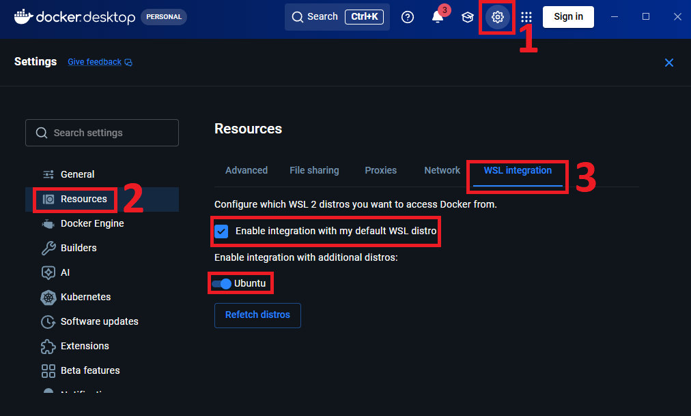

# Utils


Helper functions for setting up the Status Backend environment.

## Methods

### `launch_docker_container(wait_seconds=5)`

Launch Status Backend Docker container in the background using `docker-compose.yaml`. If `docker` is not installed, or if the container fails to start, an **exception will be raised** with the error message from Docker.

| Name | Type | Required | Description |
|-----|-----|-----|-------------|
| `wait_seconds` | `int` | No | Number of seconds to pause after the `docker compose up` command returns, giving Status Backend enough time to finish booting before subsequent code runs. Defaults to `5`. This matters mainly when the container already exists and is being restarted, because `docker compose up` returns immediately while the backend is still warming up - instantiating [`Account`](./account.md#accountdomainlocalhost-port8080-is_securefalse-backup_foldernone) too quickly will fail to connect. |

```python
from bot import launch_docker_container

launch_docker_container(wait_seconds=10)
```

**Windows Note**: In Docker go to `Settings > Resources > WSL integration` and make sure `Enable integration with my default WSL distro` and `Ubuntu` are **turned on**.


