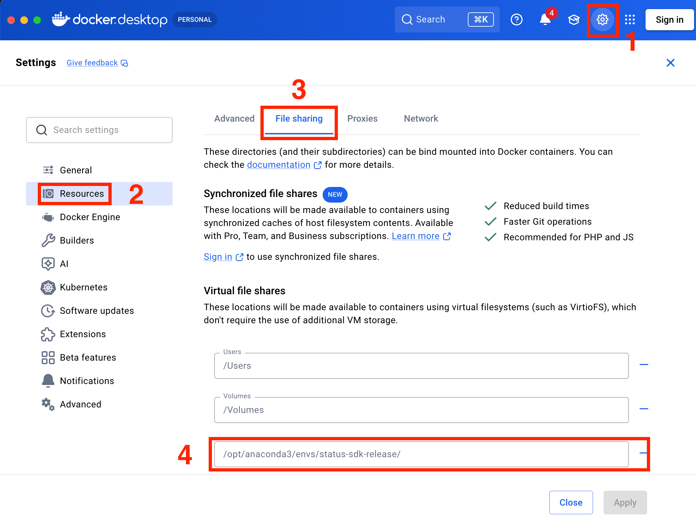

# Utils


Helper functions for setting up the Status Backend environment.

## Methods

### `launch_docker_container(commit=None, wait_seconds=5, platform="linux/amd64")`

Launch Status Backend Docker container in the background using `docker-compose.yaml`. If `docker` is not installed, or if the container fails to start, an **exception will be raised** with the error message from Docker. The container is built from [`status-im/status-go`](https://github.com/status-im/status-go) at the git ref you choose:

```yaml
context: https://github.com/status-im/status-go.git#${STATUS_GO_REF:-develop}
```

The image is always rebuilt (`docker compose up --build`) so a newly chosen `commit` is picked up instead of reusing a previously built image.

**Note**: The container mounts the SDK's `backups/` and `assets/` folders as Docker volumes. Make sure the repository has **read and write permissions**, otherwise the container will fail to start or [backups](./account.md#backups) and [profile pictures](./account.md#profile_picture) will not be saved. On Docker Desktop the repository must also be a **shared path** (see [Windows](./utils.md#windows) and [Mac](./utils.md#mac)).

| Name | Type | Required | Description |
|-----|-----|-----|-------------|
| `commit` | `str` | No | The `status-im/status-go` git ref to build from - a commit SHA, branch, or tag. When omitted, the latest `develop` branch is built. |
| `wait_seconds` | `int` | No | Number of seconds to pause after the `docker compose up` command returns, giving Status Backend enough time to finish booting before subsequent code runs. Defaults to `5`. This matters mainly when the container already exists and is being restarted, because `docker compose up` returns immediately while the backend is still warming up - instantiating [`Account`](./account.md#accountdomainlocalhost-port8080-is_securefalse-backup_foldernone) too quickly will fail to connect. On [Windows](./utils.md#windows) the same value is used to wait between retries after WSL has been restarted. |
| `platform` | `str` | No | The platform the image is built for. Defaults to `linux/amd64`. Run `docker buildx ls` to see the platforms your Docker installation supports, and pass the matching value if the default does not build on your machine. |

Wait time after container has launched:
```python
from status_sdk import launch_docker_container

# Build from the latest develop branch
launch_docker_container(wait_seconds=10)
```

Building from a specific commit:

```python
from status_sdk import launch_docker_container
# Pin a specific status-go commit
# https://github.com/status-im/status-go/commit/2bee8b6a38cdc8f92d74e2dbb8c4e77fbbeea149
launch_docker_container(commit="2bee8b6a38cdc8f92d74e2dbb8c4e77fbbeea149")
```

Building for a specific platform:

```bash
docker buildx ls
```

```python
from status_sdk import launch_docker_container

# Build for Raspberry PI 5 - arm64
launch_docker_container(platform="linux/arm64")
```

#### Windows

In Docker go to `Settings > Resources > WSL integration` and make sure `Enable integration with my default WSL distro` and `Ubuntu` are **turned on**.


Docker Desktop creates internal intermediary mounts inside its WSL 2 environment when bind-mounting paths from a WSL distribution into a container. In some  cases, these mounts can become **stale**, and the container may fail to start with:

```
error while creating mount source path '/run/desktop/mnt/host/wsl/docker-desktop-bind-mounts/Ubuntu/...': file exists
```

The only reliable way to clear the cache is to restart WSL. Method `launch_docker_container` will do the following when the container fails to start:

1. `wsl --shutdown` is run to clear the stale mounts. Keep in mind that this will shut down **every** WSL distribution, not just the one Docker uses. Any other WSL session running at the same time will be terminated.
2. The container is launched again, sleeping `wait_seconds` between each attempt, until it starts.

WSL boots back up on demand, so no manual step is needed. Docker Desktop does need a moment to bring its backend back up, which is why the retries are spaced out - **increase `wait_seconds` if the container takes a long time to come back**.

#### Mac

In Docker go to `Settings > Resources > File Sharing` and make sure the SDK repository is added to **Virtual file shares**.



#### Linux

Make sure the installed `status_sdk` folder has **read and write permissions**, otherwise the container will fail to start or [backups](./account.md#backups) and [profile pictures](./account.md#profile_picture) will not be saved.

If the package was installed with `sudo` (for example `sudo pip install`), the folder is owned by `root` and your user cannot write to it. Take ownership of the package so your existing permissions apply (adjust the path to where `status_sdk` is installed):

```bash
sudo chown -R $USER:$USER /path/to/status_sdk
```

`$USER` expands to your current login user, so both the owner and group of every file under `status_sdk` are set to you. If the container writes as a different user than the one that installed the package, `chown` alone is not enough - grant read and write permissions to everyone instead:

```bash
sudo chmod -R a+rw /path/to/status_sdk
```

