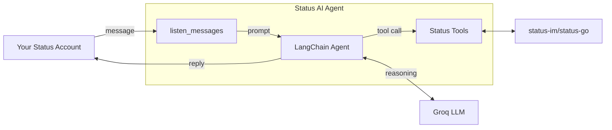

# Onchain Agent

A **personal crypto assistant** that lives inside Status App. The script logs into a Status account, listens for incoming messages **in real time**, and answers them with a [Groq](https://groq.com/) that has been given tools to read and act on the account.

The agent can look up balances, tokens, contacts and transaction history - and it can also **send messages, send crypto and swap tokens** on your behalf.

## How it works



## Tools

Each tool is a thin wrapper around the [Python SDK](../../README.md). They are defined in [`tools.py`](./tools.py), and their arguments are validated by the [pydantic](https://docs.pydantic.dev/) models in [`models.py`](./models.py).

| Tool | SDK | What the agent can do |
|-----|-----|-------------|
| `get_balance` | [`balance`](../../docs/account.md#balance) | Read the account's wallet balance, optionally enriched with market data. |
| `get_account_info` | [`info`](../../docs/account.md#info) | Read public account details. `password` and `mnemonic` are **excluded**. |
| `get_account_contacts` | [`contacts`](../../docs/account.md#contacts) | List contacts, contact requests and group chats. |
| `manage_contact` | [`add_contact`](../../docs/account.md#add_contactpublic_key-display_namenone) / `remove_contact` | Accept, send, decline and remove contact requests. |
| `get_token_info` | [`get_tokens`](../../docs/account.md#get_tokens) | Look up chains, token symbols and token addresses. |
| `search_external_balance` | [`get_balance`](../../docs/account.md#get_balancetoken_addresses-chain_ids1-walletsnone-ccynone) | Read the balance of **any** wallet address, not just the account's. |
| `search_messages` | [`get_messages`](../../docs/account.md#get_messageschat_id-start_timestampnone-end_timestampnone) | Read chat history for a date range, including payment requests. |
| `search_transactions` | [`get_transactions`](../../docs/account.md#get_transactionsrefreshfalse) | Read historical wallet transactions. |
| `send_message` | [`send_message`](../../docs/account.md#send_messagechat_id-message) | **Send a message** to any chat. |
| `send_transaction` | [`send_transaction`](../../docs/account.md#send_transactionaddress-symbol-amount-chain_id1) | **Send crypto** to any address. |
| `swap_tokens` | [`swap_tokens`](../../docs/account.md#swap_tokensfrom_token-to_token-amount-chain_id1) | **Swap tokens** in the wallet. |

**Note**: The last three tools move real funds and send real messages. See [Security](./README.md#security).

## Setup

### 1. Install

From the **repository root**, install the SDK with the `agent` dependencies:

```
pip install ".[agent]"
```

### 2. Configure

Copy [`env.example`](./env.example) to `.env` in this folder and fill it in:

```
cp env.example .env
```

| Variable | What it is |
|-----|-------------|
| `PASSWORD` | The password of your Status account. |
| `NAME` | The [display name](../../docs/account.md#display-name) or ENS name of the account. If you have previously logged in with the SDK you can provide an ENS. For first time log ins, it is best to provide a [display name](../../docs/account.md#display-name). |
| `MNEMONIC` | The [recovery phrase](https://status.app/help/profile/understand-your-status-keys-and-recovery-phrase) of the account. Used to recover it into the container. |
| `ALCHEMY_TOKEN` | [Alchemy](https://www.alchemy.com/) token - needed for transaction history. |
| `COINGECKO_API_KEY` | [CoinGecko](https://www.coingecko.com/) key - needed for token prices. |
| `INFURA_TOKEN` | [Infura](https://www.infura.io/) token - needed for Ethereum RPC. |
| `GROQ_API_KEY` | [Groq API key](https://console.groq.com/) for the LLM. |
| `GROQ_MODEL` | The Groq model name, e.g. `llama-3.3-70b-versatile`. |
| `FROM_PUBLIC_KEY` | The public key of the account the bot will **listen and reply to**. This is the account you message the bot *from*. |

All three wallet keys (`ALCHEMY_TOKEN`, `COINGECKO_API_KEY`, `INFURA_TOKEN`) are required - without all of them the wallet tools raise a custom exception.

### 3. Run

The script imports `tools` and `models` as **top-level modules**, so it must be run from inside this folder:

```
cd examples/agents
python main.py
```

On the first run, [`launch_docker_container`](../../docs/utils.md#launch_docker_container) builds the Status Backend image, which takes a few minutes. The account is then recovered from `MNEMONIC` and the bot starts listening:

```
[INFO]  Running Docker on <your-os-here>
[INFO]  Successfully logged in!
[INFO]  Starting messaging
[INFO]  Messaging launched
```

Now message the bot from the account matching `FROM_PUBLIC_KEY`. It runs until you stop it with `Ctrl+C`.

## Security

**This agent has full control of the Status account and its wallet.** It can send messages as you, transfer crypto out of your wallet, and swap your tokens - and it decides to do so based on the output of an LLM.

The safeguards in this example are deliberately simple:

- **One sender only.** Messages are ignored unless `latest_message["from"] == FROM_PUBLIC_KEY`. Anyone else messaging the bot is not processed.
- **Secrets are withheld from prompts.** `get_account_info` strips `password` and `mnemonic` before the LLM ever sees the account details.

That is the whole boundary. There is **no** spending limit, no confirmation step and no allowlist of receiver addresses. Anyone who can send messages from `FROM_PUBLIC_KEY` - or anyone who can convince the LLM through a [prompt injection](https://en.wikipedia.org/wiki/Prompt_injection) in the chat content - can move funds.

Use a **dedicated account with a small balance**. Do not point this at a wallet you care about.
