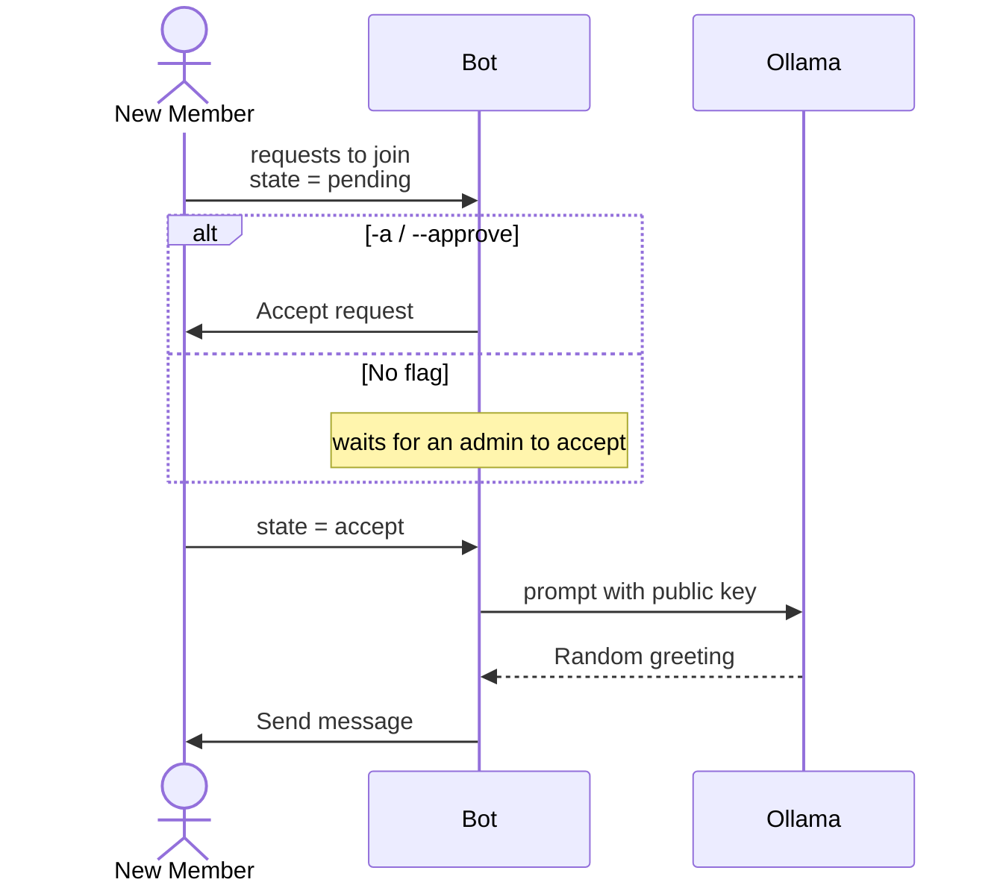

# Community Greeter

A **welcome bot** for a [Status Community](https://status.app/help/communities). The script logs into a Status account, listens for join requests **in real time**, optionally **accepts** them, and posts a unique LLM-written greeting for every new member in a channel of your choice. The greeting is generated locally with [Ollama](https://ollama.com/), so no messages ever leave your machine.

## How it works

On startup the bot [creates the channel](../../docs/community.md#create_channelname-description-emojinone-colournone-category_namenone) it greets in or reuses it if a channel with that name already exists. The then the bot starts listening for different states:

- `pending` - the request is waiting on a decision. With `--approve` (the default) the bot accepts it and moves on. The greeting is *not* sent here - accepting produces a follow-up `accept` event, which is what triggers the message.
- `accept` - the member is in the community. The bot asks the local model for a greeting and [`send_message`](../../docs/community.md#send_messagemessage-reply_to_message_idnone)s it to the channel, mentioning the new member by public key.
3. `reject` / `cancel` - ignored.

With `--no-approve` the bot never decides membership itself; it only greets members an administrator has accepted.



The persona lives entirely in the prompt inside [`generate_message`](./main.py) - by default a "Herald of [Battle World](https://marvel.fandom.com/wiki/Battleworld_(Latverion))" that welcomes members in an RPG tone. Rewrite that prompt (and the sampling options below it) for your own community.

**Note**: Creating channels and accepting requests requires the account to be a privileged member of the community.

## Setup

### 1. Install

Install the SDK from [PyPI](https://pypi.org/project/status-sdk/) with the `community-greet` dependencies:

```
pip install "status-sdk[community-greet]"
```

Or, if you are working from a clone of the repository, install the same extra from the **repository root**:

```
pip install ".[community-greet]"
```

### 2. Install Ollama

The greeting is generated by a **local** model, so [Ollama](https://ollama.com/download) must be installed and running. Pull the model you want to use:

```
ollama pull llama3.2
```

The name you pull is what goes into `MODEL_NAME` below.

### 3. Configure

Copy [`env.example`](./env.example) to `.env` in this folder and fill it in:

```
cp env.example .env
```

| Variable | What it is |
|-----|-------------|
| `PASSWORD` | The password of the greeting Status account. |
| `NAME` | The [display name](../../docs/account.md#display-name) or ENS name of the account. If you have previously logged in with the SDK you can provide an ENS. For first time log ins, it is best to provide a [display name](../../docs/account.md#display-name). |
| `MNEMONIC` | The [recovery phrase](https://status.app/help/profile/understand-your-status-keys-and-recovery-phrase) of the account. Used to recover it into the container. |
| `COMMUNITY_URL` | The invite [`url`](../../docs/community.md#url) of the community to greet in. If the account is not a member yet, constructing the [`Community`](../../docs/community.md#communityaccount-community_idnone-urlnone) sends a join request instead - see [Membership](../../docs/community.md#membership). |
| `MODEL_NAME` | The Ollama model used for the greeting, e.g. `llama3.2`. |

### 4. Run

The script loads its `.env` from the current directory, so run it from inside this folder:

```
cd examples/community-greet
python main.py
```

On the first run building the image takes a few minutes. Then the bot starts listening:

```
[INFO]  Successfully logged in!
[INFO]  Channel 'intro' created
[INFO]  Listening for incoming Battle World [0x03...] requests
```

The bot runs until you stop it with `Ctrl+C`.

### Options

| Flag | Default | What it does |
|-----|-----|-------------|
| `-c`, `--channel-name` | `intro` | The channel to greet new members in. Created if it does not exist yet. |
| `-a`, `--approve` | `False` | Accept pending join requests automatically. If not passed then members will only be greeted once an admin has accepted. |

```
python main.py --channel-name welcome --no-approve
```
