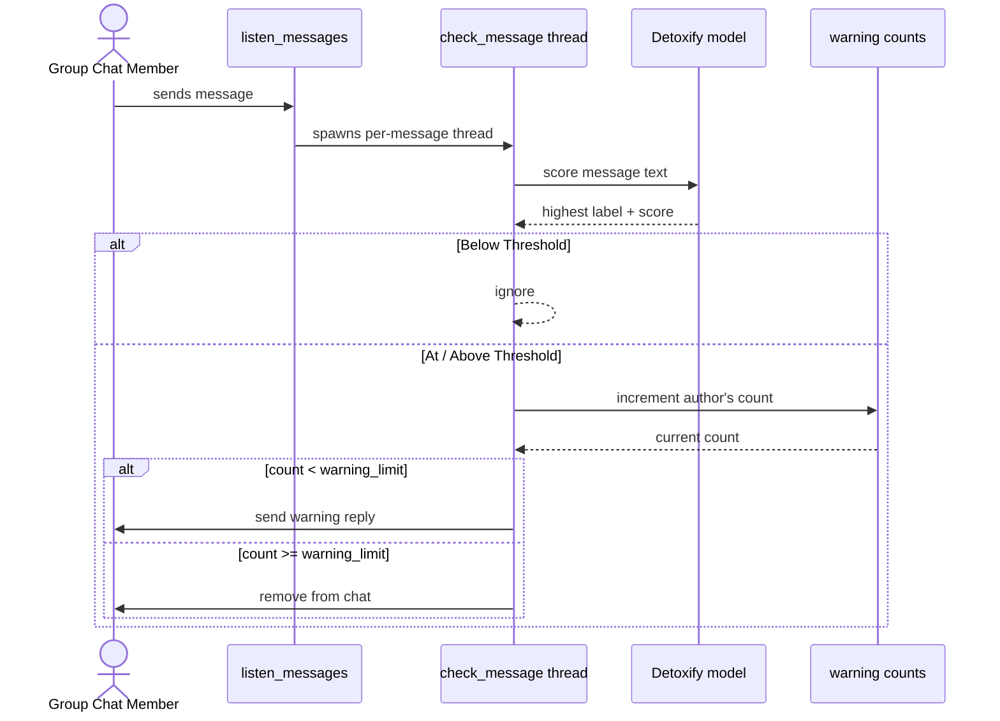

# Group Chat Moderator

An **automatic moderator** for a [Group Chat](https://status.app/help/messaging/create-a-group-chat). The script logs into a Status account, listens for new messages **in real time**, and scores each one for toxicity with [Detoxify](https://github.com/unitaryai/detoxify) (local model). Authors of toxic messages are **warned**, and after a specified number of warnings they are **removed** from the chat.

## How it works

Every message that lands in the chat is handled in its **own thread** by [`check_message`](./main.py). The thread:

1. Skips messages sent by the bot itself.
2. Scores the message text with [Detoxify](https://github.com/unitaryai/detoxify) and takes the highest label (`toxicity`, `insult`, `threat`, ...).
3. Ignores anything below the `threshold` (default `0.6`).
4. Otherwise increments the author's warning count under a lock - the `warnings` dict is shared across threads, so the read-modify-write must be atomic.
5. Sends a warning reply, or [`remove`](../../docs/group-chat.md#removepublic_keys)s the author once they hit the `warning_limit` (default `3`).




This is just one moderation policy. [`check_message`](./main.py) is self-contained, so you can rewrite it for your own use case - swap in a different model or keyword filter, adjust `threshold` and `warning_limit`  or escalate through different labels. The listener loop stays the same and only the per-message logic changes.

**Note**: Removing members requires the account to be the [administrator](../../docs/group-chat.md#administrator) of the chat. See [Moderation power](./README.md#moderation-power).

## Setup

### 1. Install

From the **repository root**, install the SDK with the `group-chat-moderator` dependencies:

```
pip install ".[group-chat-moderator]"
```

This pulls in [Detoxify](https://github.com/unitaryai/detoxify) and its [PyTorch](https://pytorch.org/) backend. The first run downloads the model weights.


**Note**: `detoxify` installs the CPU build of PyTorch by default. For faster inference on a CUDA GPU, uninstall `torch` and `torchvision`, then reinstall the GPU builds by following the instructions on [PyTorch's website](https://pytorch.org/).

### 2. Configure

Copy [`env.example`](./env.example) to `.env` in this folder and fill it in:

```
cp env.example .env
```

| Variable | What it is |
|-----|-------------|
| `PASSWORD` | The password of the moderating Status account. |
| `NAME` | The [display name](../../docs/account.md#display-name) or ENS name of the account. If you have previously logged in with the SDK you can provide an ENS. For first time log ins, it is best to provide a [display name](../../docs/account.md#display-name). |
| `MNEMONIC` | The [recovery phrase](https://status.app/help/profile/understand-your-status-keys-and-recovery-phrase) of the account. Used to recover it into the container. |
| `GROUP_CHAT_ID` | The `id` of the group chat to moderate. Group chat IDs come from the [`chats`](../../docs/account.md#chats) property, where `type` is `group_chat`. |

### 3. Run

The script loads its `.env` from the current directory, so run it from inside this folder:

```
cd examples/group-chat-moderator
python main.py
```

On the first run, [`launch_docker_container`](../../docs/utils.md#launch_docker_container) builds the Status Backend image, which takes a few minutes. Tthe bot starts listening:

```
[INFO]  Successfully logged in!
[INFO]  Loading Detoxify [cpu]
[INFO]  Listening Group Chat Status Bots
```

Detoxify runs on the **GPU** automatically when CUDA is available (`[cuda]` above), and falls back to the CPU otherwise. The bot runs until you stop it with `Ctrl+C`.

## Moderation power

**This account acts as the moderator of the group chat.** To warn members it only needs to be in the chat, but to **remove** them it must be the [administrator](../../docs/group-chat.md#administrator) - only the admin can remove members. Point the moderator at a chat it created (or was made admin of), otherwise removals are rejected and members can only be warned.

The moderation logic in this example is deliberately simple:

- **One model, one threshold.** Every message is scored by [Detoxify](https://github.com/unitaryai/detoxify); anything scoring `0.6` or higher on any label counts as toxic. Tune `threshold` and `warning_limit` in [`check_message`](./main.py) to make moderation stricter or more lenient.
- **Warnings are per public key.** The count lives only in memory, so restarting the bot resets everyone's warnings to zero.

Detoxify is a machine-learning model and will make mistakes - both false positives and false negatives. Treat it as a first line of moderation, not a final judge.
